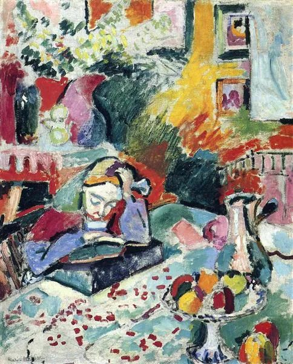

Henri Matisse，Interior with a Girl Reading

  

教育部10日召开新闻发布会。表示，针对“杜绝将学生作业变成家长作业”的问题，教育部将严格落实作业的管理工作，对于违反有关规定，特别是布置惩罚性作业、要求家长完成或批改作业等明令禁止的行为，发现一起，严处一起。

  

在这个问题上，家长与老师的矛盾，似乎水火不容。不然教育部也不会专门表这个态。在我看来，它可能被过度夸张了。教育本身容易引发焦虑，舆论与传播又往往刻意渲染这焦虑，火上浇油，小事放大，无事生非。

  

前几天，还有一43岁徐州赵姓男子，录制视频，手持“教啥啥不行，叫家长第一名”的锦旗，指控某学校的某老师。后经当地教育部门查证，其所指的学校与老师均为虚构，为博关注的此男子也被警方传唤。

  

有一类人，就像这男子一样，非常善于利用、放大社会焦虑，但又没有基本的是非与道德，胡编乱造起来，杀伤力极大。这种人永远有，有时还不是这种小混混，可能是方头大耳的大人物。比如“欧美都是快乐教育，孩子轻轻松松考上大学”，用这类谎言指控与反衬中国教育的无能与落后，现在还很流行，仍在误导不少家长。制造这种重量级的焦虑，一个大人物还不够，得有许多大人物接力与合力。如果一个人没有定力，随风倒，动辄被这些无中生有的、过度夸张的焦虑所绑架，那教育是做不好的。

  

老师布置过多的、不适当的、甚至无法完成的作业，这体现其教学水平有待提升。其实这些老师往往还是负责任的。真不负责任的老师，不布置作业大家开心，何不顺水推舟？考试就出最简单的题目，人人都优秀，过几年家长发现孩子真实的渣实力时，向谁去喊冤？

  

教育是个系统工程，离开老师不行，离开家长更不行。中国的文明早早发现这点，也正如此，在漫长的农业文明时代，吃尽教育与人才的红利。现在并非不吃这套，而是谁都知道强大的根源就在教育与人才，拼谁的数理化更领先。这个时候，中国人突然开始说，孩子成绩无所谓，快乐开心就行，这不就是翻版的美国奶头乐吗？阴谋论一点说，中国教育真奶头乐起来，孩子吃不了一点教育的苦，在廉价的快乐中沉沦，像美国公立学校的孩子一样，那真中计了。与此同时，美国精英阶层的孩子在私立学校玩命读书，一两代人之后，中国真追不上美国了。

  

教育部的昨天的新闻发布会，还说了一句，“家长也要在家里引导培养孩子养成自主完成作业的良好习惯，跟学校密切配合，形成育人的合力。”滴水不漏。其实，这给家长提了更高的要求，原来有老师的布置，家长还知道当天的教学要点，有的放矢。现在老师布置了要处分，家长拿课本自己琢磨吧。

  

养不教，父之过；教不严，师之惰。家长与老师，各有职责，各尽本分，体谅对方，则教育就好做。动辄指责对方，甩锅对方，最后变得谁都不愿意做自己的事，生孩子的，似乎可以不负责任，当老师的，教育又不敢严格。真变成这样的教育，怎么对得起列祖列宗？又怎么对子孙后代负责？

推荐：[我为什么这么高兴？](http://mp.weixin.qq.com/s?__biz=MjM5NDU0Mjk2MQ==&mid=2651640981&idx=1&sn=87e14cdaa8c858ca1e568ec71779fbd3&chksm=bd7e508b8a09d99de10ba66f42fd6f705b0dd8028b0098c23ce8b59fcfa2d4517ba932bec42a&scene=21#wechat_redirect)  

上文：[要善于勤奋，也要善于休息](http://mp.weixin.qq.com/s?__biz=MjM5NDU0Mjk2MQ==&mid=2651666118&idx=1&sn=9939aa2cde04fad14527d582dd12886f&chksm=bd7fb2d88a083bce1afa4cfbd8bacdb109005ce521e525e23c32d84310346038ebf94b2d2a4b&scene=21#wechat_redirect)
