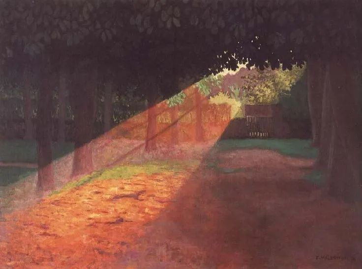
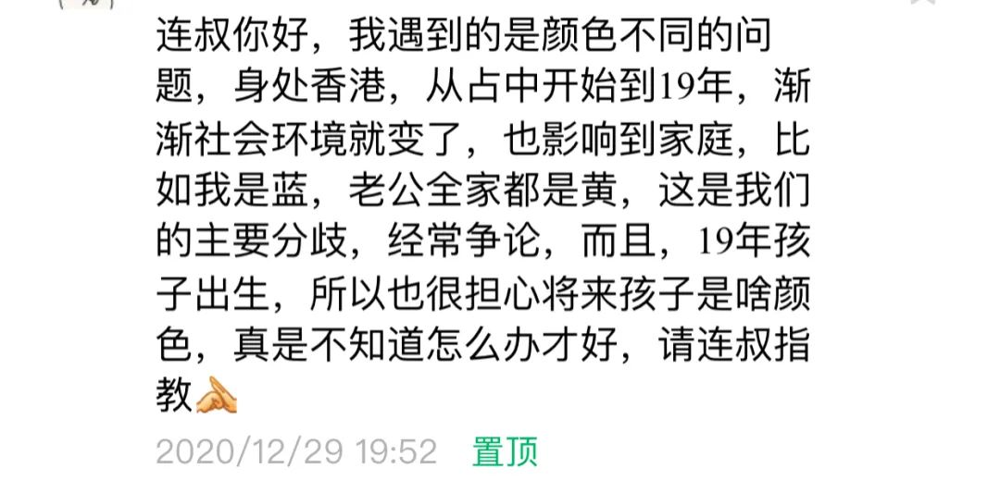

Felix Vallotton，Le Rayon

  

回答一下这位香港读者的问题：

  

  

为了便于内地读者的理解，翻译一下香港的“黄”与“蓝”，“黄”相当于内地所说的“恨国党”，“蓝”相当于爱国者。

  

不同的是，“恨国党”在内地终究是少数，而“黄”在香港势力却大。不过，如何“黄”，就是90%“黄”，全部“黄”，也改变不了香港未来的路只有一条（台湾也如是），就是认祖归宗，承认自己是炎黄子孙，属于中国，心甘情愿地变“蓝”。这个转变过程可能短不了，得有那么一两代人的时间。

  

经过2020年，如果香港人还是“黄”，内地人还是“恨国党”，那可以推断出这些人终生不会改变，他们已经无法被事实说服，争论更没有作用。他们的恨是一种激情，是一种“信仰”，中国怎么做都是错的，美英怎么做都是对的。就像疫情初期，英国推行群体免疫，被吹捧成“更高级的人道主义”，首相约翰逊感染新冠，被有些人封为身先士卒的“绅士”，迷得登峰造极，跪得身段优美。

  

到了年底，英国群体免疫不仅失败很久，还出现了更厉害的变种病毒，大量不配合隔离的人让疫情继续失控。号称第一强国的美国，更是死伤惨重，残酷冷血。这些事情如果发生在中国，政府是不是下台100次了？

  

不过，确实有“更高级的人道主义”，那是在中国，无论阶层与贫富，人人得到了关心与治疗；也确实有绅士精神闪耀着人性的光辉，那是中国科学家的真诚建议，中国政治家的勇敢决策，中国的十多亿民众为了他人、国家与全人类的安全愿意自我隔离。中国付出最小的成本，不仅战胜了疫情，还增长了经济。完成这不可能的任务，不是撞大运，不是靠强制，而是尊重规律，尊重人，有担当，负责任。此时，仍然“黄”，仍然“恨国党”，你有什么办法？神仙也没有办法，只能由他去了。

  

在内地恨国，对利益未必有多大影响，可能继续领着政府的俸禄，享受着待遇，可能照样有名有利。而在香港“黄”下去，将来谋生都成问题。事实上，香港的“黄”要消失，最后只能诉诸利益，城市机会越来越少，经济蛋糕越来越小，大家发现自己的爸爸不是英国人，也不是美国人，才会真正醒悟。内地是等得起的，只是在这个漫长的过程中，有些香港孩子，被家庭与学校教“黄”，一生可能就要浪费掉了。

  

但愿这位香港妈妈的运气足够好，有充分的耐心与说服力引导孩子，假期多带他来内地走走，不让他在成长过程中变“黄”，这样的孩子，将来才有机会，香港没机会，内地也有大把机会。

  

推荐：[尤其今年，从个人到国家，生产力竞争才是一切](http://mp.weixin.qq.com/s?__biz=MjM5NDU0Mjk2MQ==&mid=2651638016&idx=1&sn=f5ac1f43613091895b4f8e3eec79bd60&chksm=bd7e4d1e8a09c408fd7393a4a04e9a24ede85274381eb10ebf3286c8b78c96213a633646510a&scene=21#wechat_redirect)  

上文：[不要轻易放大招，不要轻易离婚](http://mp.weixin.qq.com/s?__biz=MjM5NDU0Mjk2MQ==&mid=2651670847&idx=1&sn=79be267c8782606deadd0e6436ec632e&chksm=bd7fcd218a084437566c382808abb6676ccf3b3f779776317e545d79393c4c2b0528d289976c&scene=21#wechat_redirect)
