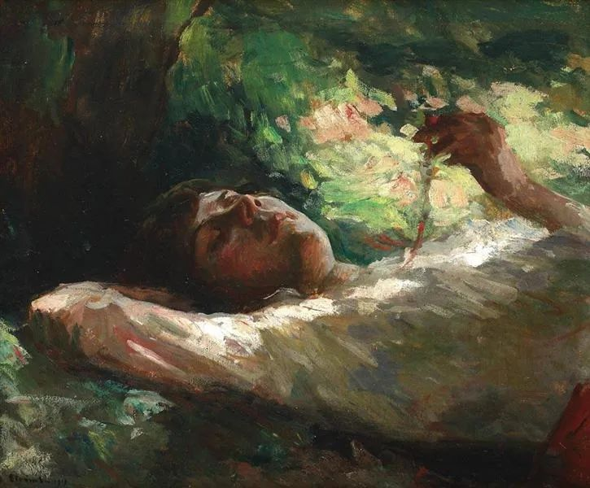

Ipolit Strambu，Reverie

  

你想要幸福吗？正常人的答案都是要。幸福可以说是人生最渴望的目标。

  

但幸福是什么？你很难说出一个准确的答案，或者你的答案很难得到足够多人的认同。别焦虑——焦虑就是一种非幸福状态——古往今来，所有尝试给幸福下定义的人，都面临同样的窘境，总有人觉得定义不够好。

  

换个角度理解，我们可以视幸福为一个开放的、持续成长的定义，他人所有关于幸福的定义，都只是给你提供一个参考，随着你人生的慢慢展开，你有对幸福的理解更深刻、更独特。

  

当然，现在对幸福的研究有些共识，个人的理解不必也不能违反这些共识。

  

比如最大的共识可能就是收入很重要。也就是说，钱很重要。没这个共识，人类社会就没有交换，没有市场。挣到足够的钱，满足了衣食住行的需求，人才觉得安全。没有安全，就像鸟没有窝一样，飞得再美也不幸福。

  

可钱也并非越多越幸福。相关的调查显示，收入与幸福感呈正比关系，但达到某个标准后，影响基本就消失了。在美国，这个标准是家庭年收入75000美元（按现在的汇率为近50万人民币）。而在墨西哥的蒙特雷，4口之家年收入超过4000美元即达标。

  

在中国，这个标准是多少？我个人给出一个比较形象的标准：一个家庭供房后的第三年，幸福就与收入不再呈正比关系。能供房，说明收入不错，房子也提供了最大的安全感。供到第三年，房贷已不是大压力。

  

有人说，这点钱不够，我还要追求更高收入。这没问题，在你能把握平衡时，我也认为钱越多越好。这平衡是什么？就是不能减少幸福。挣1千万比挣1百万好，但代价是彻底失去健康，那就失去了平衡，你的平衡点或许在挣3百万，累一点，健康有一点点风险，但是可以恢复。有3套房子比1套好，代价是全家人必须像乞丐一样活着，也失去了意义，平衡在2套房子，就会好很多。

  

幸福是达到“自己好，他人好，世界好”的平衡。自己不好，很难说是幸福，所以人要进取，要富足，要成就。只为自己好，他人不好，那活着就让世界变坏了，那也不是幸福，所以人要合作，要共情，要有兼济之心。

  

在丹尼尔·M.海布伦为牛津通识读本撰写的《幸福》一书中，得出了一个很有意思的结论，幸福很大程度上依赖于我们限制行使自己的权利，这样才可能达到包容、合作与文明。正因为这种限制的存在，人才会觉得有意义，才能与更重要的人与事产生联系，幸福依赖这种联系与意义。

  

看到这里，你或许会心一笑，人类的智慧果然都要在山顶相遇，这就是我们孔夫子所说的“克己复礼为仁。一日克己复礼，天下归仁。”克己，不是以权利为限制，是以礼的标准限制自己，礼是恭敬辞让，温和而不傲慢，总之，就是遵守“己所不欲勿施他人”的原则。

  

对自己要求高一点，更容易幸福。对他人的帮助大一点，更容易幸福。世界因我们的到来变得好一点，更容易幸福。
