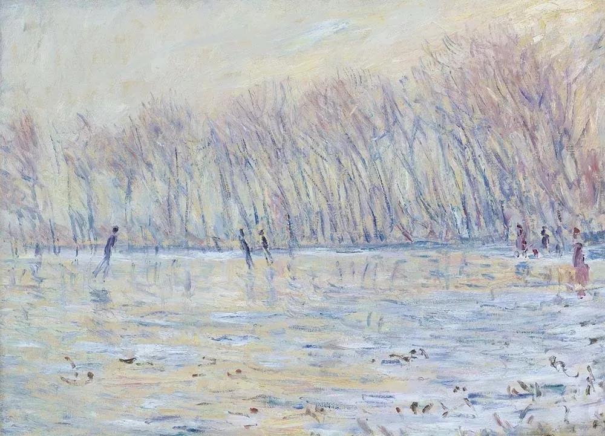

Milton Avery，Birds Over Sky

  

坚持是最重要的素质。整个2020年，全世界从正反两面强调这点，坚持做对的事情，哪怕只是戴口罩和隔离这样人人做得到的事，它不仅关系个人的健康，还显示了国家的兴衰。

  

成就，往往就是坚持一些不起眼的小事。人人可以开始，有资格结束的不多。

  

没有坚持，天资再高，出生再好，扶助再多，也没有用。人生不过又抄一遍《伤仲永》。

  

在正确的路上有了坚持，普普通通的人，一年两年，似有不同，三年四年，脱颖而出，八年十年，惊为天人。

  

人生的坚持，由3种健康构成：

  

最底层的，是身体健康。

  

拥有、维持健康，这点就淘汰不少人。健康是人最核心的资产，你活一百年，有那么七八十年可以认真做事的时光，什么事成不了？翻天覆地都行，别说一个幸福圆满的人生了。这么重要的要素，只不过你饮食节制一点，运动多一点，信医不信巫，就可得到。

  

再往上，是财务健康。

  

除了有益的债务，人不应有其他债务。什么是有益的债务？即这债务购买的资产既是增值的，又是你可承受的。往往等同于房贷。人如果掉入有害的债务陷阱，负债买自己承受不起的消费品、奢侈品，债务将如水火之势变大，迅速吞噬你的人生。人还没死，已经财务死亡、引发信用死亡、社会性死亡，行尸走肉而已。

  

学会储蓄的青少年，人生往往差不了。说明小小年纪即能克制欲望、抵抗诱惑、放弃虚荣。现在，流行文化中充斥着鼓励消费，引诱借贷，能保持财务健康的青少年，尤其难得，在人生的后半程，将领先得更快。当然，希望这种不良的流行文化能够尽早消失，青少年毁得足够多，国家没有前途，世界没有希望。

  

最后，是品德上的健康。

  

中华文明讲天命，天之道。无论多高的人，高成皇帝，它都在你之上，人没有为所欲为，无法无天的自由。地位越高，能力越大，越得如履如临，战战兢兢。德不配位，不合天命，触犯天道，就会被惩罚。从这点看，就能理解为什么中国人在疫情中那么自觉地隔离与戴口罩，他们不认为自己有感染别人的自由。隔离与戴口罩，表面是政府的命令，实际符合不给人添麻烦，不危害他人的天命与天道。

  

从总统到平民，许多美国人追求在疫情期间不戴口罩，随心所欲感染他人的自由，那是低级的、无德的自由，或者说，是对自由的误解。中国人追求的自由，是“随心所欲不逾矩”的自由，是高级的、有德的自由，是对自由的真正尊重。中国的防疫成功，是一个更有道德的国家应得的回报，这就是天命。

  

在互联网时代，一个人由于技术或（和）运气，可能在品德不到位的情况下，就有了皇帝一般的财富和影响力，这让很多人产生动摇，认为可以不需要建立与维护“不逾矩”的品德健康，这是一个巨大的诱惑与陷阱，只是让放纵者摔得更惨。

  

人一生能走多高，变多强，有一定的运气成分。但我们一直在平地上，一生是个普通人，只有我们维护上面3种健康，今年有，年年有，就必然有幸福的一生。在那些认识你的人心中，你就是让他们生活得更好的人，是了不起的人。  

  

推荐：[解决投资中国的最本质问题](http://mp.weixin.qq.com/s?__biz=MjM5NDU0Mjk2MQ==&mid=2651643667&idx=1&sn=5f38a255b168c7d0c433f1a52a898a6a&chksm=bd7e5b0d8a09d21ba539ccb7444aaf2b21f6b9745428c12b7920144b7a845e578bfe2d2097ec&scene=21#wechat_redirect)  

上文：[新年献词：经历过2020年，我们什么也不怕了](http://mp.weixin.qq.com/s?__biz=MjM5NDU0Mjk2MQ==&mid=2651671356&idx=1&sn=c5a490ff79646cc06276865f7b3a0dc9&chksm=bd7fcf228a08463400bb3fd5973e845fa943d8c697aa7807f7799b8ef0970ff62b268db226c8&scene=21#wechat_redirect)
