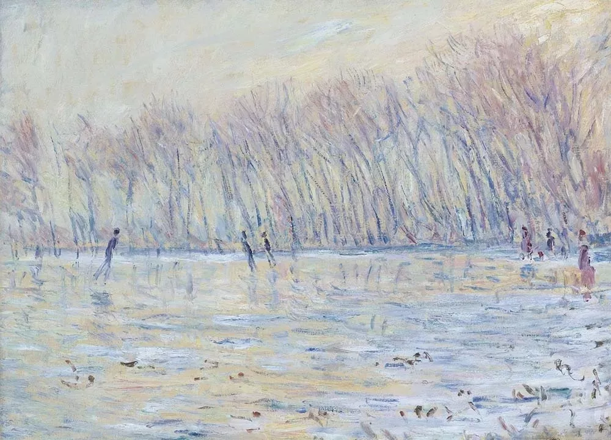
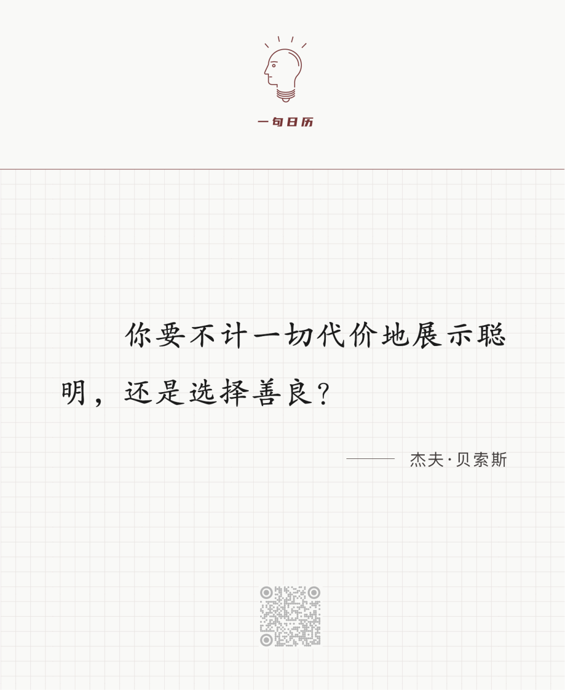

Claude Monet

  

长按二维码可关注  

  

创办了微信的张小龙先生不止一次说过这句话对他的影响。这句话其实应该影响更多人。

  

有些善良的人不聪明，有些聪明的人不善良。  

  

善良的人不聪明，那很致命，就像人形的猪与羊，全身都是宝，却无法保护自己。  

  

聪明的人不善良，那很邪恶，为了满足自己，可以把别人当成猪羊。  

  

所以，不聪明的善良者很容易成为不善良的聪明者的猎物。每个人在自己身边，都能看到这两类人，你很难认同、尊重其中任何一类，成为任何一类都不幸福，都是悲剧。

  

一件美好的事，美好的一生，只能是又聪明又善良。  

  

聪明是什么？是技能，是技巧，是算力，是知识，是机器能做的事。  

  

善良是什么？是感同身受，是于心不忍，是己欲立而立人，是温暖，是关怀，是人才能做的事，是更高一级的知识。  

  

有天生纯邪恶的人，无论后天如何培养，不能增长一丝善良，天生杀人狂、虐待狂就是这类人。与此对应，也有天生纯善良的人，无论处境如何艰难，不沾染一丝邪恶，他们不需要学习与维护自己的善良。  

  

多数人，需要学习在聪明与善良中达到平衡。人要越来越聪明，但如何使用自己的聪明，展示自己的聪明，是开是关，是多是少，得由善良来控制。聪明不是“不计一切代价”的，是有代价的，这代价就是不伤害别人，让别人获益、成长。有时你得笨一点，反应迟钝一点，吃一点亏，赢得少一点，这种看起来不那么聪明的聪明，是大聪明，是终极聪明，是克制。  

  

一切计划都是学习克制，克制天性中的放纵。今天是第159期“下周很重要”，不要小看你计划的每一件小事，我们的知识、善良、知识与善良的平衡，都在这些小事中增长。  

  

推荐：[《下周很重要2》](http://mp.weixin.qq.com/s?__biz=MjM5NDU0Mjk2MQ==&mid=2651666118&idx=2&sn=fa8dcdc328f67e39cf9b64db91dd520d&chksm=bd7fb2d88a083bce528625dda86835759a4ef08e5a5c7a6ec7fc64127d5a14a9844ebf5ecf0d&scene=21#wechat_redirect)  

上文：[年薪百万的女人却没有房子？原因没那么简单](http://mp.weixin.qq.com/s?__biz=MjM5NDU0Mjk2MQ==&mid=2651677152&idx=1&sn=629614c68fc3387cccf9a6b6b4b65a68&chksm=bd7fe5fe8a086ce84d74ddda3d8962d7985a65281a96362d9fecf34a5bb875509da23a853fb6&scene=21#wechat_redirect)
