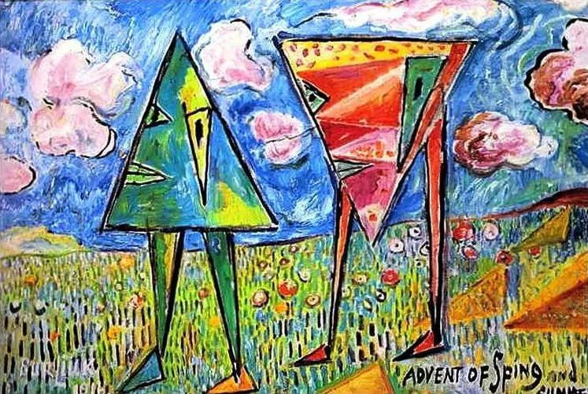

David Burliuk，Advent of spring and summer

  

连叔，您好：

  

现在是凌晨2点30分，我正在医院，原因是陪护喝醉酒的老公打点滴，看着他在打着点滴呼呼大睡，我真的是一股闷气油然而生。想给您写邮件自我梳理下目前的现状，当然如能获得您的指点，更是感谢万分。

  

家在深圳，目前关内关外各一套70平左右的小房。我是985硕士，最近刚换工作，变得很忙，加班很多，受领导重视，进步也大。老公985本科，毕业直接进了国企，工作不忙，但是因为工作离家60公里左右，不能天天回家。有一个5岁的宝宝，家里父母帮忙带孩子。我从8年前到深圳就一直没有归属感，到如今更是愈发强烈。仔细想来原因应该有三个：

  

1、 小孩身体不是太好，陆陆续续小病，家里照顾小孩的责任主要集中在父母身上，因为工作忙，所以当看到自己的母亲那么累的时候，觉得非常愧疚。

  

2、 目前住在关内，为了小孩上小学，学位房买在关外，离我如今上班的地方开车1个半小时，地铁短期内不通，所以意味着将来如果加班，我也不能每天回家，小孩没有父母的每天陪伴，真的可以吗？

  

3、 老公单位体制内，虽然很努力的工作，但是论资排辈，升级较慢，但为了这个所谓的升级，酒局必不可少，身体条件却不允许。也就是此刻我陪他在医院的原因。

  

其实我和我老公的感情蛮好的，他是一个善良的人，家庭责任感很强的人，但是在生活中的琐事中，我觉得我现在对他越来越不满，怕长此以往，是不是感情也慢慢淡了。

  

我想在35岁前离开深圳了，去离家近的地方，父母能习惯文化气候的地方，能住的了大房子的地方，小孩能上好学位的地方，自己没那么累，没那么心烦的地方。

  

我是逃避吗？也许是吧。其实以我对自己的了解我真的不是抗压能力很强的人，但在深圳的浪潮中，我不由自主的被推着往前走，毕竟不比别人努力就落后了。

  

谢谢，叔，好希望您能回复我。

  

一棵开花的树

  

* * *

  

一棵开花的树：

  

你们在深圳过得不错，为什么要离开？一家三代团聚，年纪轻轻有两套房子。

  

现在的问题都是暂时的。孩子身体不好？会好起来的。现在不通地铁？迟早会通的。就算没法每天陪孩子，一周有那么几天见不着，父母就是失职？就会伤害孩子？不至于，孩子没那么脆弱，人也不能那么脆弱。在一起时认真陪伴就行了。陪伴并不意味着必须每天见面，偶尔分离是可以的。

  

再说了，孩子的父亲在国企工作，不忙，他可以更多地承担陪伴孩子的责任。对了，你刚说过，他为了升级，得在不少酒局里拼，喝到挂瓶。好像时间也不多。确实像为某种潮流裹胁，不由自主。

  

酒，自古以来，无论中西，从来都是社交融合剂，这点不必否认。会喝一点酒，比起不会喝酒的人，有那么一点优势。但这优势可有可无，事情做得好更重要。只会喝酒，那是酒蒙子，在哪里都没有前途。你老公多挂几次瓶，在单位就能赢得酒蒙子的名声。其实原来风气不好时，也很少劝酒劝到人挂瓶，那也扫兴。更别说现在风气好很多，国企也受八项规定限制，酒喝得少了。

  

像你老公单位这样依旧狂喝滥饮的，肯定还有，但它不是潮流了，只是偷偷摸摸的反潮流。把他必须喝酒，以至于不能陪伴孩子，甚至损害身体，当成是潮流所害。那是对社会不公平的指控。他真顺应潮流与价值，每天下班就能回家陪孩子，父母可以轻松一点，孩子可以幸福一点，你的焦虑也少一点。

  

或许，他所处的这个国企是个特例，就是不拼酒不升级，那就不升级吧，都有两套房子了，怕什么呢？一点维护自己的价值观的勇气都没有，膝盖太软，只会下跪，走到哪里，在中国的任何一座城市与乡村，你都会觉得潮流很坏，裹胁着你。你无法责怪坏潮流，因为你本身就是坏潮流。

  

这个时代，深圳这座城市， 待你们不薄，收起抱怨，常怀感恩，修正自己，这是一个受益者应有的修养。

  

祝开心。

  

连岳

  

推荐：[《我爱问连岳》1至5再版，记录这个时代的爱](http://mp.weixin.qq.com/s?__biz=MjM5NDU0Mjk2MQ==&mid=2651671998&idx=2&sn=114f81297b8fbabbf6eed9c458c5c56f&chksm=bd7fc9a08a0840b656a62a8e5a395ea83393c33ea602208fcca4bb5fbf0308fef691929c8928&scene=21#wechat_redirect)  

上文：[成长的大挑战，撕扯感带来的痛苦](http://mp.weixin.qq.com/s?__biz=MjM5NDU0Mjk2MQ==&mid=2651673341&idx=1&sn=2989ef1f4d0ba273fa0db204fb7bf0f8&chksm=bd7fd6e38a085ff5cdd41389fe96f45481b03f143783e692226071a6c07d02b6ee0a82e1e7f0&scene=21#wechat_redirect)
