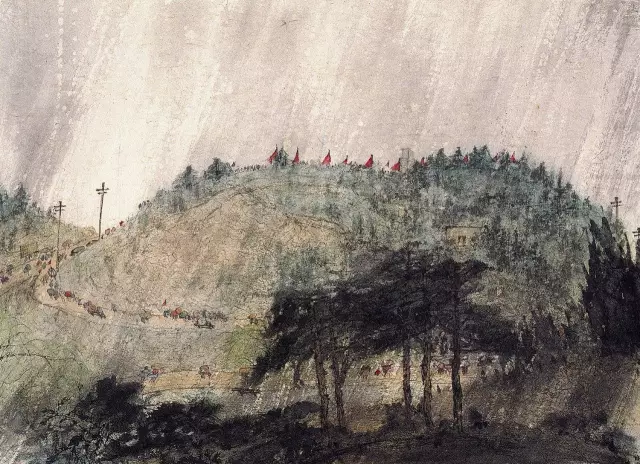

傅抱石，雨中雨花台  

  

经过了2020年，于世界的混乱，中国保留了一方净土。中国人了解中国的兴趣将大大浓厚起来。这兴趣是对的，浓厚起来也不应再淡下去。中国人应该对中国有深刻的理解，这样才对世界有深刻的理解，这样我们个人的命运与事业才不至于走歪。  

  

1918年，留学日本的周恩来20岁，他像当时的许多有志青年一样，苦苦思索救民救国之路。那时的中国，处于另一个极端，随时可能灭亡。在争论中，他的一位好朋友认为中国只能寻找一个俾斯麦似的强人，用铁血政策领导国家走向强大。周恩来认为只有强人不够，他没有没有工人、农民与学生的支持，挽救不了中国。没想到，这预示了中国两条路线的竞争。  

  

在世界强国中，由于只有苏联真诚支持孙中山的革命，国共开始联合。1924年，三个强大的年轻人聚在一起工作。31岁的毛泽东进入了国民党中央执行委员会与中央监察委员会；26岁的周恩来成为新成立的黄埔军校政治部主任；而37岁的蒋介石，是黄埔军校校长，开局便是个王者。  

  

现在很多人误将蒋介石视为笨蛋，其实他是很聪明，是俾斯麦似的强人，不亚于中国传统上任何一个权术大师。他好学、自律、在战斗中不怕死、在日记里自我反省；他赢取孙中山信任，也摘得宋美龄芳心；有终生追随他的知识分子，也有上海流氓供其驱使；他摆平党内大佬，他戏耍各路军阀。他呼风唤雨，他为所欲为，他成为中国最有权力的人。在获取与维护个人权力方面，他是中国最聪明的人。  

  

可是，他的苦主毛泽东站在更高维度对他实施降维打击。正如叶剑英晚年说的那样：要不是毛主席，我们今天还在租界开会。

  

毛泽东开局很低，低得无法再低，父亲只想让他干农活，反对他读书。一直到了15岁，他才攒了些钱“赎身”成功，正式进入小学。同班的小朋友对他说：你走错了，应该去读大学的。  

  

1927年，蒋介石背叛革命，屠杀盟友共产党人。毛泽东在失败中退向井冈山，只剩400多士兵，当地居民不过几千人。没人认为他有前途，共产国际也反对他去当“山大王”。  

  

毛泽东此时做了两点：一是向蒋介石学习，重视军队，他说，在这点上，蒋介石是先生；二是建立完全不同于蒋介石的军队。蒋介石的军队是维护个人权力的工具，共产党的军队是为了唤醒大众、保护大众。  

  

从三湾改编开始，毛泽东的建军理念是典型的从0到1，石破天惊，颠覆中国有史以来的军队观，也是蒋介石理解不了的。到三大纪律八项注意初步成形时，这支不发饷的军队具备了爆发性增长的理念内核。在战术上，毛泽东向“山大王”学习，总结出了著名的游击战，以少胜多，以弱胜敌。在蒋介石的围剿中越剿越强。蒋介石可能很沮丧，不过，当他后来看到这套战术在朝鲜战场把美军打上谈判桌时，应该心情会好一点，不是他弱，是他的对手太强。  

  

日本侵略者发动九·一八事变时，蒋介石一心只想维护自己权力的局限性，让他做出不抵抗的决定，这让他彻底失去民心，走上失败的不归路。他把主要精力放在反共。由于共产党犯了错误，一度似乎还反成了，把毛泽东和共产党逼去走长征。

  

此时，共产党的第二个大神出现了。在遵义会议上，周恩来从毛泽东的领导者和批评者转变为他的得力助手和忠实支持者，而且终生如此。这在权力史上不可能发生的事情，就发生在共产党的领导者身上。只有一个对权力毫无私心的人才做得出来，当周恩来意识到毛泽东才是正确的，他就毫不犹豫地认错，并放弃最高领导权。  

  

周恩来满足了中国人（甚至是全人类）对政治家的美好想象：文武双全，才华横溢，英俊潇洒，风度翩翩，无私无畏，善始善终，忠实于人民，忠实于爱情，鞠躬尽瘁，死而后已。（今天是他逝世45周年）

  

一个毛泽东，蒋介石都不是对手，更别说毛泽东还有帮手周恩来，只有被打哭的份了。其实毛泽东不只一个帮手，第一代共产党人精英云集，人才储备丰富，其中的一个，是周恩来留法时的朋友与同志，这个貌不惊人的小个子，直到毛泽东与周恩来去世后，才开始领导中国，大放异彩，他就是邓小平。  

  

2020年，对中国执政党的支持度，对中国的满意度，可能达到了一个新高度。回顾这100年的历史，大到政党要壮大，国家求复兴，小到个人想成长，都得符合青年周恩来所说的：再聪明的人，只有为人民创造价值，获得人民的支持，才有希望。  

  

祝愿这个国家，祝愿这个国家的每个人，永远走在正确的道路上。

  

  

推荐：[邓小平何以成为邓小平](http://mp.weixin.qq.com/s?__biz=MjM5NDU0Mjk2MQ==&mid=2651638360&idx=2&sn=718afca27076978620d55c68644de5a7&chksm=bd7e4e468a09c7500e5eacda834fc1a4410a25a027a95ff74181a526d2e77d1ebe7e2708df1e&scene=21#wechat_redirect)  

上文：[和准岳母谈判的能力证书](http://mp.weixin.qq.com/s?__biz=MjM5NDU0Mjk2MQ==&mid=2651672292&idx=1&sn=3ed45d35e3168148830820647e543684&chksm=bd7fcafa8a0843ec9383825138aa684397e859abf0a46160ad839409e1df5afeda612943b0a2&scene=21#wechat_redirect)
