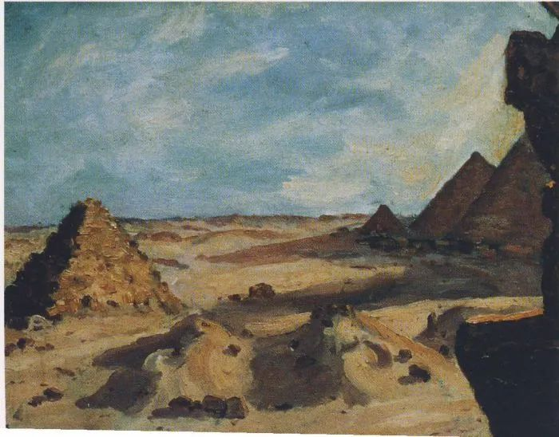

Winston Churchill，Near the Pyramids

  

对文学感兴趣，对历史感兴趣，对人类的命运感兴趣，温斯顿·丘吉尔就是一个必须知道的名字，他的作品就是你必读的作品。

  

他是一个创造历史的人。有意思的是，在20岁时，他就知道这点，并以此设计自己的人生。这也算是个人成长的典范。虽然其貌不扬，教育背景并非最佳，声线也无吸引力，甚至在放纵的饮食习惯中逐渐变成一个手持雪茄的胖子，但只要给他文字与演讲，他就能征服英国，影响世界。他凭借2000多场，400多万字的演讲，当了英国首相，赢了二战，得了诺贝尔文学奖，名垂千古。

  

这个演说界的莎士比亚，每一场演讲，他都仔细准备，精心打磨，把记录的秘书累得苦不堪言。他进入下院，当了大臣，许多演讲却陷入尴尬。不是尴尬得讲不好，丘吉尔演讲时，听众往往蜂拥而至，在该赞叹时赞叹，在该喝彩时喝彩，心满意足地听完后，他们投下丘吉尔的反对票。他们视他为下院的戏剧演员，贡献了非凡的独白，但不属于现实生活。他宏大的叙述，壮丽的排比，精美的比喻，深刻的警句，符合优秀文学作品的一切要件，不过，因为经常性脱离民众，给人自恋，浮夸，矫情与空洞的印象，他的真知灼见，比如预警绥靖政策的危险，必须团结一致对付野心初露的希特勒，也被当成哗众取宠，故作惊人之语。

  

直到欧洲大陆全部沦陷，强大的法国出人意料地投降，英伦三岛缺兵少炮，孤军奋战，此时，属于丘吉尔的历史才开始。苦撑的英国已无资源可用，最大的资源就是临危受命的丘吉尔首相，而丘吉尔最大的资源就是英语。他用一次又一次悲壮的、坚毅的、必胜的演讲，激励着英国人坚持战斗，勇敢承担责任，创造千秋万代历史上的“最光辉时刻”。丘吉尔交响乐一般丰富，史诗般用力的演讲风格，非常契合二战这件英国史上，欧洲史上，人类史上的大事，不是自恋，而是自我牺牲，不是浮夸，而是宏伟壮观，不是矫情与空洞，而是真情与洞见。最终，永不言败的丘吉尔及其国民，等来了纳粹德国愚蠢地侵略苏联，等来了美国的援助与参战，等来了希特勒的绝望自杀。

  

正如丘吉尔在80岁生日的演讲里所说的——这也是他人生最后一次杰出的公开演讲——我一直靠笔和舌头谋生，如果说我的战时演讲表达了整个民族的意志，那是这个民族有着雄狮之心，我不过是有幸被召唤发出狮吼。这才是所有读者阅读丘吉尔不朽作品时最该知道的价值，一个人的聪明，一个人的才华，一个人的一生，不关心他人，不与民族的雄狮之心连接，不为人类创造美好未来，是发不出狮吼的。

  

我们都应有一颗奉召狮吼的心。

  

  

推荐：[了解这四人，才能更好理解中国](http://mp.weixin.qq.com/s?__biz=MjM5NDU0Mjk2MQ==&mid=2651672428&idx=1&sn=747dcab92ff5c8d284c554e60cccdbe1&chksm=bd7fcb728a084264401c2c537b65aca532683e41b90a0e9a0e6d8805f22f16c22d0bf2c60dd5&scene=21#wechat_redirect)  

上文：[如果不能拉回这个姑娘，可能会有一点伤心吧](http://mp.weixin.qq.com/s?__biz=MjM5NDU0Mjk2MQ==&mid=2651675049&idx=1&sn=d1ca9b5ecd3846cdf6fe4fb8cd007f8d&chksm=bd7fddb78a0854a1f073590a8b5813811124ce59f6af7a9809b2b7a7618c298da0329b320208&scene=21#wechat_redirect)
