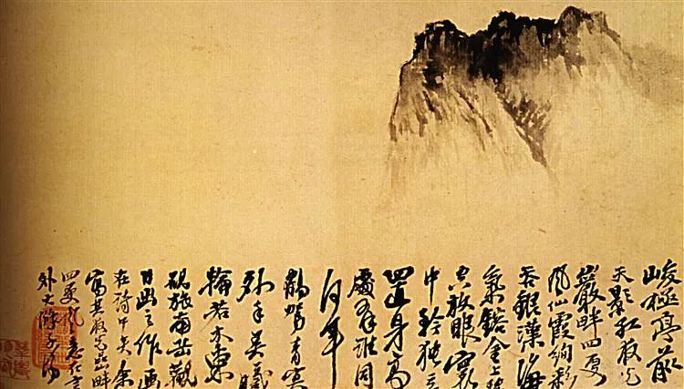
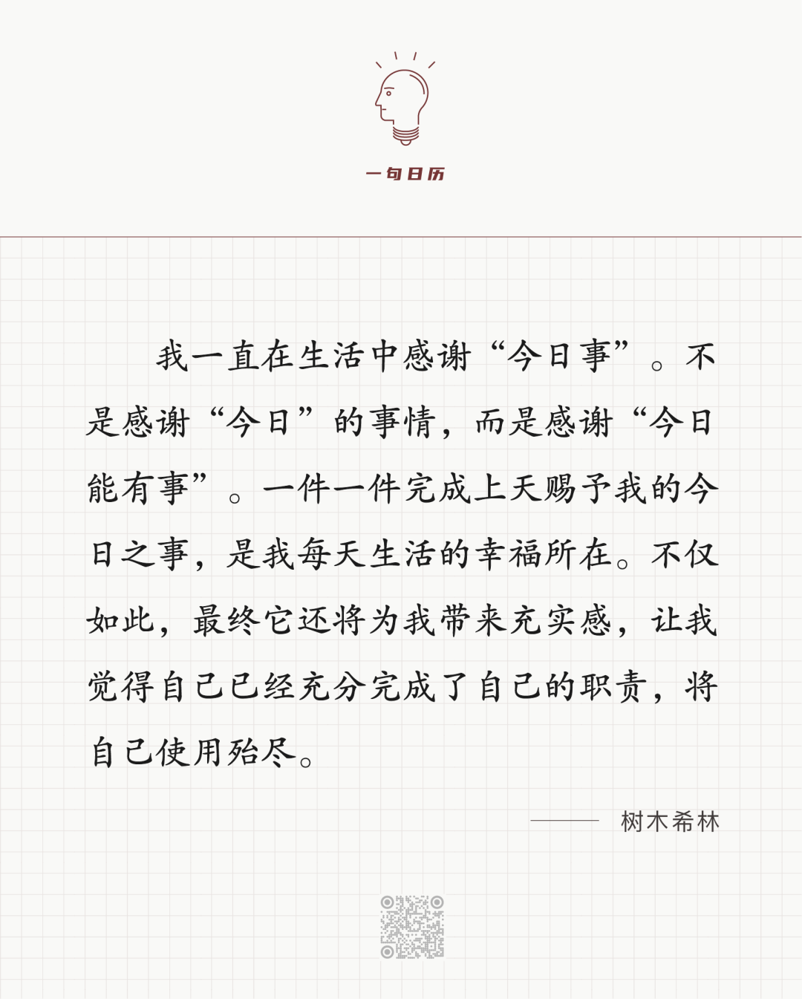

石涛，孤山

  

长按二维码可关注

这句话让我想到一套书，当时一上手，我就觉得一定要推荐。

  

读了半辈子书，已经有了“书感”，有些好书一眼看得出来。

  

这套书，虽然一千年一万年后都有读者，但短时间内，应该没有几个读者。我也不认为每个人要读，我放在办公室里，也只是随便翻翻。换言之，公司的设计师作设计，编辑写文案，从经济效益来看，并不划算。这个经济账也马上有结论。

  

但有些事不能只算经济账，只要参与，就能获得价值感，这是无价的。

  

其实，从作者、译者、出版者，人人知道，这套书或许不能赚钱。我却能肯定，每个参与者都知道自己在做一件极有价值的事，耗费巨大的心力，出一些寂寞的书，等一个时代的几个读者——这些书对他们来说，很重要。对一个文明来说，不可或缺。

  

这套名为《近代以来海外涉华艺文图志系列丛书》，目前包括以下几本：

  

《华北考古记》（全四册），作者为法国的埃玛纽埃尔-爱德华·沙畹，学术界公认的19世纪末20世纪初世界上最有成就的汉学大师。

  

《中国雕塑史》（全三册），作者为日本的大村西崖，著名美术史学者、美术评论家。是梁思成授课时的参考书。

  

《中国建筑史》《中国纪行》，作者为日本的伊东忠太，著名建筑史学家。

  

《中国古代建筑与艺术》，作者为日本的关野贞，建筑史研究家，在中日建筑史上，地位重要。

  

《云冈日录》，作者为日本的木下杢太郎，此人为皮肤科领域的权威，也是诗人、剧作家、美术家、史学家。多才多艺的他1920年9月游历云冈，陶醉于石窟艺术，写就此书。

  

《中国佛教史迹》，作者为日本的常盘大定，高僧，宗教学家，东京大学教授。

  

翻开其中任何一本，都可看到巨细无遗的史料，珍贵的图片、拓印、素描，其后都是惊人的毅力、专注与耐心。我摩挲这些书，仿佛握住作者有力的手。你若有机会在图书馆、书店遇见这些书，也请净手摩挲它们。

  

今天是第156期“下周很重要”，我们也能像人间这些伟大的、坚韧的、日日做辛苦之事的创作者一样，创作出有价值的人生。你一天天完成计划中的辛苦之事，多年以后，也将被世界一眼认出。

  

推荐：[因为好小，所以好大](http://mp.weixin.qq.com/s?__biz=MjM5NDU0Mjk2MQ==&mid=2651670165&idx=1&sn=0fbcdd9e458705ca3d8272084d22d6cf&chksm=bd7fc28b8a084b9dee011f04e48214b364bbc0fb1b9fb3bfc7fc18a9940fd107d42cae5b2940&scene=21#wechat_redirect)  

上文：[了解这四人，才能更好理解中国](http://mp.weixin.qq.com/s?__biz=MjM5NDU0Mjk2MQ==&mid=2651672428&idx=1&sn=747dcab92ff5c8d284c554e60cccdbe1&chksm=bd7fcb728a084264401c2c537b65aca532683e41b90a0e9a0e6d8805f22f16c22d0bf2c60dd5&scene=21#wechat_redirect)
