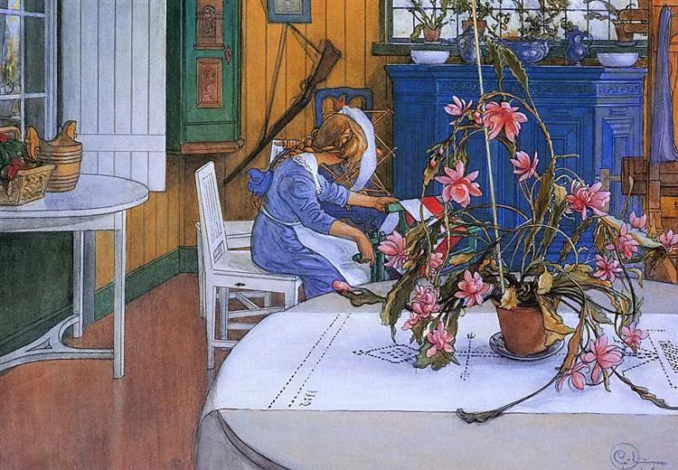

Carl Larsson，Interior with a Cactus

  

昨晚8点左右，警察敲门，他们逐家宣传防诈骗，提醒不要相信任何所谓的投资、返利。在小寒这天，辛苦得很。去年以来，更多地体会到基层警察与社区工作人员的不容易。

  

看来，春节近了，诈骗也多了，大家真要更加小心。接到什么有便宜可占的电话，你至少可以让他半小时后再挂。这半小时，你什么也想清楚了。骗局多想一想，往往到处漏洞，只是你一急就看不见。

  

防骗是人必备的财技之一，不然的话，省吃俭用攒的钱，总是被骗走，就没有幸福可言。为什么说“总是被骗走”？那是因为生活中除了职业的、恶意的骗子，还有更多无意的、甚至是善意的坑，它们的危害可没有警察来提醒你，你只要掉进去，就相当于受骗，掉一次，白干一年，或几年，或半生一生。

  

所以说，财务安全与人生幸福，某种程度上是具备一些常识，并非只和收入相关。

  

很多工薪阶层感叹自己辛苦。这肯定是事实，不过，大多数人只能是工薪阶层，只感叹辛苦是不够的。辛苦是各阶层都有的，老板天天担忧公司生存，辛苦；亿万富翁有个挥金如土的败家子，也辛苦。家家有本难念的经，世上总是苦人多。

  

在现有技术条件下，工薪阶层离苦得乐，财务安全与人生幸福双丰收，我觉得是做得到的，就是观念建设问题。这观念就是三个“该”：该进取的进取，该谨慎的谨慎，该忍受的忍受。该进取的你谨慎，该谨慎的你进取，该忍受的你抱怨，那就苦海无边。

  

何时该进取？想想家庭最重要的物质保证是什么，没错，就是房子。一个家庭，有自己的房子，就踏实了，其他花费不大的。别人喝茅台，我喝啤酒，一样开心。我觉得喝啤酒更开心，夏天下班之后，一瓶冰啤酒，几只卤鸡爪，一碟花生米，家人围坐，心无挂念，真是人间大乐，花得了几个钱？谁承受不起？买房时一定要进取，这是安全与幸福的基石，不要被房贷的数字吓到，那只是强制储蓄而已。

  

何时该谨慎？想想你最不能失去什么重要物质，没错，还是房子。抵押房子或卖房子去创业，去投资，去留学，绝对禁止，想就是犯罪。种种高回报的事，即使不是骗局，也往往伴随着高风险，这风险工薪阶层承受不起，输掉房子，大概率买不回来了，之后的人生非常被动。

  

欲望得不到满足，生出难忍。难忍也得忍，忍几次可以生出定力。我们得接受一个现实，很多欲望在我们的能力之外。工薪阶层，大到别墅，小到奢侈品，我们不要去想。自己这关过了，还要教育孩子。孩子还没度，想这想那，生出无法满足的欲望，此时培养他实事求是，从家庭的现状出发考虑问题。他越闹，越怨，越不能娇惯，工薪阶层一旦养出娇子，虚荣攀比，不仅意味着上升空间关闭，更预示着下坠的痛苦。忍得了自己一时的心软，受得住孩子一时的委屈，他长成一个务实、礼貌、守信、吃苦的人，无论天资如何，是否读过好大学，一定会过得幸福，也一定能比这一代走得高。

  

我们都已经具备幸福的能力，用好就有幸福。

  

推荐：[《我爱问连岳》1至5再版，记录这个时代的爱](http://mp.weixin.qq.com/s?__biz=MjM5NDU0Mjk2MQ==&mid=2651671998&idx=2&sn=114f81297b8fbabbf6eed9c458c5c56f&chksm=bd7fc9a08a0840b656a62a8e5a395ea83393c33ea602208fcca4bb5fbf0308fef691929c8928&scene=21#wechat_redirect)  

上文：[不当“英国病人”](http://mp.weixin.qq.com/s?__biz=MjM5NDU0Mjk2MQ==&mid=2651671998&idx=1&sn=89c9651a330c2455028e2b5344393dbe&chksm=bd7fc9a08a0840b68402d88b046f5d66772d2b8161f09fdbcd88fa756cd30567042c1e3c14e7&scene=21#wechat_redirect)
