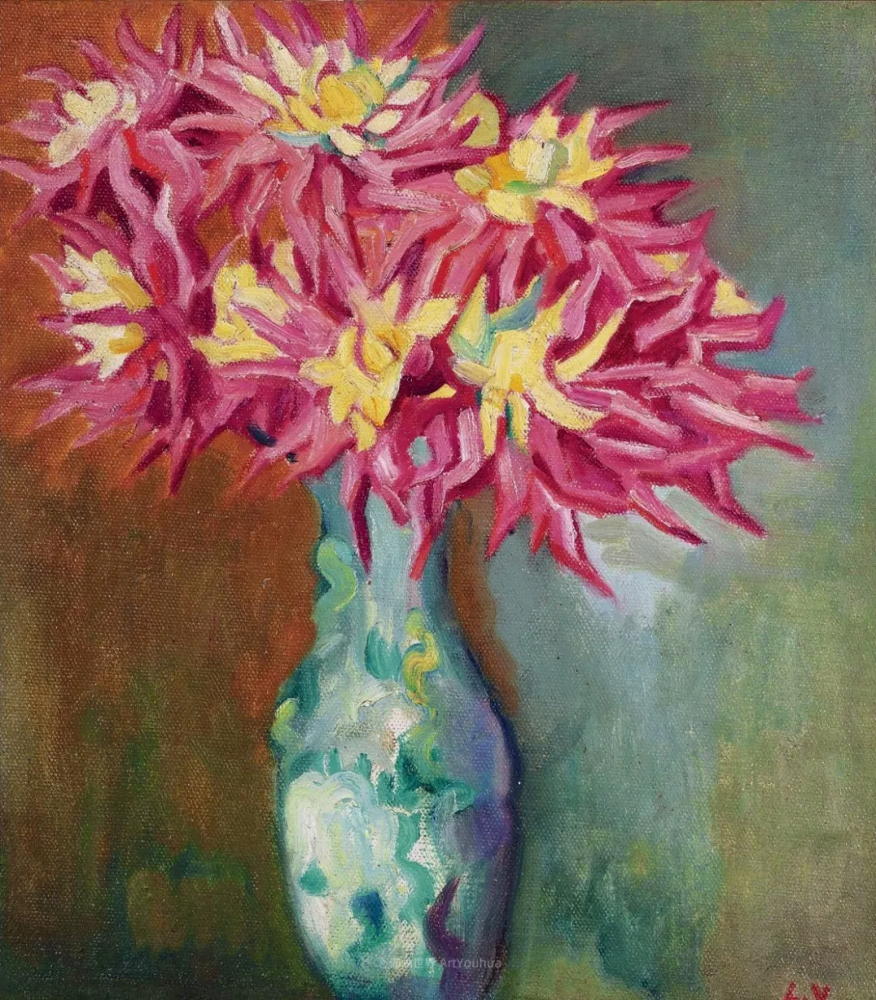

Louis Valtat  

  

连叔您好：

  

这篇文章来意主要是为答谢您，让我在迷茫的深渊中看到前进的方向。

  

今天注定是不平凡的：

  

早晨醒来像往常一样打开手机准备吸收来自互联网的各种信息，本来睡眼朦胧的我却被[连叔的文章标题给惊醒了](http://mp.weixin.qq.com/s?__biz=MjM5NDU0Mjk2MQ==&mid=2651675949&idx=1&sn=6683ae68503078e33d86a3ff94c2cf26&chksm=bd7fd9338a08502520235cae01c5b0bda3757c6a69e1fd9a4f315914e6fd72634ea5b3bd1c8f&scene=21#wechat_redirect)，我知道，一直等待的答案来了，心是颤颤巍巍的，打开文章，因不敢直视连叔的真言，选择先一字一句咀嚼自己的来文以勇敢面对接下来的“答案”。当读到连叔的回信时，心被一言一语敲打着，竟不知语言有如此大的力量。

  

我爱极了您的一句话：“不想要汗水和泪水，很简单，那就不配有爱，不配有好一点的人生”，批评我的同时也让我清晰认识了自己的无知与自私。在这之前我毫不怀疑我是善良的人，我爱我的家人，我爱我的男友，我也爱爱我的朋友。今天才知道我的爱是狭隘的，在这点是我完全不如我男友，他爱自己家人的同时也深深爱着我的家人，他会时刻提醒我给他们打电话送温暖。

  

我想我不该犹豫是否愿意继续走下去的，作为实实在在的90后，身边充斥着像我这样年龄却因结婚有车有房的朋友，她们也很幸福，这让我觉得放弃爱情换来钱财的选择是否也是对的，我承认我慌了，乱了。竟忘记当初相恋也是因为他身上那些可贵的品质，大学的时候也不乏反对之声，理由也不过是些两人外表之所差，家庭背景之所低，那时不曾有一刻动摇之心，甚至对她们的反对嗤之以鼻，口口声声告诉他们，你们并不懂他的好。写到这里心是哽咽的，不忘初心谈之容易，做之何难。

  

文章底下的留言让我真实的感受到，如果我选择离开将是多么不智，看到很多人都与我相似，却依然过的为之向往，心里那颗浮躁的心被安抚了下来。生活的“苟且”我和他一起面对，梦中的“诗与远方”我愿与他一起实现。

  

想清楚了这些，我把这篇文章发给了他，也并未告诉他文中主角是他自己，当他看到标题的时候，就惊叹问：我就值20万？我能感觉得出看文章的时候，他心肯定是有所触动的，期间反反复复问是不是我写的，我想知道作为一个旁观者他会是什么反应，我说不是的时候，他惊喜又惊叹并称它为“及时雨”。

  

男友看完文章之后，发了一长段话给我，以下是其中几句：

  

我仔细点看这篇推送，并给留言祝福的默默点赞；对于房子车子的问题，我内心仍然十分清楚并早也有计划；你更优先买下房子定下，我不愿意反驳，是你不清楚之后发展状况会是什么，举家负债买的房子不是为了浪漫就给整了；表达这些，还是想让我们处于同一战线，知道我们的实际情况，什么才是最优选择。

  

今天，是我和他划时代的一天，与过去的纠缠说再见，与未来的困难说你好。

  

谢连叔，谢您们 。

  

一个拾得金子的人

  

* * *

  

一个拾得金子的人：

  

恭喜你做对了一个重要选择。人一生的重要选择不多，就那么三五次，选错其中一两次，人生就很难纠正回来了。有什么遗憾大得过浪费一生？

  

年轻恋人，普遍面临的一大选择挑战就是要物质，还是要爱情？大多数恋爱中的年轻人毕竟出身于普通家庭，家里给的物质资助有限，他们的父母此时也到了养老压力与医疗支出增加的年龄，自身物质压力更大，在有限的物质里，如何分配给孩子一点资助和给自己一点保障，左右为难。完全不相干的人，也能体会到他们的辛酸，自己爱的孩子没有同理心，一味逼迫，那会让他们觉得人生太苦，世界太冷。

  

任何一个正常的孩子，都不会做这种事，如果用恋爱与婚姻的名义让一个正常的孩子反常，竟然去做这种事，那就让他异化成为一个不会爱的冷酷者，相当于亲手毁掉了你爱的人。更为悲剧的是，付出的成本这么大，并不能从父母身上榨出多少油水，解决不了年轻人的物质渴望。一念地狱，将所有人都拖入地狱，这就是选择的威力。

  

并不是说物质不重要，上面的挑战恰恰说明物质重要。十天没饭吃，再美的爱情都会饿死。但两个相爱的孩子，经常没有好的物质基础，这时候，要使用延迟满足，要学会往前看，你还年轻，还不知道品格与能力的雪球效应，让我教你一个简单的公式，你现在的物质压力，乘以十倍，你十年后都不是压力。穷没有关系，年轻人基本都穷，给爱情一点时间，它一定能战胜穷。爱神与财神是同一尊神，两个相爱的人，最后都不会穷。

  

物质重要，在极度渴望物质时，这条常识容易被曲解为“唯有物质重要”，只要有房有车，甚至只要给我20万，人生从此再无烦恼。以后，你有了2亿，也会有烦恼。物质只是人生价值的多个维度之一，含着金汤匙的人，身家亿万的人，能继承大笔遗产的人，如果得不到别人的尊重和爱，烦恼更大，物质满足是短暂的，尊重与爱才是长久的。

  

有些人发了财，言语猥琐，行为失德，甚至用些小物质去毁掉年轻人的爱情与一生，你会尊重这种人吗？你想成为这种人吗？这种人在年轻时，或许也单纯，也有爱情，只是在一次次重大选择中，他选择了满足自己的欲望胜过一切价值，毫无顾忌地伤害爱他的人，慢慢长成有钱的浑蛋。

  

只有物质的一生是廉价的，有爱的一生才是高贵的。只追求物质的一生必然无爱，有爱的一生却基本有物质。穷，不是年轻人的缺点，只是年轻人的特征，没有爱才是他的致命缺点。一个人放弃爱的信仰，等于宣布自己的死亡。年轻时放弃爱的信仰，那不过是死得早一点。这不是我们的一生。我们值得过高贵的一生。

  

祝开心。

  

连岳

  

推荐：[爱到6！](http://mp.weixin.qq.com/s?__biz=MjM5NDU0Mjk2MQ==&mid=2651672292&idx=2&sn=06825c45bb5845f8219931cc399935ff&chksm=bd7fcafa8a0843ecf043436aa110ba6cc65582662325564a54cc877397f694880856fc97af30&scene=21#wechat_redirect)  

上文：[谢谢你，那个姑娘拉回来了](http://mp.weixin.qq.com/s?__biz=MjM5NDU0Mjk2MQ==&mid=2651675332&idx=1&sn=8e30ec26d05c228b418fb25c7a343cd0&chksm=bd7fdeda8a0857cc12c0db2046a6a2870f625f562bfa057de5ed2a5f15a7a7f7054de92dd775&scene=21#wechat_redirect)
