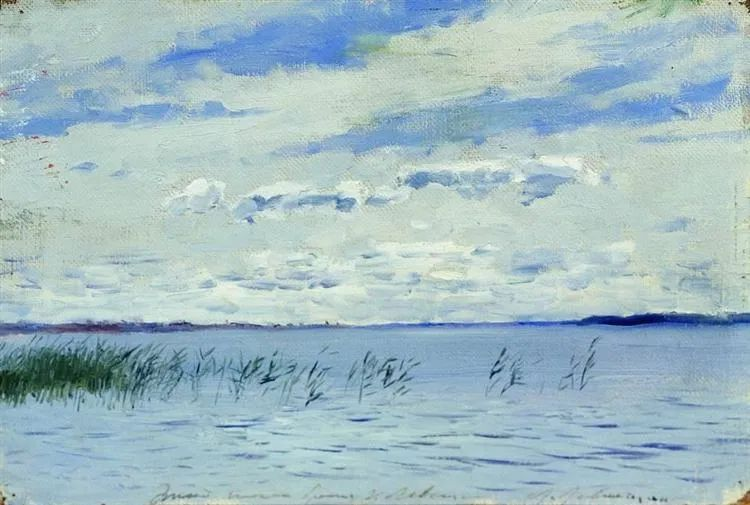
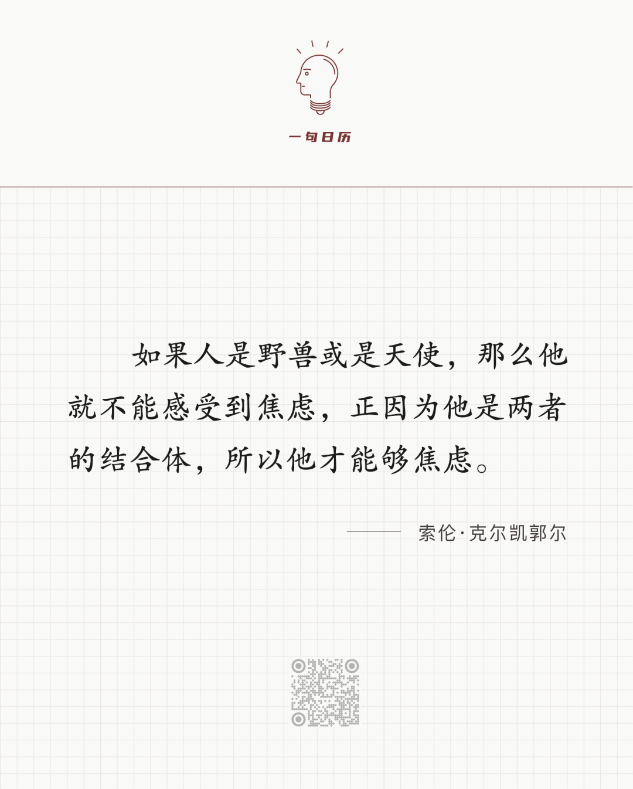

Isaac Levitan，Lake

  

长按二维码可关注

  

这句话真好，越琢磨越好。琢磨清楚了，就得到了防焦虑的根本大法。

  

没人喜欢焦虑，它让我们睡不好，吃不香，手心冒汗，脾气变坏。所以人自然产生这样的想法：如果没有焦虑，那该有多好！

  

如你所知，人的大脑反应有两个机制：战斗或逃跑。这是人类的祖先在捕猎或被捕猎时形成的本能，判断出能捕猎对手时，比如面对兔子和山羊，就战斗，猎豹或老虎逼近，判断出将被它们捕猎时，就逃跑。

  

焦虑是另一种对手，它是无形的。似乎可以捕猎它，毕竟我们都有战胜焦虑的体验。似乎它又永远在捕猎我们，一个焦虑去了，一个焦虑又来，今天的焦虑刚睡着，明天的焦虑又将起床，无穷无尽，绵绵不绝。它是一个矛盾体，是可胜的，又是不可胜的。

  

当我们想逃离焦虑时，它就是不可胜的。这种想法默认的前提是，在另一种状态下，焦虑不存在。总以为，另一个地方，另一个职业，另一个怀抱，将无焦虑。即使另一个地方更繁荣，另一个职业更耀眼，另一个怀抱更温暖，可是发现焦虑依在。抽刀断水水更流，因为逃脱不成，焦虑更甚。

  

让我们仔细分析一下，焦虑是什么？是担心自己的表现达不到预期，是害怕实现不了计划，是用力握紧一把未来之沙。人有时间感，有未来感，所以才有焦虑。野兽不理解时间，只按本能行事，没有焦虑。天使（如果有的话）全知全能，知道过去现在未来一切事件，也没有焦虑。只有人，既知道时间，又无法算清未来，才会产生焦虑，才有能力焦虑，才有资格焦虑。焦虑是人的一部分，你没退化成野兽，也没进化成天使，一生都是人，那就一生都有焦虑。知道这点，面对焦虑，也就不逃了。注定逃不了，有什么可逃的？不那么焦虑的人，与焦虑共生的人，或多或少，都悟到了这点。

  

按照统计原理，在平均线以下的事件占多数。比如人品平均分若是80分，那么低于80分的人占多数。其他事情大致如此。辛弃疾写道：“叹人生，不如意事，十常八九。”这描述的其实是科学的统计结论。换言之，我们的生活常态是不如意，有遗憾。就像我写完这篇文章，肯定不如我想像中的好，但我并不会太焦虑，因为我知道永远也没有一篇文章有想像中的好，应该尽力去写好，但不可能最好。丘吉尔是世界上最好的作家与演讲家之一，终其一生，他在演讲前也要不停修改讲稿，克服焦虑。只要是人，就有不如意，尽力就好，尽力就可放过自己，该吃就吃，该睡就睡，脾气仍然要好。

  

获得未来之沙，手不攥那么紧，用放松的手掌托着，所得之沙还更多。

  

推荐：[换换我们的底色](http://mp.weixin.qq.com/s?__biz=MjM5NDU0Mjk2MQ==&mid=2651637926&idx=2&sn=d59e25a9d5521d31b594f5e7c6698092&chksm=bd7e4cb88a09c5aef67e6352a83e04ddd7e716fd42e2b60bd123b2baa4b0000f1998824e5042&scene=21#wechat_redirect)  

上文：[为了升级，喝到挂瓶，这坏风气怎么办？](http://mp.weixin.qq.com/s?__biz=MjM5NDU0Mjk2MQ==&mid=2651673452&idx=1&sn=47a9597a4d4361fa9f41d96b8e6a7b71&chksm=bd7fd7728a085e64f056b78acc4bdcb9c03d14e5851c2c87d133076152469d179012cd6bf19a&scene=21#wechat_redirect)
