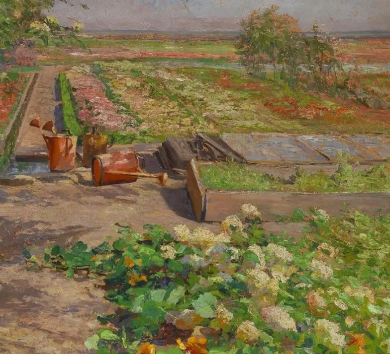

Olga Wisinger Florian

  

连叔您好:

  

我有一个相知相恋5年多的男朋友，这期间分分合合。我们陪伴度过大学四年异地时光，双向奔赴不知疲惫，现在回想起来全是甜蜜。本坚信着大学毕业找一个喜欢的地方一起工作，不再异地，但是由于一些原因现在仍然处于异地相处状态。我们之间的感情一直挺好的，并且幻想过无数次结婚的场景，我想在工作之前我一定是毫不犹豫的想要嫁给他，但是现在我犹豫了......

  

我们现在都25岁了，我跟他商量想要在27-28岁结婚的时候贷款买房子，希望他妈妈可以帮忙出一点钱，我心中想的是大概20万左右的样子，但是他告诉我说家里没有这笔钱，拿不出这么多，最多几万，剩下的靠我们自己。他爸爸妈妈都是工厂上班的，家里有3个孩子，两个妹妹，有个妹妹已经出嫁了。男朋友是211大学毕业的，他告诉我家里供他读大学已经很好了，根本没有存款。我说：可是如果只靠我们两个，我们估计30多甚至40多才可以买的起城市的房子。他说：是这样的。我告诉他：那太久了，我可能等不了，我想要一个家，我说难道要分手吗？他说：都听我的，我选择留还是不留。

  

连叔，我现在犹豫的原因就是：如果真的他爸妈没办法支持，那我估计年轻的时候就是跟着男朋友一起苦房子，然后结婚生孩子，照顾孩子，这样的生活务必是曲折艰苦的。我只是希望能在年轻的时候可以有个房子，房贷一起还没关系，甚至我可以不要彩礼，房子对于我来说就是一个安身立命的家。朋友会告诉我说，太苦了，不要继续了，趁现在年轻找一个合适结婚的。但是我跟男朋友之间的感情说不尽，他本身是一个挺努力的男孩子，只是起点比较低，他会很辛苦，我每次想离开的时候就会想他爸妈支持不了他，他也很难过，但是他没办法，他得继续。

  

我不知道现在该去还是留......

  

一个迷茫的等候者

  

* * *

  

一个迷茫的等候者：

  

你寥寥数语描述你男朋友，以我现在阅人能力来看，他有大好前程：

  

他毕业于好大学，这个起点少数人才有；

  

他体谅父母的难处，理解父母的能力边界，不逼迫父母，让他们陷入“无能感”的内疚与伤心，这是一个有情有义、善于体谅他人的孩子；

  

他尊重你的选择，多年的感情，去留都由你定，不给你画饼，不害怕，不纠缠，更没有道德绑架，指责你太物质，没远见。他冷静克制。

  

面对你的要求，他必是伤心痛苦的，这可能是他人生第一次艰难选择，但他体现得很有尊严，只愿自己面对一切，不把压力转嫁给他人。这是个勇士。

  

有胆，有识，有爱，没情绪，25岁的他，已然到了这种高境界，大概率，他的人生应有尽有，有房，有钱，有地位，时间问题。这也可以理解他为何不怕你离去，他有自信肯定有个好姑娘在等他——对这点，我比他更有信心。我是真喜欢这样的年轻人，他们是世界与未来真正的主人。

  

万事万物，终究是个概率问题，这是量子物理学揭示的真理，恋爱也是这样，年轻人的恋爱更是这样，他们的未来并没有展开。恋爱就是你的概率判断，大概率他有好未来，就是成功的恋爱。当然，大概率不是100%，只是90%，95%，99%，再好的人与事，都有变坏的可能性，1%的意外，有时也会掉在自己头上。这是我们生存的风险，逃脱不了，任何恋爱都有这种风险，没有无风险的恋爱，没有0风险的人生。

  

过几年，20万，房子，大概率不再是男友的难题，但也有极小概率永远是他难题，就看你愿不愿意接受这个风险了。其实，只要有房子就嫁，其他不管，未来一样有风险，可能理念不合，婚姻痛苦，可能人生经营不善，得卖房抵债。

  

恋爱与婚姻，最有意思的，不是你到了连叔这个年纪，不再为任何物质发愁，而是一起白手起家，一起经历风雨，一起战胜磨难，这种共同经历把两个人揉碎了，和在一起，又分成两个，你中有我，我中有你，这才是爱。爱不只有轻快，也有汗水，不只有笑容，也有泪水，靠这汗水与泪水，两人才揉成幸福的一团，才能理解真正的爱。

  

你不想要这汗水与泪水，很简单，那就不配有爱，不配有好一点的人生。想不清这点，有再大的房子，也斩不断痛苦，想清楚这点，就不会怕压力与烦恼，住个小房子，也很幸福。

  

你认为榨一榨男友那当工人的、尽力抚育了孩子的父母，他们就滴得出20万买房子，为什么不想一想，自己两人正年轻，压一压自己，不难挣这20万？老人家榨了一辈子，油可比你们少得多。

  

祝开心。

  

连岳

  

推荐：[《我爱问连岳》1至5再版，记录这个时代的爱](http://mp.weixin.qq.com/s?__biz=MjM5NDU0Mjk2MQ==&mid=2651671998&idx=2&sn=114f81297b8fbabbf6eed9c458c5c56f&chksm=bd7fc9a08a0840b656a62a8e5a395ea83393c33ea602208fcca4bb5fbf0308fef691929c8928&scene=21#wechat_redirect)  

上文：[好的爱，好的人生，是不会停止的，是无穷上升的](http://mp.weixin.qq.com/s?__biz=MjM5NDU0Mjk2MQ==&mid=2651675851&idx=1&sn=57e30dacc2bba08d0ffbf0c3e57695a3&chksm=bd7fd8d58a0851c39d382784d859a486da331948a49bcd36e9c5c5c291759b803bb66e975ae2&scene=21#wechat_redirect)
