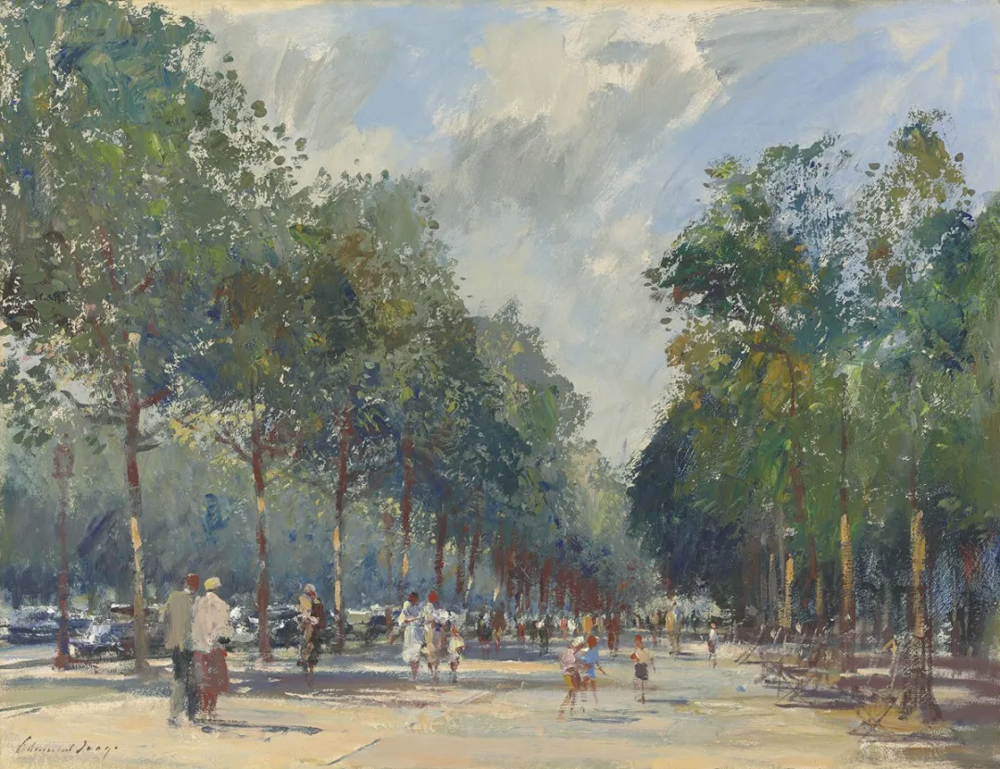

Edward Brian Seago

  

“房贷停了”！不少读者要求说说这事。其实不是房贷停了，而是一些热点城市，银行当月额度用完了，下个月才有额度，依此类推，申请房贷的客户，只能排队等候，有人可能要等比较长的时间。

  

市场之所以有变化，源于2020年12月31日，人民银行、银保监会发布《关于建立银行业金融机构房地产贷款集中度管理制度的通知》，将银行分为五档，并设立区别性的“两条红线”指标。额度最高的中资大型银行，房地产贷款占比上限为40%，个人住房贷款占比上限为32.5%。就像“房住不炒”政策将是长期性的一样，房贷额度控制也将是长期性的，是前者的具体化。

  

这将造成市场的相应调整：房子交易难度增加，流动性变慢。越是热点城市，越是如此。“炒”是不太可能了，但不意味着你将会没有房子，只要你摇到了房，慢慢等，总能等到贷款，这点，倒是不用怀疑。房地产市场永远不会死掉，只是被严格限制，从生产到消费都是如此，借用杠杆大干快上的日子结束了，杠杆率高的开发商撑不住，杠杆率高的个人也走不远。

  

对于大多数人的能力来说，也就是一辈子在热点城市买一两套房子。无论如何限制，限制不掉你这个目标，也不可能限制，不然如何实现“房住”？珍惜好房票，多等一点时间，你总能实现这个目标的。

  

房地产市场的竞争，在多数时候是观念竞争，而非财力竞争。两个财力相当，够一够能上车的人，一个判断得出好城市、好房子，肯吃苦、有韧性，更早上车，另一个总是在等房地产崩溃，中国崩溃，永远观望，谁敢说房价要涨就骂谁。十年以后，他们的财力完全不是一个量级，后者可能连一个完整的家庭都维持不了。观念不到位，体现在抓不住机会，机会硬塞给他，他也觉得烫手，非扔掉不可。观念就是财富。没有观念护持，财富一定消失。

  

房贷政策调整后，买房周期变长，对观念要求更高，需要你更能忍，更不容易动摇，恋人或夫妻也要能够保持一致不冲突。不然的话，好城市的房票也拿不住，这两种反应挺常见：一是赌气，这么麻烦，这么难，老子不买了。二是被焦虑冲昏头脑，非马上入手一套房子才能安心，此地要等贷款额度，那就随便找个地方下手，或是公寓，或是店面，或是旅游地产，或是故乡18线县城的房子，完全不知道，此房子非彼房子的区别，大过人与猪的区别，一套没有前途的房子，只会消耗你的财力与资格。更有甚者，钱放在手上就痒，骗子一忽悠什么高收益低风险项目，就全给人以实现自己“全款买房”的白日梦。

  

房子是多数人一生最大、最关键的一次投资，可惜的是，有些人买部手机，各种配置如数家珍，有得是耐心比价和排队，买房子却懵懵懂懂，无知无畏，完全丧失理性，只有情绪，厌烦做一切功课。这种心智状态，在限制日严的、交易周期变长的考验中，是必败的，一定要避免。

  

推荐：[读懂《大国大城》，理解房地产](http://mp.weixin.qq.com/s?__biz=MjM5NDU0Mjk2MQ==&mid=2651638759&idx=2&sn=a99512bbfe2e2b2c774733447b783231&chksm=bd7e4ff98a09c6ef800baecc789610e65d5d839baebe52da7e92e74eb2859ea73403ee471bbf&scene=21#wechat_redirect)  

上文：[开心，这个姑娘也拉回来了](http://mp.weixin.qq.com/s?__biz=MjM5NDU0Mjk2MQ==&mid=2651676208&idx=1&sn=65ca07823f9709aea88247e1c39f6efb&chksm=bd7fda2e8a08533873a4d0b3d9220a1c66195f96630737018e496a42b17da85b3cacb9af7dc0&scene=21#wechat_redirect)
