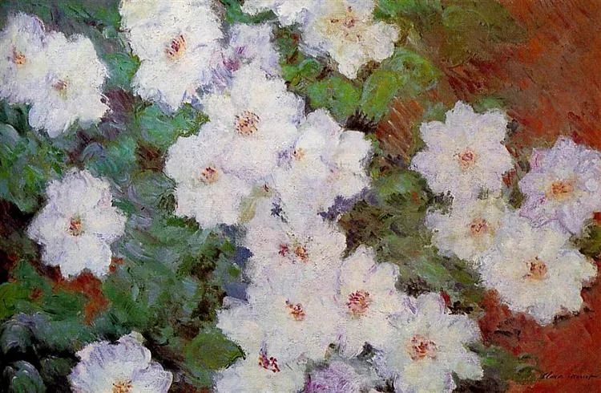

Claude Monet，Clematis

  

连叔：

  

我是[那个傻女大学生](http://mp.weixin.qq.com/s?__biz=MjM5NDU0Mjk2MQ==&mid=2651675049&idx=1&sn=d1ca9b5ecd3846cdf6fe4fb8cd007f8d&chksm=bd7fddb78a0854a1f073590a8b5813811124ce59f6af7a9809b2b7a7618c298da0329b320208&scene=21#wechat_redirect)，今天我明确且坚决地表示了拒绝并删除社交软件以及他联系方式。

  

感谢耐心温暖的连叔以及留言区读者，无论是否能收到我的感激，我从心底感谢你们的善良、劝诫、包容或者愤怒、批评，真的很抱歉，让大家伤心了。

  

18岁那天，我告诉自己，即日起没人有义务对你负责，所有事情你应当独自承担。曾阅读连叔痛批中年人的回信，读来酣畅淋漓，本做好了被痛批一顿的心理准备，可是一行行、一字字咀嚼回信、留言，竟觉得痛而温暖，凝视深渊太久，竟忘记了这个世界上还存在许多朴素而无价的情感：善良、同理心、慈悲、乐观......这些情感存在于具体的每个人身上，无关乎抽象的“人类”，无关乎永恒的时空，更无关乎高深的哲学。

  

一个无知且自以为是的女孩，走得太急、迷失了自己，幸好在许多善良陌生人的帮助下重回正道，我希望所有陌生人，包括连叔您，不要难过。

  

我不愿显得矫情，但感受到这些难过，我心都碎了。

  

写了一段幼稚的话，我希望我能在接下来的人生中修炼真正的勇气：

  

天下有大勇者，势单力薄，不惧强权威势；洞明世故，不弃善念操节。

  

初生牛犊，无知而无惧；天下大勇，固知难知险，有畏有惧，然执念往之，虽不能至，奋余力其无悔兮。

  

希望有朝一日，我能敢于正视平凡寡淡的人生，在历挫惨败后，有重头再来的勇气；在凝视深渊后，有坚持本心的勇气，必要之时，有挺身而出的勇气。

  

成为大勇者。

  

谢谢连叔。

  

无知者

  

* * *

  

无知者：

  

收到你这封邮件我如释重负，很多读者应该也是如此。谢谢你爱自己，谢谢你爱我们。

  

你的第一封邮件登出以后，留言有数千条，至今还在增加中，多到我几乎不可能看完，绝大多数是痛心、惋惜、劝诫，甚至是悲伤、绝望、愤怒，仿佛看到一个孩子溺水，自己却无力相救。如你所知，微信公众号留言最多显示一百条，许多留言者明知自己留言无法向众人展示，他们为何还要做这种“无用功”呢？那就是人类的善良天性在起作用，只要是为了挽救一个人，自己的努力没人看得到、没有回报也愿意。

  

你一生要记住这些善良的人，你也要成为这种善良的人。在漫长的人生中，当别人需要你挽救时，你要想起今天这些挽救你的人，将你得到的善良传递给他人。人类是靠这种善的传递进化的。

  

你的文字水准远高于同龄人，体现了后面强大的阅读力与思维力，有人修炼了一辈子也达不到这个高度，这是老天爷的恩赐，这也是老天爷的考验，能力用错了地方，带来的就是痛苦。怎样才能用对能力呢？就是凡事从善良的角度出发，自己做的这件事，是否让他人及自己的处境提升，知识增加？是否带去了希望，而非绝望？是否让人微笑，而非悲苦？是否双赢，而非独食？是否生，而非死？

  

所以，一个善良者，一定是终生精进者，他不会放纵自己，放弃自己，他忍受得了寂寞、孤独、误解，也不怕敌视与攻击，因为他知道，能力越大，责任越大，他有义务扩大善的范围，他要善待自己，也要善待他人，他要给饥者饱，他要给冷者暖，他要让伤心者开心，他要让堕落者上升，他要让未来比现在更好。

  

愿你有善良者的壮丽一生，愿所有孩子都有这样的一生。

  

祝开心。

  

连岳

  

推荐：[如果不能拉回这个姑娘，可能会有一点伤心吧](http://mp.weixin.qq.com/s?__biz=MjM5NDU0Mjk2MQ==&mid=2651675049&idx=1&sn=d1ca9b5ecd3846cdf6fe4fb8cd007f8d&chksm=bd7fddb78a0854a1f073590a8b5813811124ce59f6af7a9809b2b7a7618c298da0329b320208&scene=21#wechat_redirect)  

上文：[你要奉召狮吼](http://mp.weixin.qq.com/s?__biz=MjM5NDU0Mjk2MQ==&mid=2651675128&idx=1&sn=40630f63c6a248f44e03510ea8407acd&chksm=bd7fdde68a0854f06c0d198bfb944302b629d72854ca823afaf89405d9015b82f523bd85c972&scene=21#wechat_redirect)
