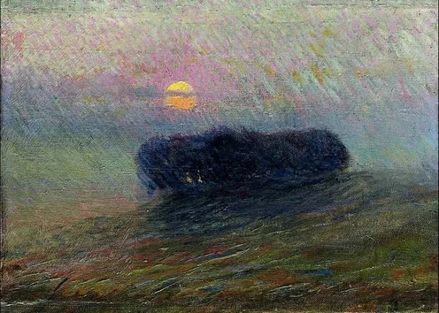

 Umberto Boccioni

  

叔：

  

早上好，我的终身大事遇到困难，希望得到您的意见。

  

我和我男朋友都是农村出来的人，没有高学历，他今年接近30，我今年25。前年的12月份我们通过亲戚介绍见面认识，双方都觉得还不错，就相处了一段时间，他在苏州工作，想着在去年5月20号这个好日子订婚，可是在订婚前知道了他没有房，（认识之前了解他说是有房的），并且为了让我父母相信他是有房的，还做了一张假的购房合同，通过微信发给我家长看，知道这件事后，我家人都觉得他在做人的原则上出现了问题，希望我跟他断了联系。但我一直到现在还在和他保持联系，并且和他同居了半年时间，（我家人不知道），选择和他在一起是为了看看他的生活上的样子，毕竟同居就是过日子的状态了，他还为此给我缴纳了一年的社保（为了买房），他的个人信誉有问题，贷不了款，买不了房，只能以我的名义买，他的车子目前在法律上也不是他的，以朋友名义买的，但首付和贷款都是他本人出的。

  

本月6号，他说他要来我家，跟我父母道歉并商量我们的事，我父母还是不建议我跟他结婚，说以后的日子会很苦，我男朋友现在买不起房，以后车贷房贷各种还，假如结婚了，要生孩子，养孩子，生活上的各种开销。父母只希望我嫁人以后不要那么累，主要他的人格我父母坚决反对，但看在我自己还想跟他继续的样子，父母让我想清楚了，真的想清楚了就同意让他来我家谈这个事情，否则就索性不要来了，不见，就此了断。

  

说的有些复杂，希望叔在百忙之中能看到此信。感恩～

  

FD

  

* * *

  

FD：

  

这事不复杂，我是你父母，明天你这个男朋友一进村，就捉起来打一顿，他的人生只配这个，娶良人家姑娘这种美好而高贵的事情，这种货色想一想都是猥亵，还敢上门提亲？当然，“捉起来打”只是比喻的说法，表达对他的不屑，不是真打，打坏了也犯法。

  

至于你，今天就和他分手，同居时发生的经济账理一理，两不相欠。这没什么可犹豫的，一个男人到了近30岁，没有基本是非观，丧失信用，靠骗人过日子，他一生也就只能当骗子，谁碰上他谁倒霉，他的老婆孩子最倒霉，你怎么可以成为他的老婆？知道他欺骗时就该分手，家人也及时提了醒，你还要瞒着家人和他同居，以至于同居到习惯了一个骗子，想嫁给他。我建议你父母打你一顿，这不是比喻，是真打，养你这么大，你以糟蹋自己作为回报，不打这口气怎么出？不打你醒不了。

  

在恋爱中，难免遇到坏人，在人的一生中，必然遇到坏人。坏人的杀伤力很大，因为人的时间有限，你每遇见一个坏人纠缠几年，不知不觉一生就没了。坏人不会因为你对他好而回报你好，坏人只会觉得你蠢、可寄生，对你尤其坏，坏人负责告诉你暗黑人性没有下限。遇见坏人，不要想去挽救他，感化他，爱他，而是要像对病毒一样，隔绝、远离，越快越好，稍稍迟疑，就会被感染，变成一个同情坏人的人，甚至想要嫁给他——这样的人，也相当于坏人。

  

遇见坏人，不是你的错。连叔我对人性足够了解，人生经验也丰富，但还是会遇见坏人。你给他信任，给他利益，他忽然就咬你一口，坑你一把。坏人基本就是这种无厘头的模式，你无法用正常的人性与逻辑去推演他，农夫想死了，也想不出蛇的逻辑。这难题让我郁闷了很久，怎么无法彻底避开坏人？难道我其实是个笨蛋？

  

可是每一次坏人劫后，都让我能力长一点，视野开阔一点，境界提升一点，有些新业务，新的利润增长点，不遇见坏人，还不会出现。这得归功于我不同情坏人，一旦发现坏人，那就迅速远离，我是农夫，从来不用怀抱温暖毒蛇，毒蛇的逻辑再怪异，也伤不了我。

  

两件事串起来，有一天恍然大悟，一个人再聪明，也必然遇见坏人，这是个概率问题。人，有1%的圣人，20%的好人，这些人从来不伤害他人，50%是不好不坏的普通人，不大好，也不大坏，这件事小好，那件事小坏，好坏随缘，20%是坏多于好的人，但没有太大的破坏性，你只是不喜欢他，不可能尊重他，剩下的9%属于蛇——其中的极少数又是绝对的恶魔。人类只是整体上好略多于坏，无穷多的时空，无穷多的人，这点“略多”就可进化出无穷的美好，但是任何一段时空，每个人遇见坏人坏事的概率却是大的——只是略小于好人好事。

  

我们要尽量避免遇见坏人，但概率决定了怎么避免也会遇见坏人，所以，遇见坏人怎么办？才是美好爱情与幸福生活的关键问题，只有一个办法，切割、止损、补强。像你这样，明知他是一个骗子，却如胶似漆，扩大损失，沆瀣一气，不仅背着父母与其同居，现在还领回家求婚，今天不分的话，可以宣布你的死亡，接下来的漫长人生，只是看看如何死，死得有多惨而已。

  

祝开心。

  

连岳
