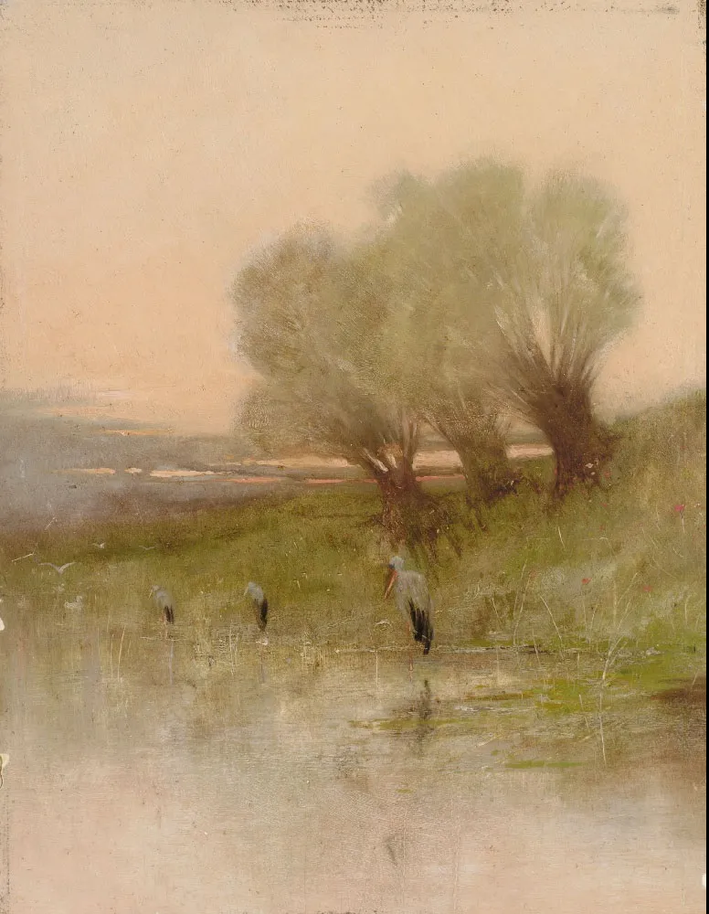

Béla Adalbert von Spányi

  

长按二维码可关注  

  

世上有四类了不起的人：  

  

一类是一眼看得事物本质的思想家。其他人争吵不休，为表象所迷惑，左右为难时，他们只是看了一眼，就如X光一样，看见事物的底层结构。  

  

一类是能将思想变成行动的的实现者。看得透与做得成，其中还有十万八千里的距离，非经过九九八十一难，思想才能变成现实。这类人可能不是思想家，但只要思想家告诉了他，他就能实现。  

  

一类是有耐心等候的人。这耐心不是一个星期，一个月，也不是一年，十年，可能是半生，一生，是几生，几百年。世事如风，舆论如雨，一下左，一下右，一下湿，一下干，有时顺，有时逆，真正有价值的事，不经过几次起伏，几轮风雨，看不出它的价值。没耐心的人，就是得到了一切，也将失去一切。

  

能成为这三类人的任何一类，都对得起这一生。  

  

第四类人最厉害，他把这三类人的优点融为一身：看得到，做得成，等得了。邓小平就是这样的人。有句话说得好，中国人总是被他们当中最聪明的人保护得很好。第四类人就是这些最聪明的保护者。  

  

我们能不能成为这四类人中的一类，甚至成为最厉害的第四类？可以，你看，邓小平的做事原则很好理解，无论是个人还是国家，冷静地做好自己的事即可。把自己做好了，人家就慢慢理解了，就是有人抗拒理解，理解不了，可也离不开我——这也很爽？是吧？  

  

今天是第161期“下周很重要”，冷静地制订计划，冷静地完成，日复一日，年复一年，一生如此，这是四类人才的唯一成长之路。

  

推荐：[未来有风险，而这是好事](http://mp.weixin.qq.com/s?__biz=MjM5NDU0Mjk2MQ==&mid=2651632658&idx=1&sn=19d18e0caf85ef048233330a755f8dfd&chksm=bd7e300c8a09b91a1b5e1450d4e9b60c46e717eebf5a696521ff8ace20a453c93fffc3be3b7d&scene=21#wechat_redirect)  

上文：[东北即将放开生育限制？](http://mp.weixin.qq.com/s?__biz=MjM5NDU0Mjk2MQ==&mid=2651682475&idx=1&sn=25fedade249dacaf9b4d891eb650d905&chksm=bd7ff2b58a087ba3e6cfc708a2a0d9ca2f9ebb7342c66f30b7d45e8677df619501d576ab3bea&scene=21#wechat_redirect)
