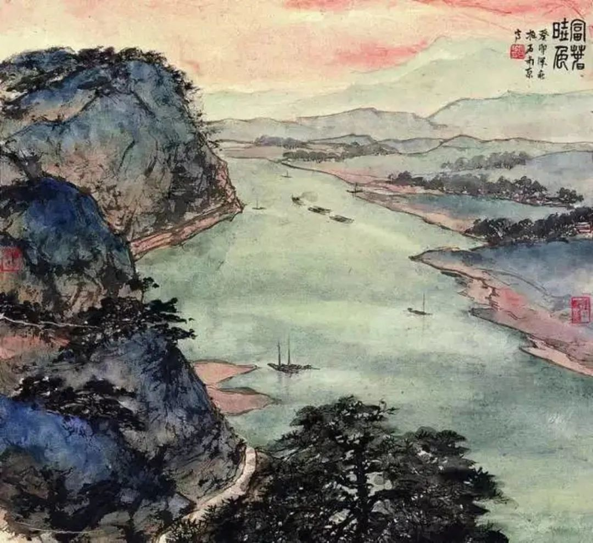

傅抱石，富春晓色

  

昨天有则大新闻，官方放出信号，预示着东北即将率先放开生育限制。

  

2月18日，国家卫健委官网发布《对十三届全国人大三次会议第9839号建议的答复》。答复中称：“‘建议国家率先在东北地区全面放开人口生育限制’对我委工作很有参考价值。我委认为，东北地区可以立足本地实际进行探索，组织专家进行研究，深入研判全面放开生育限制对当地经济增长、社会和谐稳定、资源环境战略、基本公共服务等方面的影响；做好政策调整后人口变动测算；研究实施全面放开生育政策需要配套出台的文件；评估政策变动的社会风险等等。在此基础上，提出东北地区实施全面生育政策的试点方案。” 

  

按照从试点到推广的政策演化路径，应该就是从东北放开生育限制到类似于东北的人口流失区放开生育限制，再到全国放开生育限制。甚至直接从东北试点到全国放开。总之，在很短的时间内，中国人就将没有生育限制，生多生少自己说了算。这可以说是十年来最伟大的改革之一。意味着从决策者到民众，对人口、对生育自由的认识更加深刻、科学和客观了。也意味着人们彼此间更宽容、更信任，相信其他成年人有能力做出自己的生育选择，不需要他人的干涉。所以，放开生育限制，要避免的，是走向“强制多生”的另一极端，那样，将会割裂社会，制造太多痛苦。人毕竟不是低等动物，有自己的尊严。就算是低等动物，强制多生，也能观察出它们的不开心。

  

对人口的理解，不可避免的，是一直在变化的、流动的，甚至是个性的。此时与彼时，此人与彼人，此族群与彼族群，可能完全不同。在生产力低下时，饥荒不时发生，更容易将人口视为负担，看着一个孩子饿死，母亲肯定不愿意生下他。而在生产力发达时，衣食无忧，未来美好，生孩子的愿意当然更强。

  

某种程度上，我认为对人口的理解达成一致，是不可能的事情。在任何时候，都有人将人口视为负担，同样，在任何时候，也有人将人口视为财富。任何时候，都有人不爱生育，其中一些没有分寸感的人，同时还会攻击一切爱生育的人，穷人多生，被他们骂成穷癌，富人多生，被他们骂成多占资源，女人多生，被他们骂成女奴，男人多生，被他们骂成人渣，同样，任何时候，都有人喜爱生育，其中一些没有分寸感的人，同时还会攻击不生少生的人，骂得一样难听。不过，绝大多数人，也不会被人议论一下，就改变自己的生育偏好。

  

正因为人与人不同，最好的人口政策就是解除生育限制，让人们自由选择。我从来不认为中国真会发生人口危机，这是中国的大体量与丰富性决定的，这是其他国家难有的，只要没有生育限制，政府做好服务，其中那些偏好生育的人与族群，其生育潜力释放出来，中国的人口就能保证足够的量。就像福建，好像从来不担心没孩子，就是其拥有客家与闽南两大超级爱生的族群，多子多福的观念从不动摇，他们不仅爱生，多数还负责任，客家人重视教育，闽南人善于经商，孩子成长环境都不会差。在生育限制时期，他们如此爱生好像冥顽不化，愚不可及，让政府头痛，现在简直就是民族的希望。中国这种爱生的族群，还有不少。把生育限制取消，相信民众，保持耐心，不被一时的舆论所左右，中国的人口，必然健康发展的。
