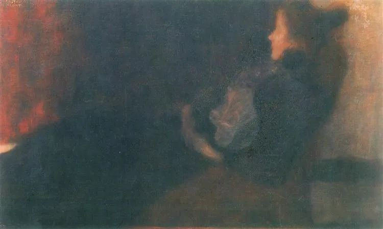

Béla Adalbert von Spányi

  

连叔，见信好：

  

自从三、四年之前，读了你的文章[《大多数爱情的平庸挑战》](http://mp.weixin.qq.com/s?__biz=MjM5NDU0Mjk2MQ==&mid=2651626747&idx=1&sn=d4f9c86068f9b3cf3c6816a117d87b95&chksm=bd7e18e58a0991f34c721c05bebfc51e42e59e038845033955fd976abc1021c47bab6932c557&scene=21#wechat_redirect)之后，我就自不量力的开始了写作之路。周一到周五，用业余时间，花费大概2~3个小时，周末更是一整天一整天的写。最近这一段时间，在上班时间，我开始6点30起床，7点50左右到单位，在车子里一直写到8点30去上班，中午在单位吃完饭，从12点写到12点30，这些写作时间都是我挤出来的。

  

正如你说的那样，我也是一个平庸的人，做着一份平庸的工作，但我心有不甘，在毕业的很多年里，找不到方向，自从阅读了你的文章之后，选择了写作。我的目的主要有两个：一是为了实现自我价值。不可否认的， 如今三十五岁的我，想要挣更多的钱，获得更好的生活，为家庭多出一份力。顺便说下，我在国企上班，那份工资勉强能够度日罢了。二是为了实现他人。我看到许许多多的人，陷入爱情、生活的困境，帮助到他们是一件多么荣幸的事情。

  

但是，正如你曾经说的那样，我这几年付出了这么多心血，也有好的出发点，但我从来没有从这件事情上获得收获，没有帮助到人，也没有赚到薪水。今天，我给连叔来信，就是想问问连叔，我还要坚持下去吗？我还有必要坚持下去吗？毕竟，我现在的工作是信息安全行业，我完全可以利用业余的时间去学习更多新知识，但我把时间耗费在了写作上面，虽然不至于影响正常工作，但要达到优秀的工作效果，那就差强人意了。

  

今天是2021年1月31号，一个跟随连叔写作三年的人，陷入了迷茫，是继续写作，还是把精力转回到工作行业之中来，精修专业？连叔，我无意于挣多少大钱，我只是希望，我在帮助别人的同时，能够有所回报，哪怕一年只有几万块，我也就心满意足了。现在附上我自己写的文章，给连叔一阅，希望叔给我一个裁决，我到底要不要写下去？连叔，打扰了，盼复，谢谢！

  

一个迷茫的人

  

* * *

  

一个迷茫的人：

  

吓我一跳，特意倒回去看了三年前的那篇文章，确定的没有鼓励别人当作家的意思。我一直认为人应该把文字练好，能够简洁、清楚、合乎逻辑地表达自己的想法，这是一个人思维能力合格的标准，但我从来不会鼓励当作家。

  

我很年轻就是作家了（虽然不是作协成员，有人不认），很快发现这一行是比较糟糕的一行。糟在两点，一是这一行普遍穷，达到了发表标准，在行业内略有名气的人，也是穷的；二是这一行普遍自我认知失调，明明是可有可无的人，却自诩为社会精英，以为他们靠几本书就该指点江山，荣华富贵，欲求不满后，他们对世界充满了怨气——竟然敢亏待我！同时对业内的一点资源（比如发表资源、评奖资源、体制供养资源）更加饥渴，毫无下线地争夺，拉帮结派，党同伐异，今天你吹我，明天我捧你，今年你给我女儿一个大奖，明年我让你儿子当一个主编，吃相又难看，又可怜。现在还玩得不亦乐乎呢，体制养着一堆作家，真是双输，害了供养者，也害了被供养者。

  

我早早知道，自己再爱文字，也不能赌这一行。按照现有玩法玩，无论输赢都是输。自己的文字当然还要天天练，生死却得彻底交给市场，那些廉价的小圈子恭维是幻觉，是毒品，我能不能活下去，活得好不好，读者说了算，自我感觉再好，市场不买账，也得认输，干点别的养活自己。但是等真输了，再来转行，可能也来不及，一个中年失意酸文人，大概率是越来越酸，祸及家人。得有B计划，写作成不成，B计划都得成。所以我一直在投资与经商，这方面的水平比我写作高。有意思的是，你对写作的回报没什么期待时，对文字的感觉更深。生活只有文字，怎么拼命写，文字也没有太大意思。文字是生活的体现，它才能一直生长。当然，还需要一点点天赋。

  

说了这么多，你可能明白了我的建议，勤奋是好的，是做成任何一件事的基础，好作家肯定也是勤奋的。不过，勤奋不一定能成为好作家，作家这行又很特殊，其他行业没有天赋，勤奋到及格线水准，也有饭吃，60分的职员、面包师、司机、花匠、钟点工、中介、健身教练、程序员，都能体面地活着，他们的中等技能也有市场。作家60分，反而最尴尬，说你不能写吧，你能硬挤出一篇文章，勉强看完，见识平庸、平淡无奇，甚至多是矫揉造作，无病呻吟，读者觉得浪费时间，不骂你就客气了，你还想要钱？可任何一个行业，60分级别的人都是多数，你看，作家这个行业是多么的凶险，不值得。

  

作家梦是最常见的梦，任何一个孩子，作文被老师父母夸过一次，作家梦的种子就种下了。我判断不出你有没有前途，不管有没有前途，我都建议你得把主业做好，这不仅是你的立身之本，主要是主业混着，玩我的副业，有这种占便宜的行为，人的精神强大不了，你的文字帮不了人，也帮不了你自己。

  

祝开心。

  

连岳

  

推荐：[2021年1月连岳读书推荐目录](http://mp.weixin.qq.com/s?__biz=MjM5NDU0Mjk2MQ==&mid=2651679168&idx=2&sn=77ea2340edc5cb727e51c684dde5284c&chksm=bd7fedde8a0864c86adf0ddccc6dae1ef4cb9770a0d879ab5f65b73e026e64effdfa68b84e2f&scene=21#wechat_redirect)  

上文：[这宇宙最大的下注，你用青春赌我，后来又押上一生，我当然拼尽一切要赢](http://mp.weixin.qq.com/s?__biz=MjM5NDU0Mjk2MQ==&mid=2651679168&idx=1&sn=ac2cbb1c4dbd47a1b7d17def9933e6a4&chksm=bd7fedde8a0864c88a947352c2e7597e0cdb4682c42de64d964c69444362668018b965e79720&scene=21#wechat_redirect)
