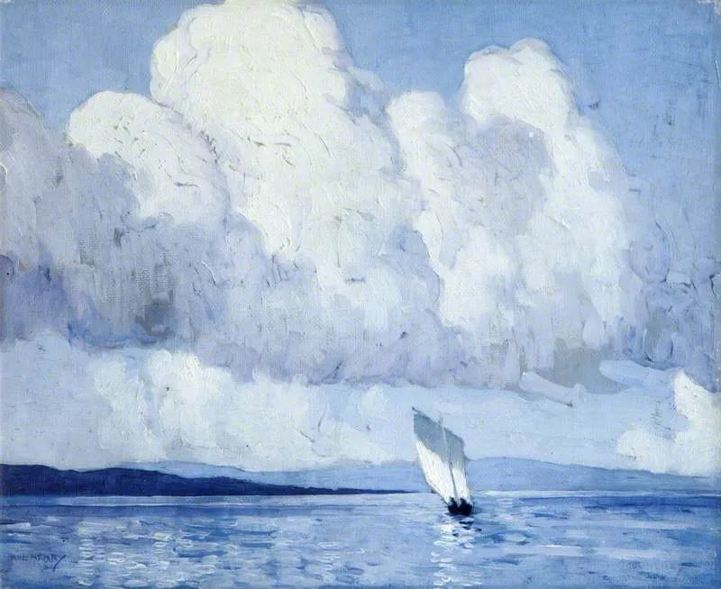

Paul Henry

  

连岳：

  

您好！

  

也许这封邮件会石沉大海，不奢求能得到你的回复，但是半夜又被噩梦吓醒的我，不知道该怎么克服这梦魇般的童年阴影。

  

我的妈妈在我2年级的时候就得了癌症，我爸爸也不怎么在家，奶奶也不喜欢女孩，以至于小学我都是中午在学校吃饭，下午放学去同学家做作业，晚上自己买个面包吃，然后到8、9点才敢回奶奶家睡觉。

  

后来，在我小升初的时候，妈妈走了，没过两年爸爸又再婚了，后来又生了一个妹妹。如今我已经成年了，可是童年的几件小事却始终困扰着我。

  

1\. 小时候在大院里玩，不知谁家支了个帐篷，小孩子们都钻进去玩，空间有限，到我想玩的时候，旁边一个小孩家长却道，这是谁家的孩子？她见没人回应就说，没空了，你不能玩。我怯生生的逃离了，那时7，8岁的我还不知什么意思，只是委屈的边跑边哭。

  

2\. 邻居家的小男孩，逮住一只螳螂（一种绿色的生物？）想用草梗从尾巴穿进去，也是6岁左右的时候，好像是当时我觉得很残忍，或者是我太害怕了，就打了他的手一下把那只绿色生物放跑了。他骂我我就跑回家了，没过一会，小男孩带着他的妈妈上门告状了，说我打了他。我奶奶应的门，要我出来道歉，还说要狠狠打我。我吓的跑到厕所里锁起门，不敢出去，我至今都记得我当时发抖的蹲在厕所上哭的稀里哗啦，大口大口呼吸，那味道……

  

3\. 到了初中基本我自己在家，一个周末早上，同班同学的妈妈来敲门问我同学在哪？我说我不知道。她的妈妈对我说，你没人管，不要把我家XX带坏了…说完就走了，留下我自己哭了好久。那时候我妈妈去世也就1年，爸爸整日不着家，我家的情况同学都是知道的。所以她骗她妈说来我家住，其实是去网吧通宵了。对此我是毫不知情的……

  

这几年事情都已经过去十几二十年了，（请别笑话我）不知道为什么时不时会让我做噩梦，惊醒来后发现自己满眼泪水止不住…

  

连老师，我知道我该坚强，平时也不会去想这些，可是噩梦却总是来找我……

  

祝您快乐！

  

Y

  

* * *

  

Y：

  

先说一句你可能会不开心的话，如果上面三件小事就是你痛苦的回忆，噩梦的来源，那么，你的成长经历是幸福的。估计没什么人敢这么跟你说，只要你说出我妈妈在我小时候就生病去世了，倾听者都会对你抱以同情，在害怕不小心伤害你的担忧中任由你放纵自己的情绪。这倾听者包括你自己，人的思考就是自我对话，分析自己所经历的一切，所以，为什么自怜一旦过度，就会变成自我吞噬的力量，你要一直暗示自己“我很痛苦”“我很悲伤”“我很不幸”。适当的自怜，或许能够让你爱自己，但过了度，却会让你恨自己，恨他人，恨社会，觉得其他人好冷酷，好残忍，都不关心我！

  

自怜若是利用“个人差异”这个借口，那更是天下无敌，一条路可以走到黑。被骂一句对你是小事，可对我就是大事，就是毁灭了我的人生，怎么样？这个态度一出来，还能怎么样，只能由你了。很多原本可以很幸福的，世界给了他足够多的人，就是这样一生不幸的，世界对他好，别人对他微笑，他都觉得是别人应该的，是在赎罪而已，这个套路多玩几次，他反而会不自觉地强化“我很可怜，受过伤”的自我认知，这样可以情感勒索他人，他慢慢失去了对等回报他人温暖与爱的能力，永不知足，也不懂感恩为何物，到了别人都不愿意搭理他时，他不会反省，反而会说：你看吧，果然大家都对我不好！人的命运，往往是这样自我设计、自我验证、自我强化的，好命是如此，歹命也是如此。不仅你应该警惕，人人都应警惕，不要把好命玩成歹命。

  

上面的话，如果你听不进去，我不会怪你。说实话，我在你这个年纪时，也听不进去。连叔我在童年的多数时光，比你苦一百倍，是极度孤独、压抑、无所适从的，也承受了不少肉体和情感上的暴力。我要参加童年比惨大赛，你绝对不是对手。在很长时间里，我绝口不提，不知怎么说，说了也没人可以解答。后来说过几次，但除了把大家搞得不开心，也没什么别的结果，而且我也真的认为，当时多数人是无意的，多数人是好的，有时候好心偏会产生一个坏结果。阴差阳错本来就是个人与历史发展的一部分，意外、失控、变异还是进化的要素。我们不仅无法万事如意，更得承认受伤是生活的组成部分，没有不受伤的人，没有不受伤的生活，过去要受伤，现在要受伤，将来也得受伤。强大的成年人就不受伤？也受的，世上总是有一部分不可理喻的坏人，左手接过你的面包，右手就给你一刀，你无法用正常的人性与逻辑推演他，这些人按概率总会碰上的，比起成年挨的刀，童年的那点委屈，算什么呢。

  

你可能想不到，时光流逝，到了连叔这个年纪，我喜欢自己的童年经历了。没有那些经历，我可能没有性格里的独立、韧性与要强，我对人性与世界也没那么深的了解，我也不会震惊于温柔、同情与爱的力量，更重要的是，没有一连串的误打误撞，我也不可能遇上连太啊，那样一生就太没意思了。现在让我再挑一次，我还会挑同样的童年，同样的人生，受同样的伤，是这些伤成就了我，让我遇到爱的人。

  

人的强大、成就与荣耀，建立在受伤后的成长之上，这点像战士，伤痕才是真正的勋章。你要早点这么想，作为命运的战士，受过伤，正受伤，将受伤，这才是我们的光荣之路，力量之路，幸福之路。

  

祝开心。

  

连岳

  

推荐：[当你真爱一个人，生命的意义就会慢慢呈现](http://mp.weixin.qq.com/s?__biz=MjM5NDU0Mjk2MQ==&mid=2651642780&idx=2&sn=ea14ca3f8ceeb84add553bbbfa301f4f&chksm=bd7e5f828a09d694ff0864711df23cf5932657d8719badc60acfa179180dd5f2958f8f6db737&scene=21#wechat_redirect)  

上文：[写在新学期，为什么要努力学习？](http://mp.weixin.qq.com/s?__biz=MjM5NDU0Mjk2MQ==&mid=2651684157&idx=1&sn=f933784b26bb5f0614403b67f1a8d6e3&chksm=bd7ff9238a0870358ee0797ec3b2f351921e7229ffed93e86a8898c33f895d5d5ba28af54dc5&scene=21#wechat_redirect)
