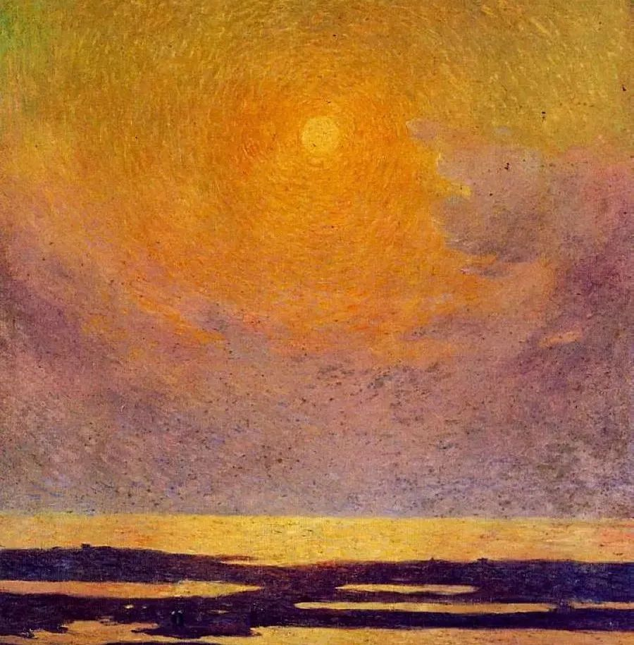

Ferdinand Loyen Du Puigaudeau

  

岳叔好，

  

我是现在班级倒数，年级150名的（年级共440人）整天无所事事只想窝在沙发上看手机却想考本市第二好中学的8年级中学生。马上就要迎来新学习期了，我一点都不兴奋。我整个寒假都没闲着，妈妈说我可以“弯道超车”了，但我并不这样认为，因为我实在无力也不想努力了。我突然间不明白为什么要努力？为什么要学习？面对堆积如山还未完成的寒假作业，心里不安，但实在无力完成。这一切糟糕的状态，要从八上期中后开始说起。

  

八上期中，我成为了年级前30，这是一个不算太好也不算太差的成绩，而好朋友年级前40。面对这样的成绩，我们开始了放飞自我的下半段学期（好朋友带着我）：聊八卦、看帅哥…在这情窦初开的年纪，我们算是将能干的都干了。在这下半学期，我无心学习只顾着玩去了与此同时我的成绩开始下滑，从班级10名左右滑到了40多，不过相反之，我的好朋友居然进步了！期末来了个年级前五！！！

  

面对着这样的心理落差，我开始了寒假。在寒假里我后一个星期才开始上课，我一直提不起精神来，上课老想着玩，玩时却想着学，超级矛盾。我该怎么调整啊岳叔。当我真正坐在书桌前，面对着自己的豪言壮语却无力了。经常就是坐着发呆，想着自己也许光明磊落的未来。后来我意识到了自己的颓废，便去知乎上搜了搜如何提起精神来学习，上面说要明确自己的目标。但我想说：我有目标，但这个似乎太过远大以至于我觉得都实现不了，而且我觉得有点不切实际、还太远了一点。

  

岳叔，我该怎么办啊，我现在简直就是心有力不足。救救我吧，我简直不知道该为什么学习，也提不起精神来。有时我觉得体校也是个很好的地方，（从小打球，结交结交了一些专业队的朋友，他们在体校练球）考个体校也不错，我甚至觉得成绩不好很酷！岳叔，你看玩了一半个学期的我竟有这种想法，我都对自己已经毫无信心了。

  

新学期了，我希望有个新的开始。也请岳叔帮帮我！拜托了！

  

祝快乐。

  

笨猪至上

  

* * *

  

笨猪至上：

  

成绩不好一点也不酷，不然你就不会给我发这封焦虑的邮件，不然你也不会羡慕考了年级前五的好朋友。当然，你可以装得很酷，破罐破摔后，挑战老师，触碰纪律，在言行、打扮上出出风头，因为不怕惩罚，也没太大的心理压力，但你内心的痛苦却越装越多。这种“假装不在乎你们在乎的价值”，是一种高明的逃避术，失败者用以自我掩饰，因为我不在乎，所以我没有失败，言下之意是如果我在乎起来，你们都不是对手。学校里的坏学生，社会上的坏人，都善于这种自我掩饰，不过，他们只能骗自己。好学生，好人，永远都是酷的，坏学生，坏人，永远处于鄙视链的最低层，这是天理。什么是天理？天理就是最强大的自然规律，没有它，人类社会无法存在，所有人发疯不承认都阻止不了它最终的决定作用。

  

你为什么要努力，为什么要学习？如果不要，就不会有努力学习的辛苦。原因很简单，不努力学习辛苦十倍百倍。你看你成绩年级前五的好朋友，她是喜悦的、自在的，偶尔可以聊聊八卦，看看帅哥，没有任何心理负担，甚至因为善于放松，更有利于学习。而没有努力学习做为基础，同样的事情你做了，就成了负担与恶习。少了一两努力学习的辛苦，你却收获了十斤不努力学习的辛苦，这交换一点也不划算。更糟的是，不努力学习造成的辛苦并非你独自承受，也会给你的老师，尤其你的父母，带去巨大的辛苦，比你的辛苦又大百倍。父母尽了他们的养育责任，照顾我们，爱我们，我们偷懒耍滑不学习，这是违约行为，而且是欺骗最无保留地信任我们的人，爱我越深，伤他越狠。这怎么是酷呢？你还小，会得到原谅，做这种事的成年人，叫做人渣，多做几次，人们骂他的兴趣都没有，他社会性死亡了，他将痛苦到没人在乎他的痛苦。

  

借着新学期开始，振作起来。学校有良好的他律环境，学校是研究管理的机构，老师是管理专家，根本不必去什么不靠谱的网站搜索自我管理方法，你按老师的安排，该预习预习，该上课上课，该复习复习，该作业作业，该锻炼锻炼，该休息休息，就行了。在我看来，你手机用得太多了，乱逛乱搜，一天就过去了，课业全耽误掉。把手机锁起来，或交给父母管理， 一天就用半个小时，甚至周末用一两个小时就行了。

  

当然，努力了未必就能年级前几名。努力的同学很多，前几名就几个。由于特长不同、成长时机未到，在这个阶段，很多小朋友努力了，成绩可能也一般。这种情况若是出现在你身上，不要沮丧，然后又放弃自己。你要知道，养成努力的习惯，向好的标准不懈冲击，意志坚强，屡败屡战，这才是学习的主要目标。一直努力，当个好人就是了，人生抱持这个简单的信条，最适合你做的事，就会在某个阶段出现，而在人生的所有阶段，从你是个孩子，到你终于老了，你都会得到他人的尊重与爱，内心宁静，幸福快乐。

  

祝开心。

  

连岳

  

推荐：[写在开学前一天：认识你的孩子](http://mp.weixin.qq.com/s?__biz=MjM5NDU0Mjk2MQ==&mid=2651634758&idx=1&sn=d7e079f0069176ade3d7427331b69595&chksm=bd7e38588a09b14e0b09ff0e2ea32f97f22ce24c85eb2b12d2199e54d7c2244f1d6367f9848e&scene=21#wechat_redirect)  

上文：[当好公务员的一个必过心理关](http://mp.weixin.qq.com/s?__biz=MjM5NDU0Mjk2MQ==&mid=2651683880&idx=1&sn=54b62e1215861faa0608d30b3145d000&chksm=bd7ff8368a087120ab9fa9c9fa7f2d01bf237cc1bf69ef397445f518c98e0f83ed0cd84b292b&scene=21#wechat_redirect)
