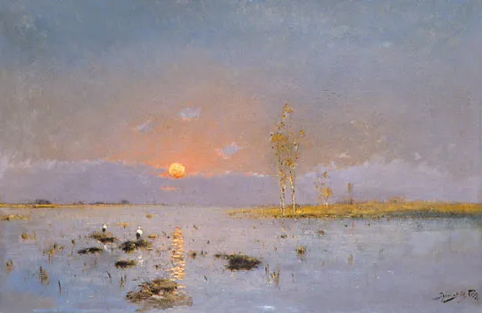

Béla Adalbert von Spányi

  

连叔：

  

您好，我是一名警察，在某二线省会城市工作，今年28岁。我想辞职已经有一段时间了。

  

当初进入警校，是出于对这身制服得憧憬还有父母的期望，同时还有我自己的虚荣心。父母认为这份职业对于女孩子来说危险性系数低、稳定、轻松、社会地位高、工资待遇好，当时，我很认可父母的观点，就在师范和警校中选择了警校。

  

在学校里，我收获了几个一辈子的好朋友还有我的爱人。我们已经结婚并且有一个可爱的儿子，现在已经两岁了。如今，我和爱人单位离家都很近，多年来彼此感情一直很好，爱人工作上进颇受领导重视，儿子有公婆帮忙带，公婆和我们关系也很融洽，且公婆家拆迁有房若干套，支持我们的各项投资计划。虽然我和爱人都算不上有钱人，但有工作和家庭的加持，也能过得挺滋润了。

  

可是，我很不喜欢这份工作，很多人说公务员就是看起来很忙，我觉得确实如此，每天像陀螺一样，被各种会议、文件充斥，总结汇报领导讲话写到吐，还时常写到深夜，可是回想起来也不知道具体忙了什么写了什么，就这样麻木的过完一天再一天。我有时真的很羡慕那些出外勤的男同志，就像我爱人，他们加班、出差确实辛苦，但是当一个纠纷被妥善解决、一个案子成功告破，那种兴奋感获得感也是实实在在存在的，同时，这也是他们立功受奖、职务竞升的凭证。而我们女同志基本上都是被安排做内勤的，这也是当初我父母还有我自己看中的一点，坐办公室有啥忙的而且危险性系数低，在领导看来也是如此，所以基本和竞升无缘。和晋升无缘也罢，我也没有立志于此，可是我实在受不了忙成狗也找不到获得感和成就感，甚至还没有存在感。

  

我知道等我资历混老了，文章就可以由新人写了，事情也有新人干了，到时候就轻松了，前辈们也都是这么过来的。可是这不是我想要的，我希望我的工作可以一直很辛苦，但是我能感受到我的付出是有意义的，我希望我每天是充实的。我和爱人讨论过这件事，我想纠正当初的选择，重新去考教师证和事业编制，去小学教书，我喜欢孩子也很擅长和孩子相处，但爱人认为我这个时候想要换一条路重新开始，难度太大了。

  

连叔，拜托给我个建议，如果我的想法片面又幼稚，请点醒我！

  

明天会更好

  

* * *

  

明天会更好：

  

警察将来的地位会更高，这得益于两个因素：

  

一是去年中国防疫成功，并在这基础上取得了经济成功，国家管理体制的美誉度提升，警察作为体制内重要的一环，自然获得比原来更多的尊重。

  

二是反腐败。少数腐败的警察，能够败坏所有警察的形象。据我所知，司法系统正在进行严厉的反腐败，不仅查现在，还要倒查历史。我很支持这种刮骨疗伤的决心与勇气。司法系统的腐败不除，国本不稳。这种反腐败最直接的受益者，就是敬业清廉的司法人员，包括警察。

  

你和丈夫都是年轻的警察，这赶上了好时光，自身没什么历史包袱，这职业也处于上升期，好好珍惜，一生解民所难，受人尊重，是很幸福的。

  

当然，一个好工作，也并不是所有环节都有意义。这就是你的疑惑所在。你当上了小学老师，你也会惊奇地发现，你还得做一些无意义的、形式主义的、空耗的事情，像你现在做内勤一样。你就是像我这样自己开公司，什么事都自己说了算，每天也有无意义的事，甚至是负意义的事——努力一通，发现做错了，我本将心向明月，奈何明月照沟渠，这种事时常发生。没有任何一种工作由纯粹的意义构成，工作都有其无意义的部分，有令人叹息、沮丧、失望的部分。

  

没有内勤工作，公安机关运转不了。会议精神，领导讲话，这些就是神经中枢在起作用，这就是其意义所在，它虽然没有破案的意义感那么具体，但它是必须的、重要的存在。会有多余的会议，无聊的讲话，希望它们越少越好，但不可能没有，它们是必要的会议及深刻的讲话的成本，就像再好的作家，都得写一些烂作品。

  

承受一些无意义，是追求意义的条件。无论是择业，还是择偶，在年轻时，有人跳来跳去，这山望着那山高，越跳越差，就是因为不知道这点。

  

无论在什么岗位，当个好警察，这就是你的大事业，大意义。好警察是好国家、好社会最好的代言人之一，不要忘了这个初心。

  

祝开心。

  

连岳

  

推荐：[锦诗人生](http://mp.weixin.qq.com/s?__biz=MjM5NDU0Mjk2MQ==&mid=2651645656&idx=2&sn=88d4cacecae0d583039c9d42ba0514a3&chksm=bd7e62c68a09ebd03b3d274c874da0c572a2634d037e90b903a033af4708bc68f3cabe87280b&scene=21#wechat_redirect)  

上文：[高考越来越近，我却脾气暴躁](http://mp.weixin.qq.com/s?__biz=MjM5NDU0Mjk2MQ==&mid=2651683321&idx=1&sn=70a8ac8b98a20a1a8a8069ccd5126895&chksm=bd7ffde78a0874f1121aa6be76bf28376cec0a51b07d00dd43ad00b2691caf418104f64d817c&scene=21#wechat_redirect)
