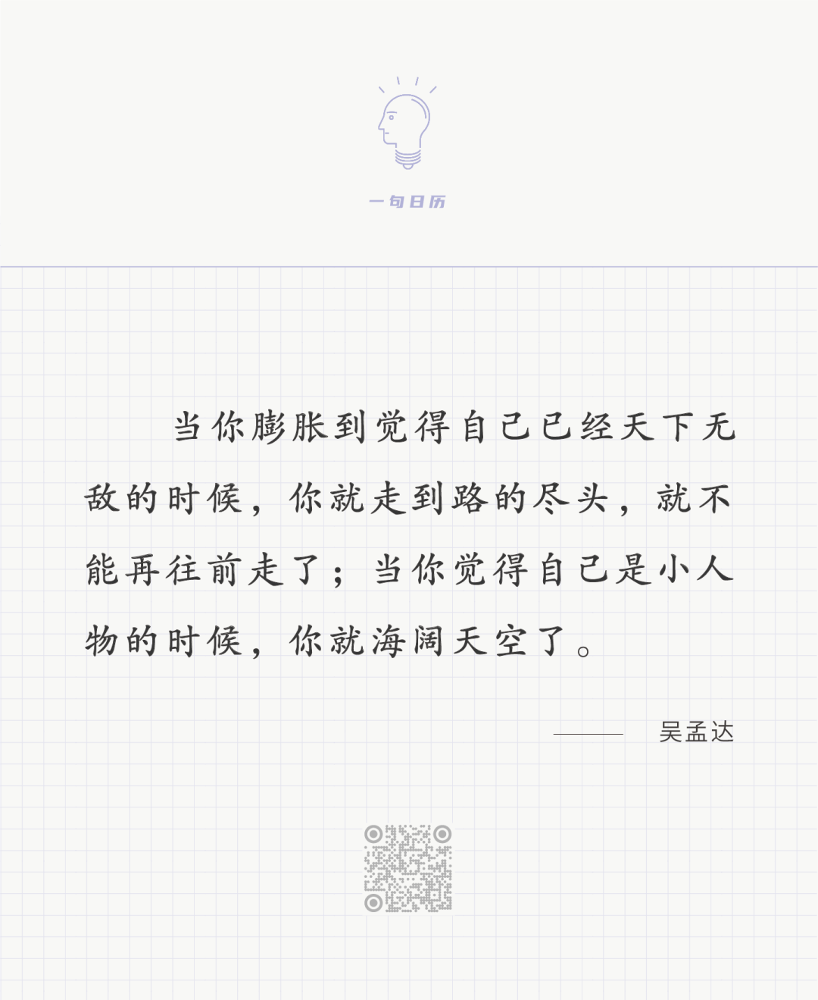

Gustav Klimt，Beech Grove I

  

连叔好！  

  

最近几个月，一直有个问题萦绕在我的脑海中，我深知，不把这个结打开，接下来的日子我都很难安生。思来想去，最终鼓起勇气给您写了这封信，期待您的回复。

  

6年前研究生毕业后，我和当时的男朋友（现在的老公）一起创业。这期间，我们一起努力打拼，如今，我们的小公司盈利稳定，每年有150万以上的收入，我们还在强一线城市买房安了家，财务状况可以说比很多同龄人要好得多。3年前，宝宝出生后我就全职在家带他，公司的事情可以在线办公，只不过工作量相应下降很多。

  

本来，我还挺享受目前的状态，一是时间自由，不用像身边上班的朋友那样，请个假都很难，我有大把的时间来照顾孩子，这是目前比较欣慰的事；二是公司每个月的盈利可观，至少我们有了房子，吃穿不愁，用不着为了生计风里来雨里去地苦苦奔波，总体而言我还挺满意。但是，最近总有一些声音在我耳边响起，时不时会有人跟我说，“你读了这么多年书，怎么最后做生意了？”要么就是“你有研究生学历，为什么不去考公务员、考编制？进体制多有优势！”

  

这些话让我感到苦恼，感觉创业做生意，似乎被鄙视了。我也崇尚市场经济，更知道拼命赚钱的重要性，尤其是对于我这类农村出身的人，多赚钱、照顾好家人，是我们义不容辞的责任。

  

但，我心理那一关总是过不了。或许是内心那股酸文人的假清高在作祟，又或者是高学历的优越感在作祟，我总是忍不住想，我是不是也该考虑，考个公务员，或谋一份体制内的其他工作呢？毕竟，一跟别人说起自己的工作是公务员、教师等，别人都觉得很有社会身份，以至于跟同学聚会时，我经常觉得自己比不上那些体制内的同学，尽管我的财务状况比他们好了太多。

  

还有一个情况，我和老公一起创业，大部分都是他在主导，我总觉得那是老公的事业，不是真正属于我的。我希望有一份真正属于我的事业，或是工作，这样在对外交流中，我能真正有一个属于我的标签。

  

连叔，对这件事，您怎么看？我是该好好跟先生一起经营共同的事业，还是努力挤进体制里？这个问题搅得我焦虑、苦恼，它的答案也将影响我对往后三五年生活的规划，目前总觉得无所适从，没有方向总没有动力，做什么事都提不起劲。渴盼您的回复！

  

心迷路

  

* * *

  

心迷路：

  

你是穷是富，不是进入体制的障碍。国考，穷没有加分，富不会减分。这说明，体制认为财务状况这个变量不是决定一个人是否可以成为合格体制人的条件。

  

如果心态正，一念天堂，穷和富都可以为自己加分。穷人进体制，因为珍惜体制为自己提供体面的身份与收入，感恩且努力。富人进体制，因为更少财务压力，对将权力交换利益的腐败更有抵抗力，廉洁且平安。

  

如果心态歪，一念地狱，穷和富都可以为自己减分。穷人进体制，总和更高收入的群体比，觉得自己的工资福利不够，生出贪婪与怨恨，今天嫌钱少，明天憎官小，最后变成吃饭砸锅的恨国党。富人进体制，觉得自己有钱又有势，和有钱的比官，和有官的比钱，和谁比都高人一等，时时摆出一副高等人臭面孔。这两种人多了，体制是会变质的，国家是有风险的。以这种歪心态进体制的人，不在少数，你也是其中一个。

  

你进体制的动力是什么？想获得优越感，高人一等，因为“我家虽然年入150万，但我在体制人面前还是自卑”。我的意思不是你有钱了就要觉得高人一等，很多有钱人这么做，那是衬不上金钱这么好的资源。钱的能量让我们能够免于匮乏，照顾家人，实现愿望，这应让我们对机遇与时代心存感激，从而变得更美好，更温和，更善良，更谦卑，更宽容，更努力，钱这样用，就帮助我们进化。我有钱，所以别人要奉承我，巴结我，讨好我，让我高人一等，不然我就觉得钱白赚了，那钱就成了毒药，自己不得安宁，也引发无尽的鄙视。

  

你想到体制内获得高人一等的感觉，到你进入体制，你会失望的。上面说了，这种体制人多了，体制与国家都危险。这种思想，体制本身是不允许的。你进入体制，要么在思想教育中把歪心态改正，要么就得犯错误。这不是什么大话，其实进不进体制，一个人都要改掉自己高人一等的大人物歪心态，正如吴孟达先生所说： 

  

长按二维码可关注  

  

什么是膨胀？觉得年入150万就好有钱，同学朋友一定要羡慕我，他们竟然没有羡慕我，我要进入体制，到时候他们就会羡慕我，这就是膨胀。膨胀就是只会从自己的角度看问题，自己的小宇宙就等于全宇宙。把自己变小，视野就可以开阔一点，心态就能平等一点。年入150万算有钱，但要时时摆有钱人的谱，你就会被嘲笑。体制人地位是高，但你真当自己高等人，你就会被小瞧。你追求“高人一等”的膨胀心态不改，做什么都自卑，做什么都死路一条。  

  

最近体制人的地位上升，原因在哪里？是他们高人一等吗？是他们事少钱多吗？是他们作威作福吗？并不是，他们这么做时，是令人憎恨的。是他们冲在防疫的前线，是他们守在扶贫的一线，是他们做得比世界上其他国家的体制人更好，是他们真的做好了公仆，为人民服好了务，是他们把自己放低了，所以升得高。你没看到这点，认定进了体制就可当高人一等的大人物，你将得多重轻视，一是真正的公仆觉得你败坏体制，玷污了他们的努力，二是百姓将痛恨你这种特权蛀虫，连带痛恨你经商的老公——这个体制人这么坏，她老公一定不是好人。不要走上这条邪路。像你这样的人混进去多了，思想又没改造好，体制人的地位又会下降。

  

无论你是继续经商，还是进入体制。无论将来多有钱，官多大，永远要知道，得到尊重，那是因为我们把服务做好了，经商的服务好消费者，当官的服务好人民。我们自高自大，挣再多钱，当再大官，也觉得不够高不够大，怎么可能做好服务？怎么有像样的人尊重你？  

  

祝开心。

  

连岳

  

推荐：[了解这四人，才能更好理解中国](http://mp.weixin.qq.com/s?__biz=MjM5NDU0Mjk2MQ==&mid=2651672428&idx=1&sn=747dcab92ff5c8d284c554e60cccdbe1&chksm=bd7fcb728a084264401c2c537b65aca532683e41b90a0e9a0e6d8805f22f16c22d0bf2c60dd5&scene=21#wechat_redirect)  

上文：[我爱一个残疾人，他却撩骚不止，我想原谅他，我有什么病？](http://mp.weixin.qq.com/s?__biz=MjM5NDU0Mjk2MQ==&mid=2651685129&idx=1&sn=4eaf99f5262cb8c67eb807594312e7f4&chksm=bd7f05178a088c0186fe35ba8d0391a1dbb981edd58a0393858f3c6bb50c3e1fd6ed9676a50b&scene=21#wechat_redirect)
