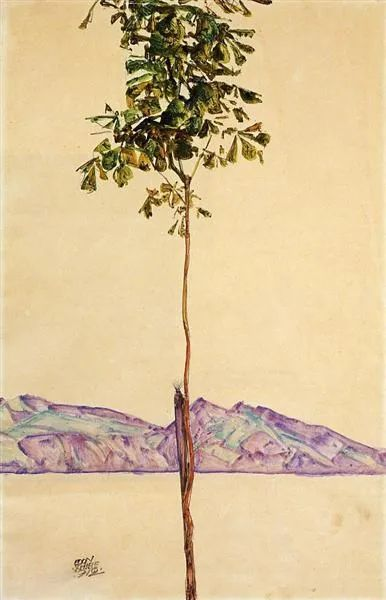
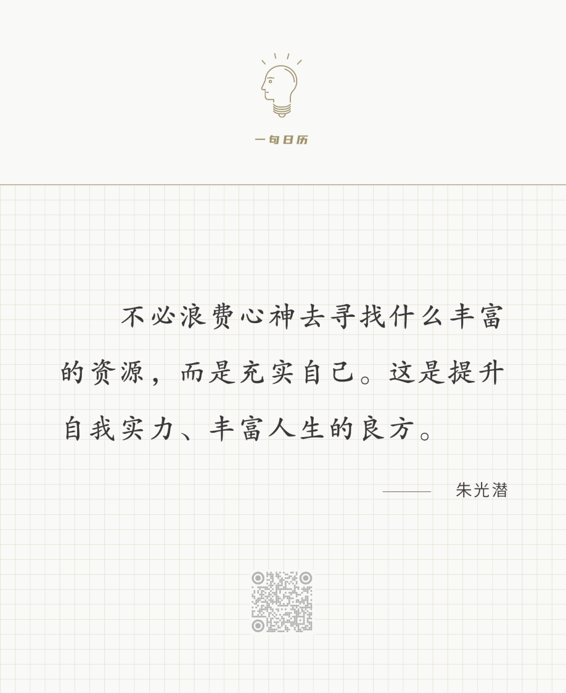

Egon Schiele，Little Tree

  

长按二维码可关注

  

不久前，偶遇一位才华初露的文学青年，讲到混圈子的话题。

  

我的态度是，要有耐心，不要去混。

  

才华本质上是孤独的，独处，安静，专注，戒，定，慧，面壁十年图破壁。对自己说假话没有意义，只会撕裂自己。

  

圈子反孤独，一个人成不了圈子。一切圈子，都是黑帮的变形，刚加入时充满了力量感，代价是你要贡献出自己，有人替你打群架，你也要替人打群架。是非，智慧，爱，一切有价值的事物，在与圈子的忠诚发生冲突时，都要让步。再有才华的人，混了圈子，收了别人的恭维，都要回报马屁，你夸我女儿，我必赞你儿子。圈子经常要求你说假话，撕下自己的一大半肉献祭。一入圈子，再无自由。  

  

人需要交往，需要被认识，被尊重，被爱，人最大的需要就是被需要，这也是显然的。破壁后的智者重回人群，他也要对话者、听众与传播。只是这种人群与圈子是不同的，它建立在价值之上，就像所有植物建立在光合作用之上。一个人孤独地发现价值，又用价值发现同类，其中最爱的那个，成为你的配偶。这是人又孤独又合群的一生。

  

一个小杯子装不下大海。一个自身丰富度不够的人，大海一样大的价值，他理解不了，承受不起，他用小杯子尝一口海水，啊，又咸又涩，解不了渴，这是无用之水，是有害之水。  

  

自身越丰富，越能理解丰富。理解越多丰富，自身越丰富。这是人发展的螺旋形式。而自身的丰富，是孤独的取经之路，一点点，一天天，慢慢前进，不怕麻烦，不怕妖怪。

  

今天是第160期“下周很重要”，用你细微而具体的计划，一步步指引自己完成丰富之旅。
