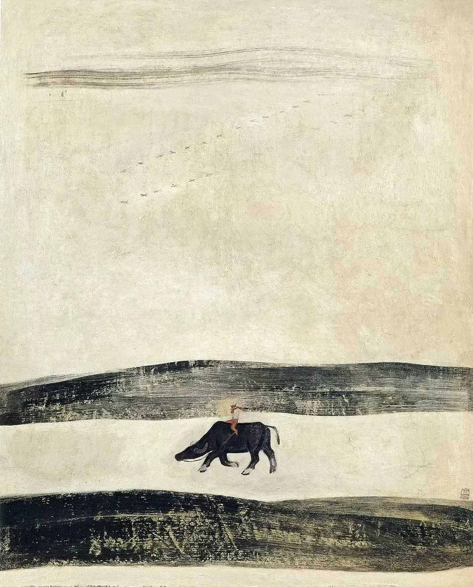

常玉

  

各位，吃完尾牙，我们公司就要开始放假了，一直到2月18日。当然，我也会停更。用这一整块时间好好反思、调整、陪陪连太。

  

今年大家的春节模式可能都有所变化，自己会拥有更多的大块独处时间，这种改变未必是坏事。原来想拥有这大块时间是一种奢望，总会被工作、宴饮、人情所打断。现在有了，有了全身穿衣镜那么大的一块时间，真实、冷静、面对面地看着你，你可以端详自己，看到伤痕，也看到肌肉。有了一整间空屋子那么大的一块时间，你如国王一般自由，也如国王一般不自由，因为你是最终负责者，是意义产生者。

  

这是一个新春节，这是春节的进化。不再那么热烈，但可能少了热烈里的寂寞。有了更多的寂寞，但可能多了寂寞里的热烈。

  

有一本厚重的、充满价值的、你知道读了必有收获的、你想读而从来没有开始读的、开始了而从来没有读完的书，在这个春节可以读完。有太多这样想做却没有做的大块事件，这个春节给时间让你完成。

  

祝你春节开心。爱你。
