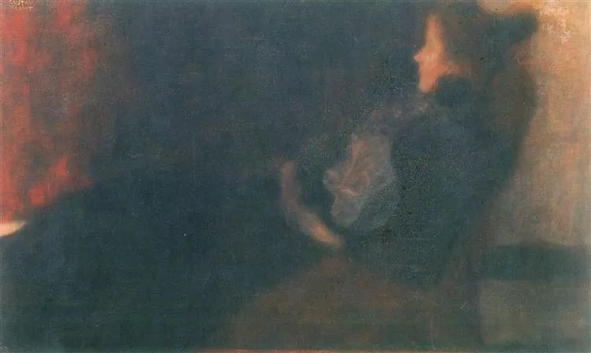

Gustav Klimt，Lady by the Fireplace

  

连叔，你好！

  

我是一个关注了你多年的读者，最近看到你回复了很多关于感情的信，看时，豁然开朗，静时，一团乱麻。说说我的情况。

  

他30岁，我也30岁。他大厂程序员，年薪40w+，我中小公司管理层，年薪30w+.（创业四年失败，积蓄较少，这个年薪也是去年刚开始。）

  

我们在一起的时候经历了很多别人没有经历过的，因为他右手天生残疾（是正常手臂的二分一大小，且不能伸直，但不影响打字），虽天生缺陷，但是他上进努力目标清新，让我很欣赏，所以熬过了家人跟朋友的反对，也熬过内心的纠结，选择跟他在一起，至今，两年了。

  

2020年他买房了，6月我搬到他新房子去住，同居了。一个月后，我发现他跟别的女生撩骚记录，我大怒，搬走了。他动员我身边所有的人来劝我，并且立下各种誓言，甚至找律师写了要分一半房子给我的协议。看在过去种种，加上自己反思，对他不够温柔，不敢在朋友圈大方承认他的存在，让他没有安全感等等原因，最终我跟他和好了。

  

3个月后，我再次发现他企业微信跟公司的女生有超过正常同事聊天话术的内容，我再次对他失望，搬离了他家，并撕毁了他的那份协议。且发誓此生不再给他机会。

  

但是女生啊，始终心软，加上他的死缠滥打，我还跟他保持联系，但是内心也一直告诫自己，不要跟他有结果。

  

给连叔写信是因为自己还有纠结，还对他抱有幻想:

  

1\. 有感情，放弃他，心会疼。

  

2\. 自身年龄大了之后不再有重新谈对象的冲动，且家里催的紧。

  

3\. 除了手跟爱撩骚的问题，他整体是我喜欢并欣赏的类型，我们组建家庭，能快速过上稳定且小康的生活，这些年一个人打拼真的累了。

  

4\. 婚姻是什么？其实我并不清楚，金牛座的我会狭隘的理解，只要婚后我掌握家庭财务，他必不会做什么出格的行为。

  

放弃的点很简单：

  

1，他的手我发现，两年了，我依旧介意，跟他出去的时候，尤其是夏天，我会介意别人看他的目光，看我的目光。有时候也会不甘心，因为自己是可以选择不承受这些，找个正常点的普通人。

  

2，撩骚这件事，他应该有瘾，他改不掉且经常撩而不自知。

  

给连叔写信纠结了很久，因为我身边有29位朋友关注了连叔，不太想让大家知道我的情况。虽然自己觉得什么都明白，但是还是希望能得到连叔及连叔粉丝的批评，建议或者鼓励。

  

 MZM

  

* * *

  

 MZM：

  

人间温暖的地方在于，一个人的不幸，痛苦，还有疾病，从来不是成功与爱的障碍。美国著名心理学家与心理医生埃瑞克森是残疾人，他很敏锐地发现，残疾显得没有攻击性，需要同情，有利于病人放下心防，更容易信任他，因此治疗效果也更好。

  

不过，这不能理解为残疾的心理医生一定更好。埃瑞克森本身是意志顽强、品格高尚、专业出色、家庭成功的人，在这些特质的衬托下，他的残疾才从障碍变成了资源。正如一位战斗英雄残损的手更让人敬佩他的功绩，但无法推断出残损的手一定有功绩。这是个简单的逻辑问题，但人的同情心，尤其是女性的，却会因为同情心泛滥，在这个简单的逻辑问题上犯灾难性的错误。只要别人展示出不幸、痛苦与残疾，就克制不住地想拯救他，在他身上倾注所有的爱，那怕他不值得爱，这就是所谓的圣母心。不幸、痛苦与残疾的人，有些同时是意志软弱，品格低劣，毫无诚信的坏人，这些坏品质放在正常人身上，你马上就会放弃，但正因为他们有“可怜”的表象，圣母却会选择自我欺骗，一次又一次原谅他们，把爱与牺牲倾注进这个无底洞。

  

恕我直言，他就是一个品格低劣的残疾人，你就是一个无知无畏的圣母。他当然不会放弃你，每次你想要离开，他都会拼命拉住你，因为你就是他的命，正像宿主是寄生虫的命。他本能地嗅出你的弱点，以及一些圣母的弱点（其中一些可能正是他撩骚的对象），只要多拉回你几次，他继续欺骗你，伤害你，侮辱你，你也会原谅他，接纳他，供养他。久而久之，你甚至感动了自己，以至于觉得可以感动中国：他是这么坏的一个残疾人，只有我一个人愿意爱他！

  

你的当务之急是要有知有畏。知是知道一个人选择终生伴侣，他一定得是个好人，这是爱情与幸福的基础，如果他有残疾，他需要他用更好去弥补，而不是因为他有残疾你就要降低标准，当一个残疾人决定做坏人，他就有了双重残疾，日益加深你的恐惧。畏是你要知道类似于你男友这样不知感恩的人，他显得多可怜，他就有多冷酷，知道了他的低劣而不尽快离开，他就将视你为女奴，你对他的奉献是应该的，你任何一丝不满与试图离开都是背叛，将会受到他严厉惩罚。

  

早点离开这种人吧，不然你以后多惨，都无人同情，他尤其不会同情，将在你痛哭，甚至惨死时，放声大笑，享受变态的快感。

  

祝开心。

  

连岳  

推荐：[钱重要，幸福更重要，平衡点在哪里？](http://mp.weixin.qq.com/s?__biz=MjM5NDU0Mjk2MQ==&mid=2651663801&idx=1&sn=7f898fb4b822c9dfe7c1b4f076b5131d&chksm=bd7fa9a78a0820b1715338b660238c9d16ec40dd6ab88c9af1a57f58de67bc6fcd02798dd82a&scene=21#wechat_redirect)

上文：[我知道，你在偷偷变厉害，你自己却不知道](http://mp.weixin.qq.com/s?__biz=MjM5NDU0Mjk2MQ==&mid=2651684960&idx=1&sn=2ae71981e5189271d317af948870cd53&chksm=bd7f047e8a088d6823b51a59b9146f8f47aa1758083da9b3b0449c6db3dbd2256c20526d7514&scene=21#wechat_redirect)
