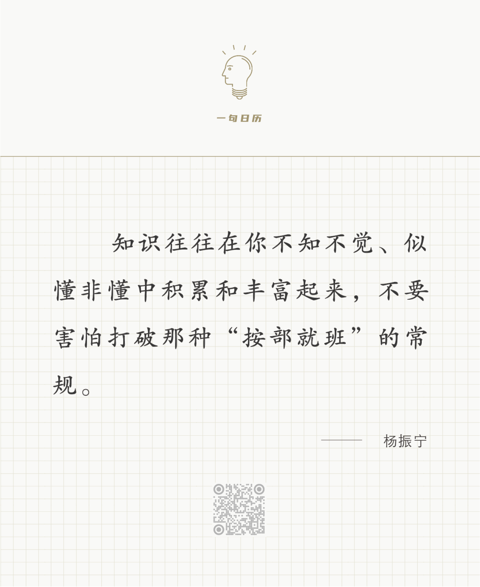

 Ferdinand Loyen Du Puigaudeau

  

长按二维码可关注

  

年轻时，一位老师对我讲的水电站理论，一直对我影响很大。他说，人就像水电站一样，开始蓄水时，你觉得没什么作用，到了一定水量，突然你就可以发电，输出能量了。到那么厉害时，你并不会更累，水流量也还是那么大。一切力量都是积累出来的。比如同样是4%的股票收益率，1万块一年挣400元，也就吃顿大排档，无足轻重。可是积累到了1000万，4%就是40万，足可支撑小康之家。知识、才能、影响力，道理也类似。

  

人最难学的，就是积累。积累总是枯燥的、无聊的、乏力的，一天能增加多少知识、力量与财富？近似于无。半年一年，毫无动静；两年三年，似有起色，但也拿不出手；五年八年，你的坚持变成习惯，你有点害怕去想自己努力的成果，甚至接受了没有成果的结局，反正尽力了。再说，你也享受积累这个过程，像和尚享受每天敲钟，即使没人听，钟声回荡在丛林里，也是美的。就在这个时候，美妙的事情发生了，你亮了起来，你发电了，水不知不觉已经蓄够。成长，就是这样不知不觉变厉害的过程，就是耐心到没什么事可以折磨你，耐心到你忘了世上还有不耐心这回事。

  

今天是第162期“下周很重要”，写下那些你重复了无数遍的简单计划，那就是你的厉害证书。

  

推荐：[说说张桂梅，什么是真正的素质？](http://mp.weixin.qq.com/s?__biz=MjM5NDU0Mjk2MQ==&mid=2651648637&idx=1&sn=3a2c64d76d2934a6cb2466617dfda28c&chksm=bd7e76638a09ff75c6f59157dbdfbbec15f148eb7b4adf46ba7fe9eeeaa3da4205d2e4cb6c16&scene=21#wechat_redirect)  

上文：[人人都得受伤，正确认识受伤，学会受伤后成长](http://mp.weixin.qq.com/s?__biz=MjM5NDU0Mjk2MQ==&mid=2651684508&idx=1&sn=32ed7aefd2a4b2f4efa1e6bde3b79bcf&chksm=bd7ffa828a087394c9706fa34ab28c7bca72b3f5ed9d250c13dcdb8a8ab19801acd65b434b05&scene=21#wechat_redirect)
