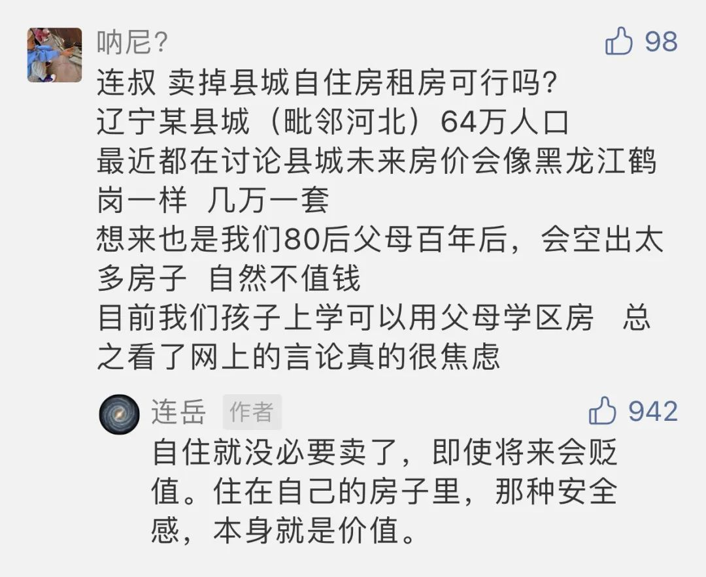

Claude Monet

  

几天前，有位朋友的留言很有代表性：

  

  

中国的房子现在分成两类：一是升值的，一是贬值的。

  

处于经济与人口增长地区的住宅，是升值的。这类房子不只局限于一二线的热点城市，即使县城级别的城市，符合这两个条件，住宅也会升值。这些数字都不是秘密，政府都会公布，你在政府网站或新闻查得到。当然，这些地方的房子，也不是所有的都值钱，大多数公寓、商铺、写字楼、配比过高的车位，也会让人亏本。买房之前，还是要做功课的，如果你连公寓与住宅的区别都搞不清楚，也不愿意去搞清楚，冲动起来一通瞎买，想不亏本也难。钱多的人无所谓，钱少就伤筋动骨了。

  

人口减少，经济萎缩的地区，所有房子一定是贬值的。这是规律，两个原因导致，一是城市化，人口逐渐向热点城市聚集，二是经济发达后生育率自然下降。多数小城市、县城与乡村，都属于这样的地区。但绝不等于说这些地方就成了无人区，不美了。总有些人生活工作在这些地区，有人是由于偏好，就是不喜欢大城市，有人是由于工作，离不开，比如当地的公务员、老师。还有，一个人到了中年以后，成家生子，有了根，流动的可能与意愿大幅下降。中国如此辽阔，人口基数如此巨量，在“房产贬值区”的人口绝对数，永远不是小数字。在这些地区的人，房产不升值就一套自住房也不买？那我觉得，这走到了为投资而投资的误区。

  

投资是为了什么？第一目标肯定是为了家人更幸福。自己家有一套房子住，连小朋友也更开心，这是人的本能。在人类历史上，是先有房子，过了很久，才有房产交易，一直到我们的父辈，绝大多数人努力一辈子盖几间房子，也是不交易的。房子更本质的价值，长期以来，不是它升值了多少，而是它代表着家庭、安全、温暖、责任感、尊重与社会地位。所以，一些必须买的东西，不能由于“它会贬值”，我就不买了，绝大多数东西，买了就开始贬值，食物、美酒、鲜花、汽车，为什么买？因为让自己爱的人开心。这个道理放到房子上，为什么就理解不了？

  

事实上，大多数人对房产是没什么研究，没多少深刻体会的，无论在“房产升值区”还是在“房产贬值区”，那些把家庭经营得富足而幸福的普通人，都是抓住了更本质的需求——“我的家人需要一套自己的房子”。在“房产升值区”的人因此发现房产的投资价值，后来有了更多的购买，在“房产贬值区”的人即使没有升值，但为家庭创造的精神价值却不输给任何一套升值了几十倍的房子。而那些天天算计房子何时会贬值的，冷酷地忽视家人本质需求的人，无论在任何地方，都还可能是无房户，既没收获房产的升值，也无家庭幸福可言。人的一生，价值高低，更多与你的观念有关，经济实力如何，身处何地，倒是次要的。

  

想开一点，想长远一点，人这一生，连身体与性命都是在贬值的，最后归零，在这短短的一段时空，我们的主要目的是为了配得上爱自己的人，是为了让爱自己的人过得幸福，这个目的统摄所有投资，为了实现这个目的，有些投资似乎会亏本，比如买一套自住房，也得坚定地做。

  

推荐：[财富的意义是什么？](http://mp.weixin.qq.com/s?__biz=MjM5NDU0Mjk2MQ==&mid=2651625687&idx=1&sn=cca233ca4c915b91c81f1ad5c14a89c1&chksm=bd7e1cc98a0995df80cd1d77bc54c406ea365c9b1622b42577e3d193eb8eb8c9e84a8f1107d6&scene=21#wechat_redirect)  

上文：[欲望与权力的交换，满足之后的空虚，幸运后的不幸状态](http://mp.weixin.qq.com/s?__biz=MjM5NDU0Mjk2MQ==&mid=2651679866&idx=1&sn=2d72d70aad99c7982d340d10f76a3853&chksm=bd7fe8648a08617267e5aea5687521875a4926e9742767a483f46e7c50080a2c598b8cf201bf&scene=21#wechat_redirect)
