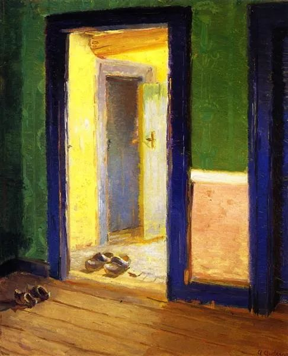

Anna Ancher，The Dinner-Hour

  

连叔，

  

新年好。

  

我们夫妻俩一直是您的粉丝。

  

对于我而已，您的观点就是我的精神支柱。最近有个问题一直困扰着我，希望得到您的指点。年终了，想买个一万多的包包，但是老公觉得我有点疯狂，不同意。我俩一直都是很尊重彼此，他不同意，我也不会自己去买，免得买回来他也不开心。

  

我年薪十几万，在幼儿园工作，老公最近这一年年薪差不多四五十万。去年生了二胎，产假128天后马上去上班了。上班后，每天中午来回跑，喂奶，上午还要吸奶一次，每天打车四次家里单位来回，就这样从八月底坚持了一学期。大宝也是今年九月份三岁上幼儿园，早上爸爸送来，下午我带回去。

  

这一年，我觉得作为小小的我，不容易，看见朋友们都买包奖励自己，年终我也没什么想买的，也想买一个包，也是第一次买这么贵的包，但是老公一直都觉得没有必要买这么贵的包，几千的就行。现在我们一直攒钱想换二手房，每个月我都把我工资转给他让他一起存起来，这两年存了五十万了，我觉得花个一万多其实也不影响什么。希望得到连叔的指点。谢谢。

  

小个子的二胎妈妈

  

* * *

  

小个子的二胎妈妈：

  

这个一万的包包，毫无疑问，得买。

  

一、 你是努力的好老婆。二、你的要求符合比例原则，这包不过是老公的周薪，完全负担得起。

  

一个人财商高，体现为学会了将两种矛盾的特质融为一体，他既是节俭的，又是慷慨的。只会慷慨，没有节俭的“傻大方”，挥霍无度，入不敷出，生活都成问题，很快丧失慷慨的能力。只会节俭，只入不出，花任何一分钱都像割肉，占点小便宜就眉开眼笑，那马上演变成吝啬，这将切断自己与他人、与世界、与机会的一切联系，眼光、格局与境界提升不了，一生只为蝇头小利奔忙，路越走越窄。

  

节俭难学。它违背人性的好逸恶劳，好生活的开始，资本的积累，都需要一个人从年轻时就开始学习量入为出，延迟满足。不肯学这苦功夫，没有后来的甜。就算继承了亿万遗产，也守不住。你们都学会了节俭，你们的未来是甜的。

  

接下来，要学更难学的慷慨。避免自己由节俭变成吝啬。吝啬有清零的功能，孔夫子说过，人一旦吝啬，即使像周公那么有才华，也不足观。

  

吝啬的一个症状是，听到家人有物质要求，想过更好日子时，他的第一反应都是负面的，轻者冷嘲热讽，重者勃然大怒，他本能想抑制家人的消费要求，即使这消费极其合理，极为必要。为什么越爱吝啬者的人越倒霉，受伤越深？因为爱需要回应，需要肯定，需要感谢，而这些多少都得花钱，所以得轻视、无视、伤害你的爱。或者，他们对爱的定义就是你得纯付出，别想从我这儿得到一丝回报——这当然不可持续，令人厌恶且痛苦。

  

吝啬是忘了节俭的初心，不知财富的意义。无论如何，钱最后都是用来花的，财富是为了改善生活。节俭是让我们更有钱花的一个手段而已，人的生命有限，不学会花钱，不懂慷慨，为节俭而节俭，手段成为目的，那不过是守财奴，浪费了这一生。自己浪费倒也罢了，迫使爱你的人也浪费一生，无异于谋财害命。

  

自己爱的人，勤奋工作了一年，想要个好一点的礼物，当然是秒速打钱，或飞奔着去买，开心都来不及，怎么能劝阻呢？钱在这么关键、这么高效的时候不用，什么时候用？珍惜老婆（老公）还有具体的物质需求的岁月，现在买得有点“肉痛”，那正是买的时机，满足感特别强，将来你们很有钱了，包包可以随便买，那时反而没有多大兴趣。

  

我们要努力有钱，钱可以保护我们，可以让爱的人生活舒适，钱让我们的爱、帮助与善良更有力量。但如果为了有钱，变得冷酷，克扣折磨自己爱的人，失去了温柔与正义，悲悯和爱意，那钱就成了诅咒，再有钱，一生也不足观。

  

祝开心。

  

连岳

  

推荐：[远大理想的注要小，现实生活的注要大](http://mp.weixin.qq.com/s?__biz=MjM5NDU0Mjk2MQ==&mid=2651630977&idx=1&sn=6df0b1eaadf7ef54b53e03fe647168ca&chksm=bd7e299f8a09a089d815ff944663dc06ef28cda6b56289706db5c8d0ff1e14cac783bc8e60e1&scene=21#wechat_redirect)  

上文：[世上有了不起的四类人](http://mp.weixin.qq.com/s?__biz=MjM5NDU0Mjk2MQ==&mid=2651682691&idx=1&sn=d9a9e6d73a9cdc0e21f2f714a3bed676&chksm=bd7ff39d8a087a8b46241a8b54ac8dae065585a8cef7aeb0020aaf2815b4674660ee8c2e8579&scene=21#wechat_redirect)
