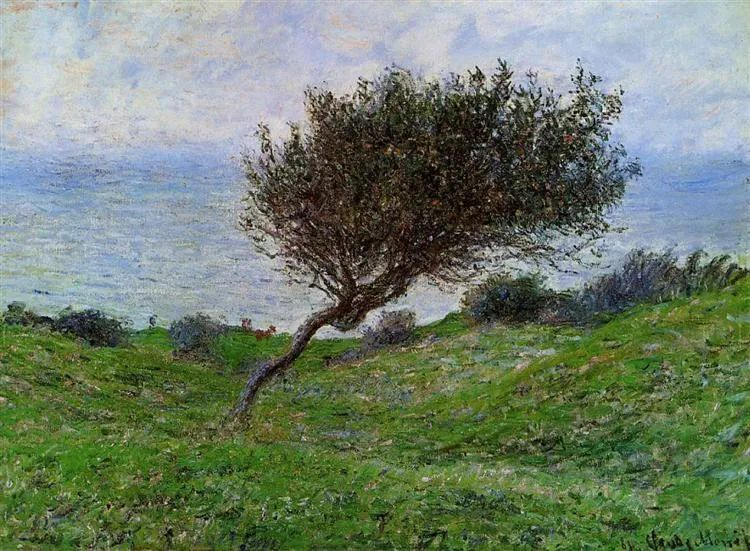

Claude Monet

  

连叔：

  

你好。

  

终于，我成了不久前看到的“迷茫的高考生”，写这封信，就像…抓住最后一根稻草吧。

  

这些年，学费从一年1w多交到了一年近2w，在小县城里堪称“贵族学院”，是啊，大家都这样说，身边的亲戚只会一语“花这么多钱栽培你…”，“起码考个厦大？是吧。”…我不知道他们是在“激励我”？还是“嘲讽我”？

  

浑浑噩噩又过完一个寒假，寒假什么计划？全部泡汤。马上迎来开学考，想必又是很烂了。没办法闯作业林、渡试题海，就等着老师们的口水风暴。我不知道他们是怎么做到一边吐槽所谓“名师”水平基本都一般，然后一边去学他们的“花招”，再来埋怨我们基础不好？但是…你想要普通民办校基础好去哪里哦！？老师们已经在盘算着缩短讲课时间，并改为自学。我？自学？我盯着课本，也不能盯出朵花儿来吧…我们只有课本，但你要学的对象可是人手配一台平板电脑还学习能力很强的！！臣妾做不到！还有总是做不完作业，挤不出时间刷的题，应付不完的没用的活动…

  

哎，我不知道高考会怎么样，可能也会正常地“发挥失常”吧。经过了八省联考一片魔幻的摧残，就像所有的雨都要落在同一朵花上一样，我想躲。我只打算稳稳地填一填本二批…我是没目标、没理想、没追求了，但是本一就是遥不可及…我尽量抓住最近的宝！就是看起来完全和金钱付出不对等。作为“最差一届”的一份子，有的老师亲切的给我们总结了，可能因为我们是“非典宝宝”，所以才不聪明，哈哈，一点也不好笑！

  

最令我困惑的是，是老师，先前分开开“男生女生会”，男老师开女生会？告诉我们女人就是要相夫教子？最近一段时间来，老师们又夸起了“差生”，说：“不管老师怎么骂，他们隔天还是能笑嘻嘻地说老师好，哪像你们，说两句，脸就臭的不得了！”还有多着呢，感谢他们，我也算“学会做人”。因为选科，我阴差阳错进了“快班”，还好吧，也就是经常性垫底，就是每天都能听到“你还是快班的！丢不丢人？！”“你们快班的必须会！”“没考上本一多丢人！”…嗯，是哦。我是快班的呢！但是，完全没有被“激励”到呢，我可不是宋荣子！我基础差、学习能力差就是我最大的缺陷，上课不敢睡觉，生病不敢请假。但是…呃…无奈，是我不够努力吧，是我没有放学后再留30分钟吧？还是我没有过上“标准高三生生活”？我不知道…

  

祝好。

  

一个迷茫的福建考生

  

* * *

  

一个迷茫的福建考生：

  

想起30多年前，我有个学霸妹妹正在读高三，有天突然收到她的信，诉说压力很大，大把掉头发。我看了很慌，想好好回一封信。想了几天，一个字也写不出来，当时确实没那个本事，我只比她大3岁，自己那个愤怒、恐惧、难熬的高三没有结束几年，还会在梦中纠缠自己，实在不知如何化解。后来好像就没回信，她自己熬过去了。

  

高三谁都难过，无论成绩好坏，只要你心中仍存一丝希望，就会难过。30年前如此，现在如此，30年后也如此。你的邮件，从亲戚到老师，从社会到学校，从说话方式到教学方法，逐一抨击，我不会和你探讨这些问题，因为他们的表现方式180度转变，你的抨击火力照样这么猛。高三学生，就是放进伊甸园里，他们也什么都看不惯，这是他们表达害怕的方式，人高马大的大孩子，也不好意思怕得脸色发白掉眼泪，只好表现得不在乎，逆反，离经叛道，眼里的同学，父母，老师，个个都猥琐，以一种极端的攻击情绪替代内心极端的害怕。我高三就是这样的。只是当时不知道自己是害怕，以为自己快要发疯。

  

高三不仅你怕，你所处的整个系统都怕，老师，父母比你更怕，怕你撑不住，怕你放弃，怕你太害怕，怕你的天天抨击。又不敢跟你硬碰硬，忍你，让你，恭维你，让你觉得自己特别有理，特别来劲。有些毫无头绪的家长，若按你的指示改变照顾你的方式，你却会变得更加火大。这时候，你就不是个正常人，完全开启碰瓷模式，郑关西怎么卖肉，都要被你打。

  

知道自己的这个真实状况，对自己有好处，它是不可避免的，是大战发生前的恐惧，只能接受它。战胜这种恐惧的最好办法，就是保持生活的简单，越能简单重复，胜算越高。

  

高三学生，做到顺从，即可简单。顺从家人的照顾，生活无忧，家人是照顾你的专家。你再不喜欢的老师，都是应对高考的行家，顺从老师的指导，学习无忧。把自己的生活极简至准时作息，听课刷题，这样时刻安定，妄念变少，内心也可趋向宁静，波澜不起。在重大选择与挑战发生时，我们要做的，是减少外界的干扰，什么都看得惯，什么都看不到，赞美自己，赞美他人，抨击批评这种事，更是碰都不要碰。

  

祝开心。

  

连岳

  

推荐：[什么是初心？有时出发很久才能发现](http://mp.weixin.qq.com/s?__biz=MjM5NDU0Mjk2MQ==&mid=2651638321&idx=2&sn=a804a9f5ed7e7e34171c344811ff78c4&chksm=bd7e4e2f8a09c7393542162d03979740762594e7e4f73fd0b35c5ad4fbfe8d930e4c9561912f&scene=21#wechat_redirect)  

上文：[老婆想要个好一点的包包，高级一点的回应是什么？](http://mp.weixin.qq.com/s?__biz=MjM5NDU0Mjk2MQ==&mid=2651682856&idx=1&sn=9605ccccd2662de45494116b741ac815&chksm=bd7ffc368a08752072e370984ead7936f6e36692c98509d9e40a9d5ed5f345416225d874d870&scene=21#wechat_redirect)
