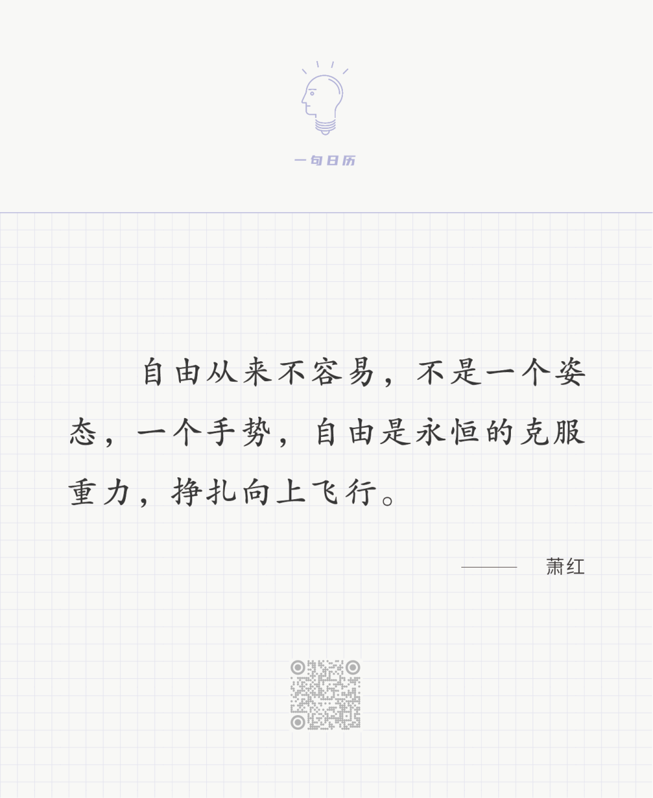

Karoly Ferenczy，Birdsong

  

长按二维码可关注

  

向上飞要克服重力，这引发一个有意思的问题：我们要不要恨重力？

  

恨不得。没有重力，就没有大气层，没有地球，没有我们，没有一切翅膀，也没有飞翔，更不存在自由。

  

重力阻碍我们，重力也成就我们。一切障碍我们的，克服了就是成就。没有障碍，就没有成就。会呼吸很了不起吧？不会呼吸命都没有，可是没有一个人会把呼吸当成自己的成就，因为呼吸不需要我们做任何努力克服障碍，你生下来就会，不必学习，无须努力。而直立行走是成就，孩子走出第一步，总是让父母惊叹欢呼，因为直立行走克服了重力学会用两脚保持平衡。一切学而后得的，都是成就。

  

学就是克服障碍，越重要的学习，需要克服的障碍越大，越多，越强。前人，他人都无法克服的障碍，你克服了，那就是奥运冠军，诺贝尔奖得主，学科领袖，飞机发明者，圣人，佛祖。每天的学习都要面临一堆障碍：难以开始，走神，无法坚持，疲惫，懊悔，我们不停地惊醒，收敛，行动，在这拉锯中获得一点收益，挣得一点自由，终于飞了起来。

  

今天是第164期“下周很重要”，你制订的计划就是你需要克服的一连串障碍，逼你想，逼你做，逼你飞。不要怕这障碍，要爱这障碍，它会转化为你的力量，你的智慧。

  

推荐：[不怕别人变好](http://mp.weixin.qq.com/s?__biz=MjM5NDU0Mjk2MQ==&mid=2651628353&idx=1&sn=40f179914c910d3d049f9082451fb0ea&chksm=bd7e275f8a09ae49529fddce7be8064976515f4d88054681bf8407ec4b7feee3af6ffb3a3441&scene=21#wechat_redirect)  

上文：[拥有2000万现金的互联网女工，人生之路怎么走？](http://mp.weixin.qq.com/s?__biz=MjM5NDU0Mjk2MQ==&mid=2651689353&idx=1&sn=37f51dc9f4430a449ac2bac062869871&chksm=bd7f15978a089c81878eb3c4f6e9a851cbc8a0323796c0d50bb448d49ef3ec3ed51996468edc&scene=21#wechat_redirect)
