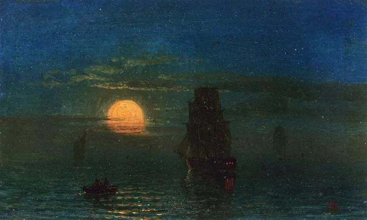

Albert Bierstadt

  

连岳您好：

  

衷心的希望你一切都好！心中纠结很久，还是提笔给您写了这封信。

  

我和老公都是80后帝都土著，育一孩上小学。双方普通家庭，三年前，老公查出肺癌晚期骨转脑转，手术后病情稳定了一段时间还正常上班。但最近几个月病情反复，基本卧床，体重直线下降，夜里疼的无法入睡，从以前意气风发到现在形如枯槁，周围人看到真的很难过。

  

我们不和双方父母住，但也都离得不远。孩子从小是我父母帮忙带大的，现在也是我父母照顾，同时还要兼顾给我老公做饭保证有营养的汤汤水水。他们是上岁数的人了，很累，但也很心疼我老公，觉得他是好人让我不要放弃。我白天上班工作紧张，晚上回来还要照顾他和辅导孩子，一家人心力交瘁。

  

而老公父母呢，以自己离得远和疫情期间坐公交车不安全为理由，一直不出现，却还在电话里表白自己如何爱儿子，并让我多照顾。3年来，他父母照顾他的时间不超过三个月，还只是做顿饭而已，经常以我老公对他们的态度不好就骂骂咧咧撂挑子。他们是那种让别人觉得很不舒服的人，明明很普通就是底层劳苦大众，却表现出高高在上，要求别人给予最大尊重和敬仰。当年我在临盆前挺着大肚子坐在床上，他妈妈以我没有站起来迎接她而破口大骂。而我老公说话稍微不耐烦，他们就能恶语相向指责半天，最后必须以他们胜利告终。这是对待自己唯一的孩子啊，一个癌症晚期病人，毫无人道可言，做父母的生性如此凉薄震碎了我的三观。

  

我们其实很不愿意跟他父母接触，也雇了钟点工做晚饭不麻烦双方父母。但我老公现在这个样子，身边离不开人了，我父母身体和情绪上都不允许再过多付出，而他父母又是极其吝啬出钱出力且经常出言不逊扰乱正常生活。我真的不知道该怎么继续下去，每天都很累，也不敢去接受更有挑战的工作。很长时间没带孩子出去玩了，觉得很对不起他。孩子每次问爸爸得的什么病，什么时候能好，我无言以对。我是连放弃都会被唾弃的人吧，人生过半，但已没有未来……

  

没想到人生如此之难，不知道能不能收到您的回信。希望来信不会影响您的心情，祝您开心顺利！  

  

人生太难

  

* * *

  

人生太难：

  

加油啊。我唯一会怪你的，就是你没有早点给我来信。我不是说我的回信有什么魔力，至少我可以为你加油。至少看到你的来信的所有读者，他们都会为你加油。

  

见识人性的不堪，是我们人生逃不过的一课。一个人真的了解人性，就在于他发出了这声感叹：人性的黑暗真是深不可测。就像你现在一样。对于还没有这个感叹的人，我总是用这句话警告他们不要过于轻信。而对于已经吃过苦头的人，我还会送给他们另外一句话：人性的光明真是高不可测。就像你的丈夫，他身患重病加上遇上这样的父母，他内心的悲凉数倍于你，但与此同时，你的温暖，岳父母的慈悲，他的感受，可能数十倍于没有悲凉过的人。

  

人性的黑暗，黑暗的人，在于它无法用正常的情理推演。按人情，按天理，它都不该发生。它往往体现为逆人情天理，你信任他，他偏背叛你，你爱他，他咬你最凶。这种反差与震撼，才体现出黑暗的恐怖。遗憾的是，这种事情最常发生在人们认为不该的家庭里，黑暗的人，吞噬的第一批人，就是其身边的亲人。这就是我们既要珍惜血缘，又要超越血缘的原因。不珍惜血缘，连家庭都不爱，不建设，连最爱自己的人都要辜负，那会变成一个黑暗的人。不超越血缘，那会被身边的黑暗者捆绑，无法挣脱他，成为牺牲者。

  

凡身边出现黑暗者，我们要做的就是隔绝。隔绝得越好，黑暗越无法影响。隔绝有很多种。不闻不问，不来往，拉黑，这是容易想到的隔绝法。但是，如果你还对黑暗者抱有希望，以为他们将后悔、惭愧、改正，那就是还没有隔绝，迎接你的，极可能是新一轮打击。黑暗者之所以黑暗，在于他们的自我评价极高，不是他错了，是世界错了，不是他骗人错了，别人不上当才错了，他没回报你的爱没错，是你爱他不够的错，他凶你、害你、甚至杀你，都是正当的，甚至是为了你好，简直就是天使，有什么可悔改的？对黑暗者彻底死心，才是真的大隔绝，你才能够清静、安宁、有力、生长。

  

我知道，你很累。太需要一点亲人的帮助，你认为他的父母无论如何此时总会帮你一把，毕竟是他们的儿子。你觉得应该会、肯定会、是人都会。这就是还没有用“彻底死心”隔绝黑暗者，你还以光明的人性推演他们，产生了希望，希望破灭后的失望、绝望，让你累上加累。他们已经死了，黑暗者在人性上已经死了，和我们不一样，已不再是人。知道这点，他们才无法继续伤害我们。

  

你现在的生活重心是好好陪丈夫治病，不要对自己太严格，其他的人生任务与精进，都可暂缓。也不要都自己硬扛，可以适当寻求帮助，让单位、好友知道你的难处，甚至可以请求孩子的拥抱与安慰（孩子做得到的），所有光明的人，都会帮助你的，这对他们来说，也是自然而然的事。

  

拥抱你。

  

连岳

  

推荐：[在不完美中生存](http://mp.weixin.qq.com/s?__biz=MjM5NDU0Mjk2MQ==&mid=2651628775&idx=1&sn=b95c6ffdcfc33fca051ab6cdb3985375&chksm=bd7e20f98a09a9ef501d384cd30f6684fb6a7ac18495470b34655ebba7224aebdaca8eed9e54&scene=21#wechat_redirect)  

上文：[如果爱像长胖那么简单就好了](http://mp.weixin.qq.com/s?__biz=MjM5NDU0Mjk2MQ==&mid=2651688266&idx=1&sn=9e269e3ad3147df62d56f49280b6e80f&chksm=bd7f09548a088042a88492b99e92251dad3fa99a67364f4d646b8f5796ec9e5cc13c35bed83e&scene=21#wechat_redirect)
