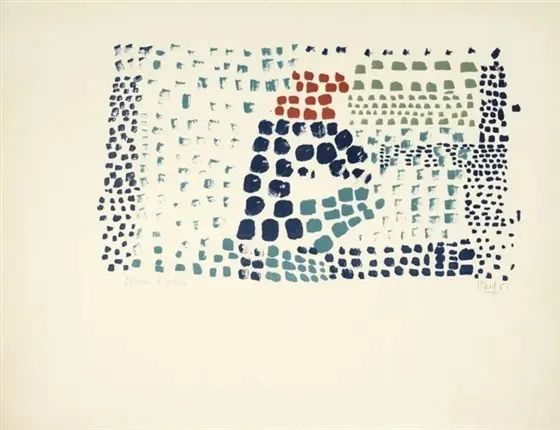
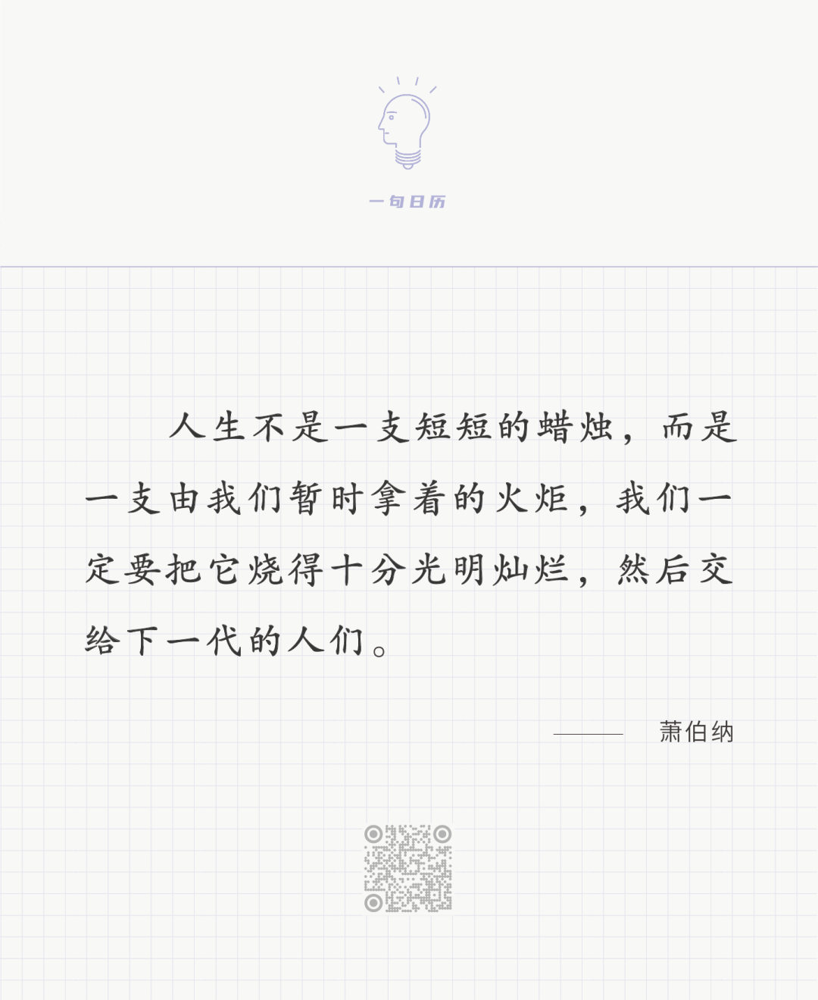

Nicolas de Staël

  

  

长按二维码可关注

  

施比受有福。但受好学，施难学。受是本能，施是智慧。

  

人一生下来，就会抓住东西，抓住妈妈，抓住奶瓶，后来抓住声色犬马，抓住功名利禄，人总是觉得不够，至死不放手。  

  

受得再多，不学会施，人生总是累的，受得再多，无意义感也将淹没一个人。只想着受，一个人很快就会封闭，灰暗，不思进取，混吃等死。孔夫子说过，饱食终日，无所作为，人一定会出乱子。现在进入富足时代，更容易理解这句话。饱食不是孔夫子时代的稀缺品了，而是必需品，一个人吃不饱，扶贫也能让他吃饱。饱食后做什么？这是一个人必须回答的问题。人得有所作为，这样才不会乱。你一定有过这样的经历，今天什么也不必做，那往往变成乱睡乱吃乱喝乱玩，一天结束时，特别疲惫，特别无聊，特别懊恼，这就是一天之乱。这样乱上一个月，乃至乱上一年，人就越来越难收拾自己。乃至无法收拾，除了会吃饱，会受，其他什么也不会了。  

  

人得有所作为。学会了施的人，容易有作为。施是什么？是不满足于只满足自己，是在满足自己之上有更大的目标，受只是基础，是起步，饱食之后要做更重要的事。所以萧伯纳这句话好，一定要把自己的人生烧得十分光明灿烂，交给下一代人。这是一个伟大的、无止尽的目标，立足于个人，又超越个人。当然，这么大的目标显得空，似乎无从下手，但只要理解，在个人满足之上，有更高的目标，很多小事都会亮起来，比如固定的早睡早起，到点睡觉，到点起床，有利于健康，效率也高，很多人为什么做不到？因为这纪律有约束感，总像有人监督着自己，作息是自己的事，我何必这么苦？当你理解更高目标往往体现为纪律约束时，你却会喜欢约束感，喜欢那一点不舒服，乃至这不舒服变成了真舒服，没有约束的舒服反而成为让你害怕的假舒服。

  

今天是第163期“下周很重要”，你制订的计划就是纪律，就是约束，就意味着有所作为，就是将人生烧得十分光明灿烂。  

  

推荐：[青年的资本与陷阱](http://mp.weixin.qq.com/s?__biz=MjM5NDU0Mjk2MQ==&mid=2651633412&idx=1&sn=c9b5d1dbdf0198837c165018472197a5&chksm=bd7e331a8a09ba0c640527dc9f1cd8dac15e2150afee896b83f972c706160d659db91d3a5589&scene=21#wechat_redirect)  

上文：[我的女友是一根鱼刺](http://mp.weixin.qq.com/s?__biz=MjM5NDU0Mjk2MQ==&mid=2651687527&idx=1&sn=09eb6f525bea229503f1326c3f13aade&chksm=bd7f0e798a08876fd4595ae2664e75df254366cc5675ac291395c5bb4ec75a32cd556a58be8b&scene=21#wechat_redirect)
