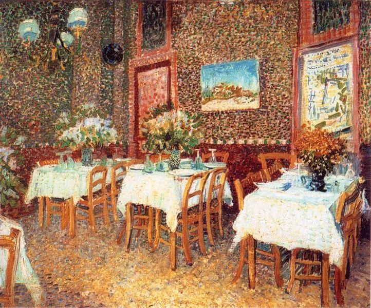

Vincent van Gogh

  

连叔，您好！

  

深思熟虑后，纠结了好些天还是鼓起勇气找您要答案。关注您已有3年，您的文章每篇必看，一日不看就难受。因此也被您的观念深深影响着，指引着，温暖着，陪伴着，让我在黑暗中有勇气前行，敢于坚定自我，走向光明。

  

我有3孩子1个在身边带着（省会城市），2个在老家我妈帮忙带着，老3今年9月份上幼儿园，学费1万，准备给她接来。

  

我32（男）是开面馆的，夫妻经营一家小店，亲戚合伙人2个，我夫妻3成股份，1个5成，1个2成，目前夫妻收入2万，家庭开支1万包月供，说起月供也是在您的影响下买的房。

  

我是20年6月份在省会城市买的房，买房经过之艰辛，只有自己知道，当时差点和老婆离婚了，还好最后理性战胜了感性，婚姻保住了。现在还有最后首付3万就还完了，再就好好还月供，也算在大城市立足了。

  

心里有开心也有恐惧，开心是我这底层人也会买得到房，孩子到时可以都接来读书，想想就幸福一家人，恐惧是收入太低，目前没有积蓄，就在今年1月初把手里的存款4万还了首付，因此手里没有钱了，这时又是过年形势花钱地方太多，孩子学费，都得提前安排好，因此也心生焦虑，纠结痛苦。

  

围绕以上问题有2个想请您指教：

  

一、 对收入我不太满意至少月入3万才是安全的，所以我想和老婆分开来做，老婆继续保持原来的股份3成，工资6000。这样生活开支可以保住。我想去发展我喜欢的事业烘焙，到烘焙店打工了解操作流程成本控制，然后再兼职骑手，我想收入也不会太差，我对自己还是有信心的，但是这都是我主观上的，不够客观。

  

二、目前重要紧急的就是现金流断裂，我想去银行贷款5万作为流动资金。不知怎么选择，还请智慧的叔给我指条明路。

  

您说过人生重大选择只有几次，做错几次再无机会，所以望您能看到。当然您也不一定能看到，那就尽人事听天命吧。

  

祝连叔身体健康。

  

沉默是金

  

* * *

  

沉默是金：

  

恭喜你。一个人在自己喜欢的城市买了房子，是自己和整个家庭彻底融入这座城市的象征。从此，就享有这座城市发展的红利。你的孩子将来也会以你为荣，你改变了他们的人生起点。

  

你们夫妻月收入2万，家庭开支1万包月供，这财务是很安全的。你们还很能存钱，付完首付半年多，就又有了4万元还债。

  

所以不必焦虑，财务安全时，最好的应对就是不要动它，保持原样运行，机器不坏不要修。经营稳定又能挣钱的小吃店是最好的生意模式之一，本钱不大，存货周转快，客源稳定，复购率高，营销费用为0，更重要的是，客人吃饱后满足与幸福的神情，给你带去多大的成就感！这就是佛陀所说的人生八正道之一的“正命”，谋生的手段正大光明，疗人饥渴，给人快乐。你怎么是底层人呢？人只分为正派与不正派，你履行正命，又有家庭责任感，当然是正派人。一切正派人，日子都会越来越好的，有房子也是天经地义之事。

  

你的焦虑，不是财务因素，主要是心理因素，我称之为“第一次购房焦虑症”。人的本能厌恶负债，第一次买房的人，往往财务并不宽裕，又背上少则几十万多则几百万的房贷，负债厌恶本能大发作，简直觉得活不下去了。很多人没房子不是财务支持不了，而是这个心理关过不了。

  

厌恶负债本能是好本能，这令人慎重。但好房子的房贷很特殊，是包装成负债的资产，理解这点就能战胜负债本能，不再恐惧。省会级别的城市，房子长期的升值幅度（短期或有波动），将大大大于你现在欠银行的房贷总数。理解不了其中的逻辑也不要紧，你咬牙还两年房贷就习惯了。两年后，一碗面可能涨价了20%，而月供还是一样，月供在你收入的占比中越来越小，最后毫无感觉。这事实会告诉你金融真相，能缓解你的焦虑。你买第二套房子时（如果政策与市场还有这个机会），心理压力就会小得多，甚至没有。人生的重大选择确实只有几次，选择承受并战胜“第一次购房焦虑症”，就是其中一次。

  

你现在的当务之急不是进入新行业，尤其要靠贷款启动，失利了（这可能性不小），负债增加，财务焦虑叠加心理焦虑，那真会崩溃。财不入急门，越急越要有定力。要更专注于本业，夫妻俩把面馆经营得更好，在口味、份量、卫生上更上层次，这才是你增收的最佳途径。

  

我是南方人，却是面食控。祝你生意兴隆，人生很长，人生很巧，不知何时就旅行到你的城市，偶然走进你的面馆，虽然见面了也不认识，但想想这场景，就像吃了一碗好面一样舒服。

  

祝开心。

  

连岳

  

推荐：[读懂这本书，即读懂房地产](http://mp.weixin.qq.com/s?__biz=MjM5NDU0Mjk2MQ==&mid=2651642904&idx=2&sn=c7a4accad23afb1d6513a7b99ac49ab9&chksm=bd7e58068a09d1104cec5ef8b1c38cc1d56c5c441cb1f8b9f6afd61c3d3279db3ca66969d3a7&scene=21#wechat_redirect)  

上文：[一个坏男人变好，需要多长时间？](http://mp.weixin.qq.com/s?__biz=MjM5NDU0Mjk2MQ==&mid=2651689819&idx=1&sn=3fe39055902a14c2c02ce0b446d436b5&chksm=bd7f17458a089e53adef17f0bea9f01bdc1aa862548d7ccc2b3b29c04ffd795975d7942a694d&scene=21#wechat_redirect)
