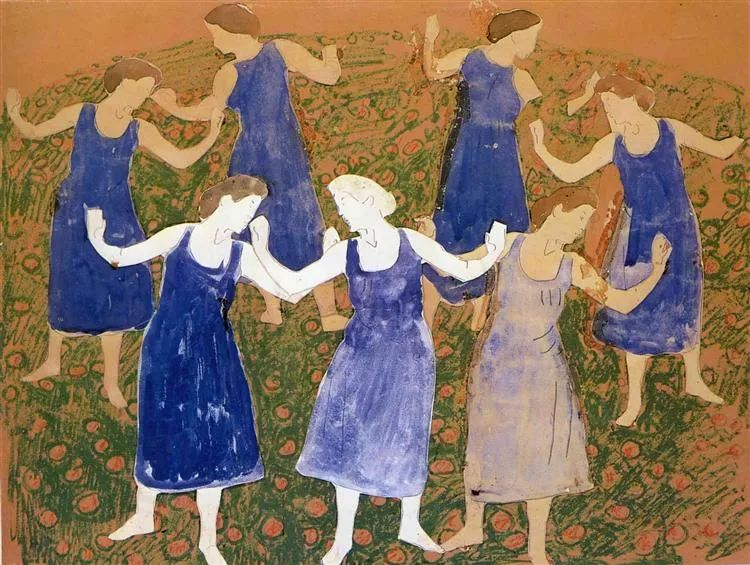

Ferdinand Hodler

  

连叔：

  

您好！我是一个98年的小女孩，我跟我老公认识半年就登记结婚了，半年后摆了酒席，在这段期间我们有过很开心也有过不愉快，不愉快是在摆酒前筹备的日子里出现了一些矛盾，但是最后解决了，我自己是一个总会把坏脾气留给亲近的人，好的脾气留给外人的人（我是这样认为的，我奶奶，我弟弟也这样认为我）我老公是比我大五年的，但是他在家里是最小的，所以可能很多事情都是公公婆婆那边帮他安顿好，但是他也是一个很能吃苦的人，工作再累，也从来没说过，以前的话很少做家务，自从我跟他一起后，我会说他需要承担家务，他现在就会把家务打理得很好，可以说，我跟他在一起这一年多，都是他洗衣服的（包括我的贴身衣物）甚至工资每个月都是上缴，只留自己需要花费的，对我更是随叫随到，宠爱有加，在一起期间，我做过两次手术，但是他都是照顾得我好好的，说真的，他真的很爱我。虽然我也爱他，但是我觉得他更爱我多一点。

  

在一起的期间我们吵过很多次架，每次都是他哄回我，第二次手术后，我情绪很难控制，一点小事我都会闹得很大，很容易失控，甚至如果在车上吵架，我会抓他方向盘，我写到这里，自己觉得自己都很不对，但是每次就算大吵后，我老公还是哄回我，对我千依百顺，有时候我在想是不是他惯得我，所以我每次都那么放肆，我家人都很喜欢他，觉得他是一个脾气很好，对我很耐心，很老实很踏实的人。但是最近我吵架的次数逐渐增加，我很多时候因为一些事我就发脾气，把事情弄得很大。比如，有一次，我跟他很开心的去喝喜酒，在路上看到有工人施工弄牌子，我就说：“老公，这里施工以后车子就又少了位置停车了。” 他就笑着说：“我的车就停在施工位置旁边。” 然后走到快到车的位置的时候，他松开我的手，掏车钥匙开车，走在我前面，那一瞬间我就会不开心，我会觉得难道车都比我重要吗？觉得他担心车被施工的不小心弄到，然后赶紧把车开出来，我就会觉得不开心，我就开始发脾气说他，他说：“并不是的，我只是想走快一点开车门给你”。我就会觉得这个是借口，我就坐车上不说话。然后他就开车开到我娘家的路上看到我姑姑了，就停下来，我打开窗户问候了一下姑姑，姑姑就说：“奶奶今天中午头晕，刚刚去看病了打完针回来了。”然后他就把车开到我家门前（因为我们是本村的，所以家里离得很近），我当时还在生气，他也没说话，我就下车了走回娘家，然后我问候了奶奶一下，奶奶就说你要去喝喜酒啊，我说是的，然后我就出来了，看到他在车上撑着头玩手机，我就很生气，我上车后，我说：“我自己过去喝喜酒就好，不用你去。”  他就默默地说：“我送你过去。”  然后就开车走了，在路上，我就开始发脾气说他，“你一点都不关心我家人，我进去你也不进去，真的一点人情味都没有，就算我跟你生气，你也不必这样吧”？然后他说：“我没有不关心你家人，第一，你刚刚说我担心车被划到，我并不是这样想，我只是想走快点开车门给你。第二，我刚刚也在生气，因为无缘无故你这样说我，我没有这样想你这样说我，我也会难受不开心，所以我就想着你先进去，我先缓一下再进去，我就看手机分散注意力，但是我没想到你那么快就上车了，你上车就气哄哄的。”  但是最后我们还是和好了。

  

可是，这几天我一直对这个事很难释怀，觉得为什么他这样做，明知道我会多想，但是又不会做好，我就会现在很不信任他，感觉他对我的解释都是骗我的，包括他说并不是不想进去，连叔，我该怎么办呢，我该怎么样走下去，我最近变得很敏感，一点小事都会发脾气，我要怎么做？我真的嫁错人了吗？

  

98年的小女孩

  

* * *

  

98年的小女孩：

  

你没有嫁错人。你嫁得太对了。你老公简直是为了拯救你而生的。他是一个难得的好人，好到什么程度呢？如果他写了这封邮件，我会说他娶错了人。一个脾气上来抢方向盘的女人，明天可能就会把两人都害死，车祸还会害死另外一些不相关的倒霉者。

  

但你运气很好，是你写邮件，所以我们讨论的重点变成如何保住这个好男人，如何保住这个婚姻。好运气会用完，这或许是你最后一次了。人不能只靠运气过日子，运气只是给你更好的机会，最终还是要靠一个人的努力、上进、克制，将机会转化成实实在在的获得，不再失去。

  

你当然是一个坏脾气的人，这点你奶奶，你弟弟火眼金睛，一点没说错。坏脾气的人也分等级，有好的坏脾气的人，有坏的坏脾气的人。好的坏脾气的人，他们生气，还建立在事实的基础上，别人确实说错了话，做错了事，只是他们无法用平和高效的方式纠正这些错，生起气来，结果错上加错，这种人容易得到原谅，毕竟他们行事有客观标准，熟悉以后还是能够对话的。而坏的坏脾气的人，只要他们想发脾气，就可以发脾气，纯主观行为，在这个时候，别人无论做什么，都是错的，爱他都是错的。他们的家人倒霉，只有家人让着你，其他人凭什么无缘无故受你的气？对等报复一下，你也很难受，所以你们这些家伙欺负家人很狠，出门都是好脾气，知道外人惹不得。

  

你当然属于坏的坏脾气的人，你描述的这件事，认为自己委屈得不得了，以至于怀疑自己嫁错了人。看下来，纯属你脑补过度，无事生非，像个女流氓一样寻衅滋事。可见你的自我认知多么离谱。你的老公很可怜，他要么被你欺负得失去正常人该有的情绪反应，陷入抑郁黑暗之界；要么忍无可忍，最后离开你这个疯狂的迫害者。为避免这两种不愉快的事情发生，你得真心悔改。可以负责任地说，你向老公发脾气，99%是你的错，一是忍住，忍得把牙咬碎都要忍，忍100次就不会那么辛苦了；二是批评他之前，先检讨自己，想批评他1句，先检讨自己9句，这个比例关系符合你坏的程度。只有这样，你的婚姻才保得住，才不会失去这个如此包容你的男人，他是你把脾气变好、变成一个好人的最后机会。

  

祝开心。

  

连岳

  

（我的邮箱：lianyue@xmlykd.com，来信前请谨慎考虑，因为意味着只可能在微信平台公开回复，并授权我用于图书汇编。）

推荐：[不让一只蝴蝶干扰自己](http://mp.weixin.qq.com/s?__biz=MjM5NDU0Mjk2MQ==&mid=2651633074&idx=1&sn=15ccf0444c12f82ef42f1253f6ff75a0&chksm=bd7e31ac8a09b8baeacfcf5a884a740734aa74764eee01e6e4c4dc8656d2e9e258b336538b86&scene=21#wechat_redirect)  

上文：[越能戒，越能慧](http://mp.weixin.qq.com/s?__biz=MjM5NDU0Mjk2MQ==&mid=2651691326&idx=1&sn=506adef61e923d8d85986228ec694314&chksm=bd7f1d208a089436b830d718deef653f74d3e40a5c524717b14eb4a9c86b0bcd823e66260352&scene=21#wechat_redirect)
