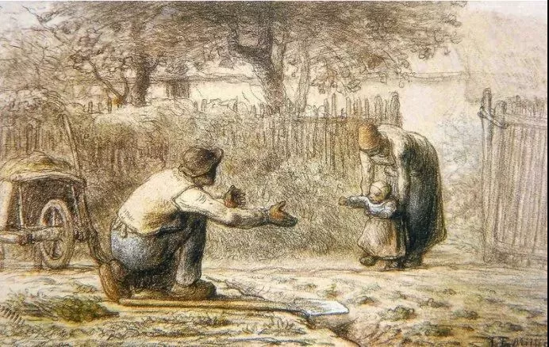

Jean-Francois Millet

  

连叔好，先拜个晚年。

  

经常从连叔这里找生活智慧。坐标广州，夫妻两都是外地人，本地政府机构工作。从除夕得知老婆怀了二胎，一家人就纠结起来。我35，老婆34，之前14年自然怀孕一次但是六个月时因为宫颈机能不全未保住流产。后又因输卵管堵塞求子五年才得。现有一个一岁十个月可爱健康男孩，来之不易，做了三次人授两次试管才得到。其中老婆艰辛取卵吃药打针无数。生下来才三斤多，立刻住了保温箱。还好一路精心照顾，正常长大了。

  

说回我们目前纠结之处，我开始是不想要，因为想只要一个就好，经济上，大人的精力上都好。老婆开始很想要，并不是她很想要二胎。而是心里觉得对第一个失去的小孩的愧疚，以及自己吃药打针求医所受太多辛苦，现在老天自然送来一个宝宝，不要心理上过不去。而且从身体上来说，如果这一胎不要，后面基本也不可能再要了。后来去医院检查，医生说怀这一胎是幸运之极。但是因为老婆是天生双子宫，后期大出血中央前置胎盘风险还是比普通孕妇大得多，而且宝宝可能因子宫小发育受限偏瘦小。于是我们开始了反复纠结，生的话怕大人风险宝宝不健康，另外客观上家里只有一个老人能帮忙带，经济上家庭年收入35w，没有积蓄。但是房贷很重，加上投资佛山房产失败，目前亏钱严重，加上大宝也还小，这时候时间不那么合适。不生的话心里难受，另外这个只有一次二胎机会，老婆后面基本没有再怀概率，放弃的话以后就没有了。怕后面一胎不坚定，会后悔没有生也怕失独。很纠结，给连叔说了这么多都语无伦次了。每天晚上都睡不好，每天被相反的两个念头反复横跳折磨，一会想要一会不想要。老婆前天还想要，现在打算不要了，说怕身体吃不消，已经约了3月的计划生育门诊。可能是我想要的太多，又瞻前顾后，心里也反复推翻好几次。有时白天不想要，觉得养好一个就好了。晚上睡觉时细想又觉得来了就是缘分，这么不容易小概率不要多可惜，两个一起有个伴。还有就是老婆的心情，生与不生，我能做些什么去帮助她呢。之前我想一胎主要是考虑了客观经济和人力上的问题，后来我觉得这个不是最重要的问题，客观条件是会不断变化的。现在老婆做任何决定，我百分百支持她，但是不想她因为客观条件受限留下遗憾。

  

一个35岁苦恼男求助

  

* * *

  

一个35岁的苦恼男：

  

无论生几个，妈妈的安全始终是放第一位的，这点毋庸置疑。还好，这点可以靠医生，你们也经历过，自己也算是半个专家。在这个前提之下，我的意见是，还是要了这个孩子，因为你们那么爱孩子。

  

试想一下，如果现在你们怀的是第一个孩子，你们的心情只有一个：欣喜若狂。怎么可能会想到放弃他？一切让你辗转不安，左右为难的因素都不是阻力，为什么他等你们更有经验之后，第二个来到，就要放弃他呢？不是应该感谢他吗？

  

在城市里，尤其是广州这样的一线城市，财富间的等级非常之宽，无论多富的人，上面总有更富的人。这既是机会的展示，也是压力的来源。人很容易把成功与生活的标准提得很高，觉得最富贵的那个阶层，才是真的生活。完全没有必要，有自己的房子，有一份工作之后，收入与幸福就不再呈正比例关系，爱，责任感，陪伴，才是真的生活的最重要构成要素。而这些，你们都做得到，做得好。抚养孩子，不是金钱上无尽的军备竞赛，并非砸钱就能赢得一切，所以工薪阶层的父母，不必过于焦虑，只要你爱孩子，好好陪他，多聊聊天，人生的黄金原则，人间的天理，就那么几条，将它们变成孩子的底层结构，从不动摇，他的人生将是美好的。我们的父母，他们就是这样抚育我们的，他们当时有几个钱？饭可能都吃不饱，面临的风险与压力，比我们现在大得多。纵向和他们比，就会发现，现在这些压力，都不叫压力。

  

你们还有一个优势，就是在政府机构工作。中国的生育政策、生育文化将由抑制变成鼓励，对生育更友好的软硬件建设，都将加速，这极可能首先体现在政府雇员上，起一个示范作用。你们生第二个孩子，会增加一些支出与劳动，但我想，是可承受的，也会随着收入的增长逐渐变轻的。家里有两（多）个孩子，年龄差距不大，他们结伴游戏，不缠着大人，有时反而比只有一个孩子更轻松。就像我们小时候，都是兄弟姐妹一起玩。

  

前几天，我还在劝一位爱孩子但由于自身原因无法生育的好朋友，尽快去收养一个孩子，理由也只有简单的一条，你那么爱孩子，而且是那种非得通过抚养一个孩子的方式爱孩子的人，那就不要犹豫，把收养列入计划，尽快实施，这对你，对那个将被收养的孩子，都是好事。人与人最美好的关系，是由爱连接在一起的。血缘很重要，但要看得破。大家三观正，血缘锦上添花，凝聚力强，效率高。但如果有人观念出问题，无情无义，无有底限，迷信于血缘，无法切割，整个家庭就会被团灭。我的意思是，这个世界上，那些想用抚育孩子的方式爱孩子的人，都应该有孩子，不能生也不是障碍，不过，像你这样自己能生的，当然更好。

  

祝开心。

  

连岳

  

推荐：[钱重要，幸福更重要，平衡点在哪里？](http://mp.weixin.qq.com/s?__biz=MjM5NDU0Mjk2MQ==&mid=2651663801&idx=1&sn=7f898fb4b822c9dfe7c1b4f076b5131d&chksm=bd7fa9a78a0820b1715338b660238c9d16ec40dd6ab88c9af1a57f58de67bc6fcd02798dd82a&scene=21#wechat_redirect)  

上文：[写在新学期，为什么要努力学习？](http://mp.weixin.qq.com/s?__biz=MjM5NDU0Mjk2MQ==&mid=2651684157&idx=1&sn=f933784b26bb5f0614403b67f1a8d6e3&chksm=bd7ff9238a0870358ee0797ec3b2f351921e7229ffed93e86a8898c33f895d5d5ba28af54dc5&scene=21#wechat_redirect)
