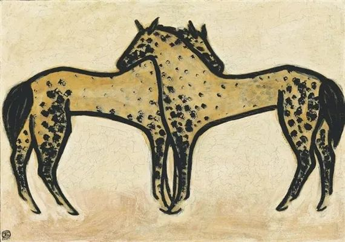

常玉  

  

连叔您好：

  

我有一个喜欢了10年的男孩。他高三复读来到我的班级，我们成为了好朋友。暗恋他一年，12年高考结束告白被拒，他说觉得我们做朋友很好啊。直到今天当年表白的事情我们都只字不提，虽然心里喜欢，但我也没再提过。

  

大学四年我们联系不多，他在沈阳，我在哈尔滨，我没谈恋爱，他交过两个女朋友。毕业后我考进运营商回家做一名国企小职员，他顺利进入上海某航空公司成为一名飞行员。

  

16年毕业到18年，我们渐渐多了些联系，一到两个月就会打次电话，一聊就是几个小时。18年11月我休假去上海找朋友玩，中间约他一起去了迪士尼，从那之后，我们大概每周都会聊天，还会跟彼此分享生活里的小事。

  

20年初疫情爆发，隔离在家的大概两个月里，我们开始每天语音聊天、玩游戏、居家运动，相互鼓励陪伴着，连着麦各自做各自的事情，休息睡觉也不例外，第二天早上醒来才会挂断。恢复正常工作生活后，也几乎每天打电话，和他一起玩会聊会天。

  

毕业工作这四年多里，有同事、朋友的朋友追过我，还有亲戚朋友介绍的人，但只有一个喜欢的谈了四个月，恋爱时我们没联系，分手那天很伤心给他打了电话，他安慰我，还帮我“骂”前男友。至于他，可能谈过两个吧，也是后来才和我讲的，他谈恋爱的时候完全没有迹象，也从不发朋友圈。

  

我俩生日很近，会为彼此准备礼物。平日里我也会寄东西给他，日常他吃到什么好吃的也会给我买，前几天买了双球鞋觉得好看，送了双同款给我，还说是情侣鞋。虽不迷信，但他还是问我要了一块钱。我还笑他是不是害怕把我送走。

  

他每次回家我们都会见面，一起吃个饭，再去万达玩一会，有时候他非要去我家做客（我一个人住，没和爸妈住在一起）。年前这次回来，白天逛完在我家一直呆到凌晨才回家，我们靠着彼此坐在沙发上聊天，吃烧烤。没有亲吻没有别的，只有临别时简单的拥抱。但却让我有一种谈了两天恋爱的错觉。

  

回上海后有天他突然问我：你觉得咱俩合适吗？我本能的说不合适，他说：“你别说因为咱俩太熟了，我觉得好还吧。”其实我是觉得他喜欢身材好又漂亮的，可我只是个太普通的女孩。也许他只是随口一问，但却让一直内心平静的我又起了波澜。昨天聊天，他问我今年休假想去哪里玩，说要不然你想去哪我陪你去吧，我们一起。我说好啊。可是如果我们单独去旅行，我怕途中会发生些生什么，是我想多了吗，我又该如何面对呢。

  

因为我一直深深的认为我们两个不可能，所以我几乎不主动联系他。一边觉得反正大家都单身，聊天就聊天嘛，都是朋友。一边又觉得谁家正常朋友每天都聊天好几个小时的，想着到此为止吧，该结束了。然后又总是不争气的舍不得拒绝，只要他打电话，我就会接，就算有事，也会先回应他一下。

  

其实如果我们在一起，我可以辞掉工作去上海找一份，我可以不在乎。我从没问过他是否也喜欢我，也许是骗自己吧，害怕听到否定的答案，觉得自己连备胎都算不上。日子一天一天过去，我如今也不是17岁的小女孩了，不能一直这样下去了啊，所以家里安排的相亲，我会乖乖去看，努力试着去相处，但总是觉得差点什么，最后都无疾而终。别人觉得我眼光高，告诉我别太挑，其实我好像是懒得重复那些重新认识一个人的过程，觉得很累。

  

说了好多呀，真希望所有事情都能像发胖一样简单，希望连叔能给不争气的我一些建议，或者批评也好，不知道能不能得到您的回复，祝您快乐！

  

没故事的女同学

  

* * *

  

没故事的女同学：

  

快点答应他。你爱他，他也爱你。你们其实已经在恋爱了。

  

你担心自己身材不够好，也不够漂亮。托尔斯泰说过，人是因为可爱才漂亮，不是因为漂亮才可爱。这个老同学，这个飞行员小伙子这么小心翼翼地，隐藏起妒嫉，既怕离你太远，让你走掉，又怕动作太大，把你吓走，费尽心思，又自然而然地追求你，在他眼里，你是无限漂亮的。

  

一个人与自己爱的人在一起，是会变美的。女为悦己者容。这个容，多数人只理解为化妆，把自己收拾得漂漂亮亮的。其实这个容更应理解为见到心爱的人，人突然明亮起来的感觉，你自拍时，照镜子时，像是看着静物，你看不到这种爱的互动与加持功能。不是女为悦己者容，是汝为悦己者容，是人为悦己者容。一个沐浴在爱中的人，他的眼神是清澈而温柔的，单纯而又丰富，他脸上永远带着一点笑意，就是担心也隐藏不住快乐，他的身体是干净的、香的，他的灵魂是飞翔的，香的。这种美不是物理层面的漂亮，是强烈的，但又无形的，是爱独有的。两个相爱的人，往往蓬头垢面相见，但每天第一眼睁开看到他，就看得到这种美，觉得今天踏实，今生也很踏实。

  

就像你写的故事，不过是一些吃饭、聊天、送礼之类的日常生活，但为什么读完觉得特别美，心情特别好？一个大作家未必写得出来，如果没经历过这种爱，他是写不出来的，虽然每个人都会吃饭、聊天、送礼，可是缺了爱的关照，不过是无聊的琐事，一点也不美。

  

爱确实无法像发胖一样简单，爱往往像减肥那么辛苦。这么好的东西，让我们人生明亮的X因素，让我们这琐碎一生变美的魔法，当然要辛苦得到。有时候，越爱就会越怕，怕拒绝，怕否定，怕失去，怕风险。不要怕，或者说，应该去承受这些怕，这是爱应有的勇气与担当。人与事，小到一粒原子，大到多重宇宙，时时在变化，不确定性确定存在。两个相爱一生的人，必然有一些怀疑的时刻，痛苦的时刻，难熬的时刻，危险的时刻，最后，老了，死了，分别的时刻到来。只有预见到这些时刻，接受这些时刻，你才不那么怕，你才不会怕。爱，包括爱这些怕，包括爱这些辛苦，爱在这些怕与辛苦中成长，长得更爱，长得无法摧毁。

  

快点答应他，不惧一切地爱。爱能让你不惧一切。

  

祝开心。

  

连岳

  

推荐：[自信远比你想象的重要](http://mp.weixin.qq.com/s?__biz=MjM5NDU0Mjk2MQ==&mid=2651632910&idx=1&sn=164dc9a9bbfa3dc63ceb822c82f5abe1&chksm=bd7e31108a09b806043a0029ede666a071f0389b93bf2df738b1f976088f3910c16b161b9ffc&scene=21#wechat_redirect)  

上文：[什么是真舒服？什么是假舒服？](http://mp.weixin.qq.com/s?__biz=MjM5NDU0Mjk2MQ==&mid=2651687816&idx=1&sn=e1d4faf9afcc38faabdea41b7d303a95&chksm=bd7f0f968a0886805004eae4bf76dd71b238f66a529e552d8a54e405e4e303f81754b1039401&scene=21#wechat_redirect)
