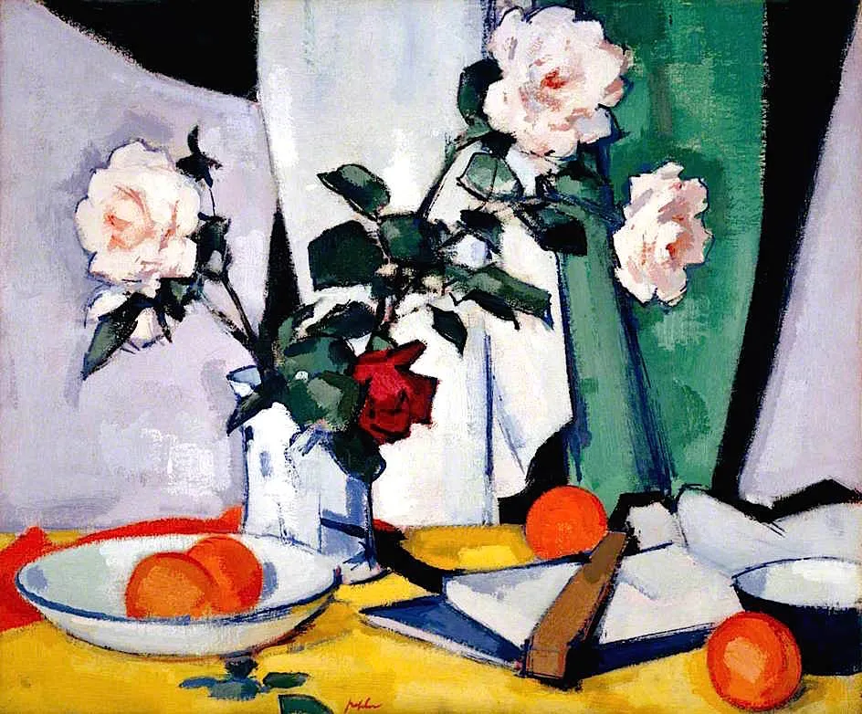

 Samuel John Peploe

  

连叔晚上好，

  

这么晚还打扰您，实在抱歉。这封信的问题本想着努力自己解决，但是快一年了我还是不知道应该怎么去面对这个残酷的事实，只好来请教学识渊博阅历丰富的连叔。

  

是这样子的，我妈妈在去年确诊了肺癌，很不幸，这句话我从前以为只会在电影里出现，没想到也在我的生活里出现，而且妈妈才48岁，那段时间真的很痛苦，感觉好像要失去整个世界。确诊的时候，已经是晚了几年发现，失去手术机会，辗转几个医生都是同样的答复，好在几经折腾检测病理基因检测等，最后有靶向药的方案适合治疗，从2020年6月份就开始了这个终身治疗的方案，到目前定期复查，定期到医院打针拿药，周期是21天去一次，目前情况较为稳定，就是人特别消瘦，总是跑医院心理也有点不安，加上药物导致的皮疹也比较影响妈妈的心情。不过好在我之前给我爸妈都买了医疗险，好在医药费都可以报销，每次去医院都要至少四千以上的花费，好在有医疗险，我们的家庭才不至于破碎（父母都是农民，我是95后刚毕业两年）。

  

现在的问题是，之前我们跟妈妈说的是身体里面是囊肿，因为不严重，所以吃药打针就好，不需要做手术，妈妈没什么文化，加上有亲戚刚好在医院旁边，每次去医院我们都是在医院打个针就去亲戚那边住，所以不会受病友的影响，她也不识字，就是完全不知道自己是什么状况，因为病情也稳定，目前没有什么太难受的症状，所以我们跟她说医生说吃药看看，定期检查，如果吃到里面的囊肿消了就好起来了，这个说法她是相信的。但是随着现在快一年了，每三周去一次医院，也做了三四次CT复查了，还是得一直去，她就开始怀疑了，一直问到底是怎么样，怎么这么多次了还是要去。我很纠结，不知道是要一直找借口骗她，还是可以告诉她以慢性病的态度去对待这个东西，要怎么去告诉她，怎么去让她坚信会好起来，而且有耐心地按时到医院去复查？妈妈虽然不是有文化精明的人，但是也是会想很多东西的人，日子久了我怕她容易放弃，或者比较消极，请连叔给我个建议吧，我真是想破脑袋了。

  

以前总觉得想要赚多少钱，想要上升到什么职位，想要过什么样的好日子，后来啊，觉得健康平安就好了，团圆的日子都能团团圆圆的，就很幸福啊。如果快乐和暴富太难，那祝连叔和公众号的朋友们平安和健康吧。

  

一个无能为力的女儿

  

* * *

  

一个无能为力的女儿：

  

你是有大能力的人，父母的完美孩子。不可思议，如此年轻，却有远虑未雨绸缪，也有定力独当一面。

  

有些病情，我们选择不告诉亲人，那得同时符合两个条件，一是这病在他不知情的情况下能够治愈；二是他本身心理比较脆弱，知情后疑神疑鬼，大悲大惧，不利于治疗。

  

你妈妈需要终身治疗，第一条就不符合。还是得把她现在的病情及治疗方案告诉她，她不再瞎猜瞎想反而减轻心理负担，否则，问得多了，总得到敷衍，又老要上医院，她会反向得出自己的答案：我肯定是不治之症。之后要让她放松、配合治疗，难度就大多了。也就是说，你瞒着她反而会让她觉得病情更严重。

  

她刚知道时，难免低落与伤感。任何人知道自己得接受漫长的治疗，开始心情都悲伤。但人是有适应能力的，把悲伤的权利还给她，一段时间后，她就会情绪稳定，并接受新的生活形态，即定期到医院检查、治疗。熟悉这个节奏，她也可更好地安排自己的生活，这也有利于康复。再说了，你妈妈和你一样，也不是一般人，一般人养不了你这么好的孩子。她能度过难关的，相信她。

  

病、老、死，是人生的大挑战。经过大病更知道健康是人的最大资产。保持健康，不让家人担心，应该早早意识到，这是责任感的体现，也是一件不容易做的事，早睡早起，控制体重，营养平衡，经常锻炼，戒烟少酒，这些事情你能守纪律、能做好，其中得到的意志，也有利于你追求人生的其他目标，职位金钱之类的，它们也是重要的能量。

  

你在照顾妈妈的过程中，保持健康也是一个大任务。不要有“妈妈病了，我还在想着自己的健康”的负罪感，妈妈病了，更需要你身体好。

  

拥抱你。

  

连岳

  

（我的邮箱：lianyue@xmlykd.com，来信前请谨慎考虑，因为意味着只可能在微信平台公开回复，并授权我用于图书汇编。）

推荐：[成熟度提升等于对抗度下降](http://mp.weixin.qq.com/s?__biz=MjM5NDU0Mjk2MQ==&mid=2651633245&idx=1&sn=922af7bc972354e771a8e3a3d6d4d898&chksm=bd7e32438a09bb553811f36cebca5262fdca191fe601d6a1e880ca8df00cc965a5d4e4abe4e2&scene=21#wechat_redirect)  

上文：[老实一点长大](http://mp.weixin.qq.com/s?__biz=MjM5NDU0Mjk2MQ==&mid=2651693735&idx=1&sn=a31d27d97a6d244295197fb1bece4fbb&chksm=bd7f26b98a08afafb58ebf0525b76042434e459bb322f1c8e5b3d48fbd46628af51f6a7581cb&scene=21#wechat_redirect)
