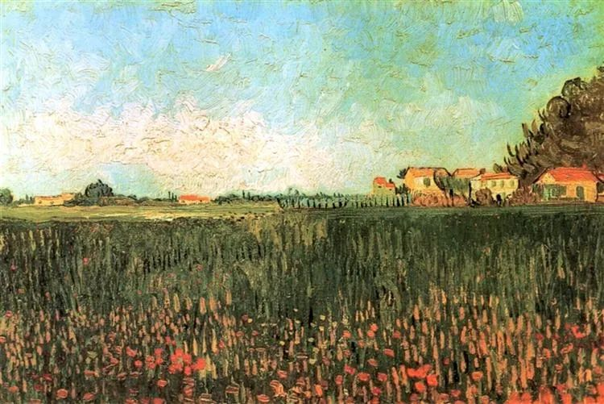

Vincent van Gogh

  

连叔，您好！

  

感谢您温暖的文字伴随着我无数个上班的早晨，正能量的声音给了我这个90后满满的动力。一直阳光，活力，充满干劲的我近来却像一只泄气的皮球。

  

事情的缘由是这样子的，自己在一线城市非盈利的社会组织工作，一直跟随组织在推动一些能够改善社会问题的事情，我觉得这份工作还有意义，自己也在工作过程中，通过接触的人和事，自己的世界观和人生观也有很大的积极影响。

  

去年，随着疫情的影响，组织尚处起步阶段，加上最高负责人的商业板块尚处于投资阶段，现金流比较紧张。在没有任何文件正式说明，只有直属领导口头表达困难的情况下，上半年工资只发一半左右，下半年以业绩考核为由（组织本身就是非盈利性，工作中需从事很多没有收入但不得不做的事情），也相当于变相不发全额工资。当时考虑到老板强大的社会责任感和当下不容易，加上预期年终情况好转，工资会补发，没有当即提出反对意见。

  

2020年初的时候，本人跟随组织进行多种尝试和突破，也积极参与社会抗疫活动，工作充满斗志，相信会共同克服困难。但是随着疫情的逐步稳定，工作恢复正常，薪酬却一直没有正常化。自己的经济也越来越紧凑，生活也受到影响，面对这些不合理的措施，自己也是相当郁闷，工作热情逐步消减，以至于现在很是失望，甚至害怕听到“情怀“二字，感觉自己就像一个“傻子”。自己也跟领导针对这个问题进行沟通，也没有得到很多正面的反馈，有点失落。一方面是组织的社会正义，另一方面是自己的正当利益受损，影响生活，作为一个年轻人应该如何选择呢？

  

一个“很傻“的90后

  

* * *

  

一个“很傻“的90后：

  

慈善没错，情怀也没错。不仅没错，还是是稀缺的品质。中华文明之所以了不起，就在于它早早认识慈善与情怀的价值。一个人的能力越大，地位越高，越要有慈善和情怀。 

  

孟夫子说过，老吾老以及人之老，幼吾幼以及人之幼，天下可运于掌。就是说慈善与情怀是管理天下的基础，一定要老人之老，幼人之幼，关心每一个需要关心的人，这样的仁政才是无敌的。这个常识变成了中国人的文化基因，代代相传。原来由于生产力不足，一姓之天下，社会动员能力也不足，孟子的情怀很难落地。如你所知，中国去年发生了一件大事，就是战胜了绝对贫困，中国再没有一个处于绝对贫困中的人，这是空前的，甚至可以大胆地说，地球上没有第二个稍微大一点的国家能做到这种事，它也是绝后的。这是中华文明，也是执政者真正追求慈善与情怀的结果。

  

作为一个中国人，听到有人做慈善，有情怀，有亲切感，像你一样，就是自然而然的事。尤其是人生经验少的年轻人，一个人说得漂亮，往往就能打动他。得人成本如此之低，骗子必然趋之若鹜，所以，假慈善假情怀比比皆是，其真实目的无非想无偿或廉价占有你的财产和工作。这比冷酷无情，不加掩饰的剥夺更可恶，因为它败坏了慈善与情怀，容易让上当者不再相信，也不再实践慈善与情怀。

  

如何鉴别真假慈善与情怀呢？还得回到孟子那句话，真正的关心，是从老吾老，幼吾幼，推及全天下之人的，你身边的人都不关心，自己的老不老，自己的幼不幼，满嘴仁义道德，那就假的。你现在的老板，拖欠工资，员工的生活保障不了，基本诚信都没有，他所谓的社会责任感怎么能够相信？建议你尽快去找个正常的工作，老板嘴再笨，说不出什么漂亮话，但只要他善待员工，比起口惠而实不至的老板，更有社会责任感，也更善良。认识一个人，不要看他说了什么，要看他做了什么。

  

真正的慈善与情怀，也不需要什么漂亮话，把自己的工作做好，对那些值得的人、那些需要帮助的善良的人，像对待自己的家人一样对待他们就行了，这就是大慈善、大情怀，小则可以管理好家庭、公司，大则可以治理国家，拯救人类。这样的慈善与情怀，是你的立身之本，永远要相信，永远不要失去。

  

祝开心。

  

连岳

  

（我的邮箱：lianyue@xmlykd.com，来信前请谨慎考虑，因为意味着只可能在微信平台公开回复，并授权我用于图书汇编。）

推荐：[既然我上了微博热搜，那就说一说](http://mp.weixin.qq.com/s?__biz=MjM5NDU0Mjk2MQ==&mid=2651638031&idx=1&sn=f346c8615bc8b939fbbfd2249379e570&chksm=bd7e4d118a09c40747c68abdaf008d590afce06bb4743ce96d5a3b134bb7b5f84dfcf374c876&scene=21#wechat_redirect)  

上文：[夫妻不要两地分居，但不得不，怎么办？](http://mp.weixin.qq.com/s?__biz=MjM5NDU0Mjk2MQ==&mid=2651691918&idx=1&sn=276e7fdb5a684b8e6dfba2c363e67234&chksm=bd7f1f908a08968676f7f7daf6a34b586118a584b1463dfc7f84369ad8cda4b125794ef0b027&scene=21#wechat_redirect)
