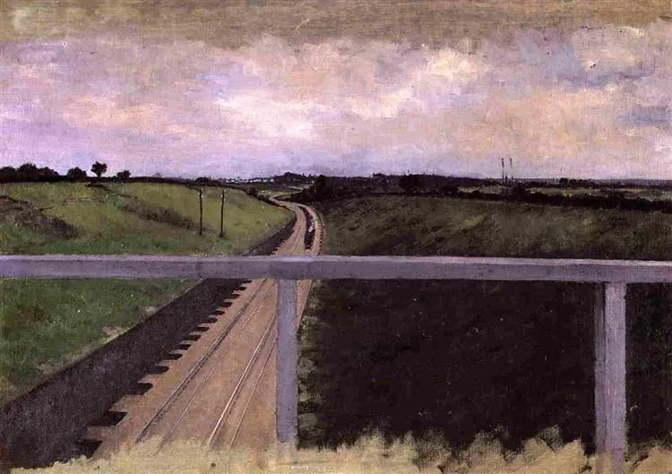

Gustave Caillebotte

  

敬爱的连叔:

  

展信佳！我留言过许多次从未被精选，也正如您所说，去信大概率不会被回复，当做自我梳理也好。我也想借此平台自我梳理一下思绪。

  

受连叔好观念的熏陶，我作为一名基层小公务员越来越看到自己认真工作的价值，也本着十分的真心、诚心、耐心在对待我的服务对象，近期被提拔了部门负责人并调到了窗口部门，窗口部门偶尔会被投诉，我作为负责人需要妥善处理这些问题，一般情况下确实是我们的工作人员存在问题，此类事件倒是好处理，也正好是发现我们工作上的问题并及时整改的机会。特殊情况下，也会发生工作人员的确没问题是服务对象自身不讲道理的纠缠，比如喝多了酒神志不清楚的人、在别处受了气来窗口发泄的人，今天有一个投诉，是因为她第一个找到的窗口人员在忙而让隔壁窗口为她办理事项，让她多挪了一步路而表示不满，哪怕在忙的那个窗口人员向她说明了情况。

  

现在整个政府部门都在打造服务型机关，优化营商环境，非常重视投诉的处理，因此投诉的结果无一例外不论对错均是我们赔礼道歉、争取谅解，我们有时也会觉得挺委屈，投诉只是一通电话的事情，成本很小，但至少需要三个相关部门的工作人员各自花费1-2小时来沟通解决，我认为那些无道理发泄情绪的投诉是占用公共资源，但我们无力解决此类情形。今天下午反复打了5通电话给上述投诉人，4次打通未接听，1次打通被挂断，明天上午我还得接着打，因为心里总是想着解决这个投诉，回家考证学习都有些心不在焉（这个纯属个人心理素质不行）。有些同事有时会放大极少数的委屈情绪，灰心地感觉现在政府部门窗口人员总是低人一等，不能获得某些服务对象起码的尊重，也越来越多的人不愿意在窗口部门工作，虽然我不这么觉得（很大一部分的服务对象都是很好的），毕竟把自己该做的做到极致，被无理投诉的次数就会是极少数，就算偶尔受点委屈，调整调整情绪就过去了，但是我却不知道应该怎样去安慰我的同事们，怎样帮助他们能够理清正确的逻辑而快速从“委屈”的情绪中脱离出来，不知道睿智的连叔有没有好的思路能够帮帮我们。

  

祝连叔、连太好！   

  

服务员小兵

  

* * *

  

服务员小兵：

  

看了你的邮件，我的第一反应，你可能想不到，是什么呢？是开心。

  

当然不是幸灾乐祸，政府部门窗口人员不应该无缘无故受委屈，弄清事实后，作为负责人，你应该安抚他们，鼓励他们。我开心的是，你所在的政府打造“服务型机关”是成功的。政府本来就应该是服务型机关，“为人民服务”几个大字一直挂在政府里面，这说明政府只能是服务型。但政府作为整个国家唯一垄断暴力与权力的机构，其中的工作人员又很容易忘掉为人民服务的初心，蜕变成骄横、霸道、高人一等的老爷。衡量一个政府好不好，最重要的标准就是看它有没做好服务，老爷是做不好服务的，只有公仆才能。

  

我写文章，也是像你一样，在从事服务业。只要与人打交道的行业，本质上就是服务业。我无论多努力，写得多好，每天都有人骂，有些还是多年的读者，可能他今天心情不好，或者某句话、某个观念他不喜欢，他就可以污言秽语，造谣诬蔑，忘掉你给他的一切。早年我会生气，偶尔忍不了，还回骂几句。自从想通后，就不会气了。做好服务，理解人性就是了。人性丑的地方是什么？是下愚不移，极小一部分下愚者，永远在生气，永远不满意，永远不进步，你送他一百块钱，他高兴吗？他却怒火更盛：你为什么不给我一千块，一百块顶什么用？生为下愚者，一生都在受惩罚，和他们有什么可生气的？多想想通情达理的大多数人即可，他们是人性美的地方，而且还有极美的上智不移，那一小部分上智者，就是我们做得不够好，也永远给我们鼓励、温暖与爱。越是委屈时，越不能忘了他们的存在。人间总的来说，是公平的，是美的。

  

好服务有两个内容，一是业务熟练，二是能受委屈。什么是受委屈？就是没错也被骂，骂了不能还嘴，有时还得道歉。业务熟练容易，能受委屈却难。能受委屈是什么，是孔夫子说的“人不知而不愠”的君子，是佛陀菩萨行中的“忍辱”，也是人民至上的体现。民众主要通过窗口真实感受政府，当他们看到一个无理取闹的人、甚至喝高的了人欺负窗口的公务员时，他们看到的就是一个为人民服务的政府。从这个角度看，任何一个受委屈的公务员，从窗口一线的，到你这个无条件道歉的负责人，都是政府最好的代言人，这种委屈，不是浪费时间，不会吃得没意义，而是相当值得花时间，相当有意义。

  

祝开心。

  

连岳

  

（我的邮箱：lianyue@xmlykd.com，来信前请谨慎考虑，因为意味着只可能在微信平台公开回复，并授权我用于图书汇编。）

推荐：[你看到你的苦，我看到你的幸运](http://mp.weixin.qq.com/s?__biz=MjM5NDU0Mjk2MQ==&mid=2651633394&idx=1&sn=fd856f561298eb1aa2f8719382ab28c6&chksm=bd7e32ec8a09bbfad02a633cee9aa0d8bb68ac0674d9971b278b319991441fa7730f814d325c&scene=21#wechat_redirect)  

上文：[妈妈生了大病，要不要告诉她？](http://mp.weixin.qq.com/s?__biz=MjM5NDU0Mjk2MQ==&mid=2651694947&idx=1&sn=b8181cf91305cf6a956ac93070c9c94d&chksm=bd7f237d8a08aa6b937ca097cd4d12cf0c9aa762c9b9b69fbbb0205ebf4e1aaae6316f0fb84d&scene=21#wechat_redirect)
