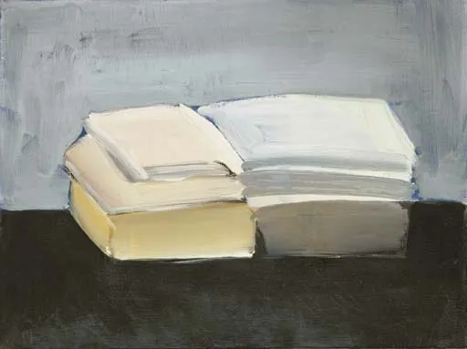

Nicolas de Staël

  

连叔：

  

你好呀！今天又是心情低落的一天，脑袋嗡嗡的，看书也看不进去。感觉自己活的好累啊，每天都在寻找生命的意义。可是却总是被情绪牵着鼻子走。

  

连叔，钱是什么呀？为什么谈到钱，我的父母既变脸又无奈，我感觉他们养我长大供我上学真的很辛苦，他们挣钱真的不容易，妈妈从小就告诉我家里很穷，但是我阿姨她们都有工作单位，对我也很大方。我对金钱一点概念都没有，我感觉自己每天都在省钱吃饭，网购也是只用拼多多，也不敢买啥，就日用必须品之类的。我每次花完钱都会有一种罪恶感，就像今天一样。我感觉自己就是一个只会花钱的罪人，不管我花了多少钱，我都会有这样的感觉。我觉得好难受啊，妈妈总是和我说钱要花在有用的地方，可是什么才是有用的地方呢？我的学费吗？我想发展自己的兴趣爱好，可是妈妈说没有必要，她告诉我这是没用的。可是我想坚持呀，我喜欢呀。可是想到要花父母辛苦挣来的钱，就好痛苦啊。最后，妈妈还是把钱转给了我，我也报名了。妈妈转钱给我之前，我跟妈妈说，4月和5月的伙食费不用给我了。

  

我现在一边兼职，一边上学，用兼职的钱做我的伙食费吧，省省还是可以坚持两个月的。只是我的心情好复杂啊。我不明白年长的大人对于金钱的看法，也不明白为什么到底要怎样衡量才知道钱有没有花在有用的地方？

  

我现在“投资”自己，是不是没用？我到底应该把钱花在哪里？我要死死的做一个守财奴吗？我真的很会花钱吗？

  

(我现在一年的学费加上住宿费6250元，学校在大湾区的珠海，每个月妈妈给我1500元左右的伙食费，包括零花等等各种费用。今天报名特长班，我和妈妈拿了2400元，两个月的伙食费不用给。自己出了2000元是寒假兼职的钱。这是年学费，考虑了各种因素报的。）

  

连叔，我想好好读书，将来有好工作，稳定的收入，就不用像我现在这样，一花钱就有罪恶感。但我还要继续在这种低谷期活四五年，慢慢熬吧。

  

连叔，你可以回答上面我的疑惑吗？

  

一个大学生

  

* * *

  

一个大学生：

  

大学生花钱有罪恶感，其实不是坏事。罪恶感这词听起来很可怕，而正面一点理解，就是人应该节俭、珍惜、感恩，花了钱就像伤害这些情感，让人难受。大学生还没收入，用的都是父母的钱，这些情感强烈一些是正常的。大学生花起钱来没感觉，那才不妙，是财商很低的表现，这样进入社会，很容易被骗、负债、破产，经营不好自己与家庭。

  

你小时候一定背过一句所有中国人都背过的诗：谁知盘中餐，粒粒皆辛苦。背过是什么感觉？感谢农人的付出，珍惜每一粒粮食，浪费了于心不忍。这是中国人受的好教育，早早生出同理心、悲悯心，这样的孩子不会变坏。但你也可以将之解释为增加孩子浪费的罪恶感，我不背这首诗，浪费粮食就没有心理负担。

  

钱是什么？钱就是盘中餐，分分皆辛苦。可以看得出来，你父母的经济捉襟见肘，供你上大学供得很辛苦。他们谈起钱，“变脸又无奈”，是他们正常的反应。世上的苦人，钱不多，每一分钱都计划好了，一想到要额外花钱，反应大致相同，即使笑，也是苦笑。你从小得到姨姨们的大方资助，作为孩子，你不会有什么心理负担。而你妈妈不同，想到自己的孩子要让姐妹们照顾，她既会感激亲情，又会有深深的愧疚与不安，更害怕你忘了这份关照，如果你不成才，长成一只不知感恩的白眼狼，她会觉得背叛了自己的姐妹。这是她的压力来源，也是她让你产生花钱“罪恶感”的心理动机。她不这么想，不这么做，才是不正常的没良心。如果她说，孩子，没事，你缺钱就找姨姨们要，她们很慷慨的。这样你确实没有罪恶感，因为把你养成了恶人，恶人作恶怎么会有罪恶感？

  

大学生处于一个奇特的年龄段，既独立又盲从，既单纯又虚荣。说独立，确实有许多奇思妙想，活力无限；说盲从，也有很多话语是人云亦云，很多行动是亦步亦趋。说单纯，是白雪还未受灰尘污染；说虚荣，是开始喜欢一些艳丽的粉尘，想用它们化妆自己，特别怕同学们知道自己家境普通，自己家穷，所以，同学有的，我也要有，还要更多，比吃比穿比享受，家长满足不了自己，生怨生恨，甚至用网贷饮鸩止渴。大学教育，就是把这独立与单纯保护好，把盲从与虚荣的弱点控制住。按大学的课程设置，一门门学好学精，相当了不起了，一定是受欢迎的人才。除了大学毕业证书，有没有其他华而不实的证书，一点都不重要。

  

一个大学生，花钱有罪恶感，很正常。你以后很有钱了，钱花得不对，不小心浪费了，也会有罪恶感。只有败家子花钱才从来没有罪恶感。

  

祝开心。

  

连岳

  

（我的邮箱：lianyue@xmlykd.com，来信前请谨慎考虑，因为意味着只可能在微信平台公开回复，并授权我用于图书汇编。 ）

推荐：[我知道，你在偷偷变厉害，你自己却不知道](http://mp.weixin.qq.com/s?__biz=MjM5NDU0Mjk2MQ==&mid=2651684960&idx=1&sn=2ae71981e5189271d317af948870cd53&chksm=bd7f047e8a088d6823b51a59b9146f8f47aa1758083da9b3b0449c6db3dbd2256c20526d7514&scene=21#wechat_redirect)  

上文：[什么是“第一次购房焦虑症”？如何战胜它？](http://mp.weixin.qq.com/s?__biz=MjM5NDU0Mjk2MQ==&mid=2651690143&idx=1&sn=51550a7ef42082c962d36b4b3ffbce02&chksm=bd7f10818a0899972cc0ba0397a026b9766bd0f1b2d31bbdea2da3e3e3197f014d63938f8ccb&scene=21#wechat_redirect)
