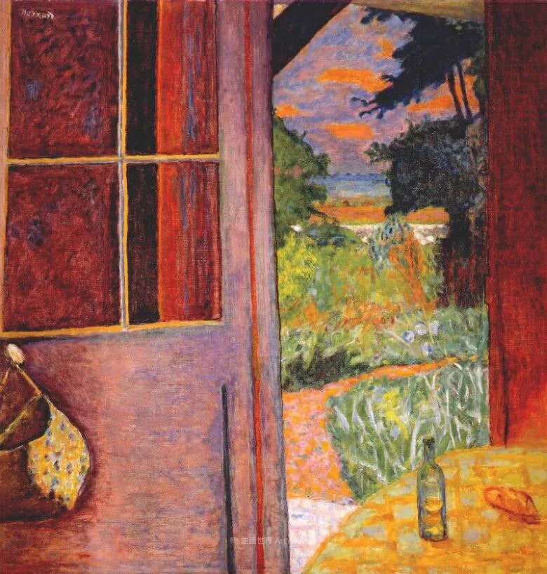

Pierre Bonnard

  

连叔，你好！

  

我是一位90后，也即将晋升为母亲。最近好多情绪压得我喘不过气来，一想到，我整个人就想原地爆炸。事情多的我都不知道该怎么办。

  

第一件事，家庭里面的事，老公打算在二线城市买房，但是摇号摇了好几年，久摇不中，房价眼看越来越高，买二手房他又觉得性价比不高。买房的事情。我在资金上却又无法帮助他，内心焦虑不已。我们俩就是整晚整晚的都睡不着。目前靠他一个人买房可能只能买在比较偏的地方。但是他又想稍微往上再迈一步，虽然我们经济压力会很大，但是他怕房价涨了，到时候想换房子都换不起。我内心很自责，因为在这件大事上，我觉得我无法帮助他太多。

  

第二件事，我个人的事情，虽然怀着孕，我要上班又要准备考试。脑子快要裂开。我在一家互联网公司上班，公司近年业绩不好，去年裁了一大波，今年好多同事都纷纷跳槽了，很多同事跳槽后跟我说薪资的事情，说完我就觉得自己好没用，觉得自己工作了这么些年，却比这些刚出来毕业生工资还要低。再一次给了我沉重的一击。对于目前的工作，我做的不太好，我觉得我也不是很努力，我甚至都觉得我在混吃等死，好像完全不喜欢这份工作。最可怕的是，我好像没有特别喜欢做的事情。人生都感觉了无生趣。不知道最近为何我有如此悲观的念头。

  

然而我看见别人比我优秀比我努力时，我又在暗暗和别人比较，心里暗暗骂自己没用，一面讨厌看见这些人，一面脑海里生活中都是这些优秀的人。我已经不知道该如何专注自己的生活了，好像每天上班看见他们我就会觉得自己没用，我想远离他们，但是却又离不开。我心乱如麻，每天就把精力和时间浪费在无畏的思想斗争当中。无法摆脱。

  

我一度怀疑自己有精神分裂症，事情做着做着就想到别的事情，然后一发不可收拾，一整天都处于忧心忡忡的状态，我看过心理医生，医生说我缺乏正念的积极思想，我的内心脆弱敏感，好像一点事情就会让我崩溃，有时候莫名其妙就会有些阴暗面，会对身边的朋友产生莫名的嫉妒情绪，我冷静下来想的时候，我觉得自己很可怕，我不明白自己为什么会这样。我希望早日能专注自己的生活，早日离开我那些令人讨厌的阴暗面和负面情绪。希望连叔，能给我一些方法，感激不尽。

  

一位90后

  

* * *

  

一位90后：

  

你是多重不安全感叠加，没房危机、工作危机、孩子又快要降生、再加上夫妻俩愁得整夜睡不着，在这种情况下，还满脑子正念，那是缺心眼，不是人正常的的反应。这时候需要的是正解。

  

当下你的主要任务是什么？生孩子。不是换工作，也不是比技能。换工作估计没人敢要你，现公司暂时业绩不好，却没有因此把你这个孕妇裁员，还是有担当的。将心比心，就不宜再责怪雇主了。经营不易，市场凶险，每个公司都会有起伏，在伏的时候你留下（虽然是不得不）共苦，我想，公司也会记着你的好，更能同享起的甜。

  

你忧愁的主要来源是什么？是人这种动物的本能，快要当妈妈了，又是第一次，茫然失措，惶恐不安，都是难免的。你看自然界的哺乳动物，此时，雌性也需要雄性的协助，还得有个窝。而你如今还在愧疚无法帮助雄性“我在资金上却又无法帮助他，内心焦虑不已”，更是想窝而不得，不安全感在你内心天天扔炸弹，你肯定得爆炸。

  

所以，有了自己的房子，你的忧愁就会消失大半。不然，忧愁还会持续增加，孩子并不等人，一天天固定长大，很快要上幼儿园、读小学，没有房子，实现这些基本需求都有难度。其实，你们本不该有这无房忧愁，有意愿，摇了几年号，有实力，即使房价越涨越高，按老公的实力也还能能买“比较偏”的新房。你们没房，不是因为没钱，而是犯了新手买房容易犯的错：贪。

  

摇号买房，把新房的价格限制在市场价以下，越好的房子，差价越大。这诱惑人非摇到不可，以为不摇就是扔掉了这笔钱。事实证明，你可能摇几年也摇不到，而这几年时间，房价又涨一大截，你即使现在摇到了，对比几年前的市场价，还是要多掏不少钱，此时就会懊悔：早知道，当年市价买套二手房，现在房子住了几年，还升了值。

  

早知道没穷人，人犯错不要紧，犯错是变聪明的成本。人怕的是一再犯同样的错误，一边说“早知道”，一边做着同样的事，让当下成为多年后的“早知道”。

  

从你丈夫仍然觉得“二手房性价比不高”来看，他还在贪，还会一门心思摇号，再摇几年中不了，又有什么不可能？摇到孙子要出生时摇不到都有可能。懊悔加贪婪，两把欲火攻心，晚上睡得着才奇怪。

  

像你们呆的、房价一直涨的二线城市，二手房交易占比已经很高，而且将越来越高，成为主流，性价比高的二手房，多得是。某种程度上说，买家喜欢的、愿意接受的二手房，就是性价比高的。

  

二手房现在是你们的救星。二手房有很多好处：一是马上可住，原来基础好的，简单装修一下就行，又快又省；二是配套成熟，市场、各级学校、交通、公园、甚至包括医院，都在运行，若住在新区，还得为这些事发愁好几年。不要再摇遥遥无期的号了，赶紧去看看二手房，尽快买的话，孩子出生前就能搬进去。

  

买房是个系统工程，要做完美决定，对人的要求太高：要知道金融，要知道地产，要有抗压力，要有勇气，要对国家有信心，要对未来有信心，要对自己有信心，还得有点钱。这些要素具备的人，没几个。奇怪的是，为什么一座城市，无论多好的城市，多数人还是有房子？那得感谢他们履行了自己的责任感，面临结婚生子，总得让家人有地方住，想不了那么多，无论多怕，也得把一套房子扛起来。而房产增值，家人觉得安全而幸福，就是回报。什么好处都想得，想得太多，太贪，最后反而两手空空，只收获千愁万绪。

  

怀了孩子，增加不安，但从另一个角度说，让你们等不起，必须马上行动去买套二手房，这就是烦恼变菩提，偏见变正见。

  

祝开心。

  

连岳

  

（我的邮箱：lianyue@xmlykd.com，来信前请谨慎考虑，因为意味着只可能在微信平台公开回复，并授权我用于图书汇编。）

推荐：[软弱的人，爱也给一次变强的机会](http://mp.weixin.qq.com/s?__biz=MjM5NDU0Mjk2MQ==&mid=2651626427&idx=1&sn=c87058764f2b24c06c72a502656ec928&chksm=bd7e1fa58a0996b392fa344f816f3429bacd81f28fc941ff906a7874a6cfc639a3810e0d3611&scene=21#wechat_redirect)  

上文：[我，大学生，讨厌花钱有罪恶感](http://mp.weixin.qq.com/s?__biz=MjM5NDU0Mjk2MQ==&mid=2651690320&idx=1&sn=4c7fa7c82a57a49c90466a65ceaab751&chksm=bd7f114e8a089858ebef0a88faa0b164ff7ddd12e3d034cc1d5431112adec4ffa78e9c2b4249&scene=21#wechat_redirect)
