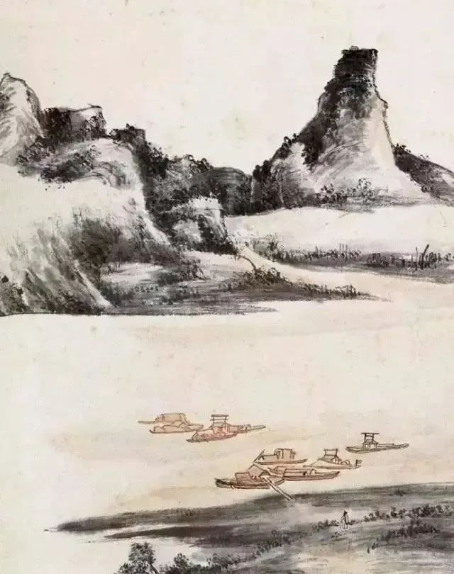

黄宾虹

  

连叔：

  

你好！关注公众号很久，很喜欢问答的部分，回答清晰明确，面对现实又温暖积极。也很喜欢读留言，看着那么多的普通人互相鼓励、分享，太有正能量了。

  

我目前面临职业和人生的重要选择，是出国发展还是留在国内？

  

我的基本情况：坐标上海，任职五百强国际公司，两个就读公立小学的孩子，先生运营自己的电商公司，一套房自住，其他一线城市还有一套小房子出租。家里日常费用由我承担，颇有盈余，买房（首付、房贷）等大宗支出先生出大部分。双方父母都在老家居住，身体尚佳，每年过来上海团聚一段时间。有住家阿姨照拂孩子生活起居，学习发展等主要由我照顾。

  

公司有计划把我外派美国工作，福利待遇都不会有问题，好处是我的未来职业发展前景广阔，孩子可以享受比较好的国际教育，我们也可以有新的不一样的人生体验。问题在于：1. 我先生更倾向于在国内发展，可以说服但有可能面临一到两年两地分居；2. 双方父母年纪渐长需要照顾，我和先生都是独生子女，这一天迟早到来，而出国后我的未来发展可能会更多在其他地方，回国内工作的可能性低，至少一出去就是5-7年。我和先生都更看好国内的行业发展，觉得即便留在国内职业发展也不会是大问题，但又觉得孩子在公立系统太累，中考高考压力重重下付出大量的精力刷题，这些付出对于孩子走上社会其实帮助并不大，不如去国际教育系统更好地发展思考能力、沟通能力和合作能力。

  

不知道连叔能不能看到这封邮件，我尚有时间思考，公司谈的时间点是一年后，所以尽量做到不焦虑不纠结。读连叔的文章，感觉像一个睿智的前辈侃侃而谈，言之有物，希望能听到您的建议。

  

谢谢！祝安好！

  

站在人生十字路口的人

  

* * *

  

站在人生十字路口的人：

  

你现在拥有一个标准的幸福家庭。富足、和睦，夫妻齐心、能干，老人健康，孩子成长。夫复何求？

  

中国有很多这样的幸福家庭，当事人自己的能力与努力当然是重要因素，但更重要的是，他们恰好在正确的时间出现在正确的地点，也就是刚好处于中国这几十年迅速和平稳定的发展大潮流之中。否则，再能干的人，不幸生在一个战乱国家，你也很难有富足安全的生活。再讲卫生的人，把你放到美国，你也很可能感染新冠病毒，乃至死掉。

  

很多享受了中国发展潮流的人，仍然处于懵懂无知状态，以为一切不过是自己的努力而已，有些人走得更远，认为这个国家配不上自己，70后以前的人尤其如是。这是他们成长背景决定的，在观念形成的青少年时期，欧美日，包括香港台湾，在物质技术、生活水平上的巨大领先，让他们彻底失去自信，再也站不起来了，变得比欧美人更爱维护欧美地位和价值观。经过去年防疫的“超级世界大战”，中国体现出的上下同欲，科学、勇气与纪律兼具，最后既战胜疫情又收获经济增长，完胜欧美日。在这个新出现的现实面前，按理，人的观念应该改变，也应该判断得出，中国更大的发展潮流正在开始，原来没有自信的人应该自信起来，庆幸自己并非在潮流之外。但据我观察，许多人并未改变，仍然趴在地上，他们更坚定地认为中国不行，永远追不上欧美。因为人到中年，就很难改变自己了，即使是错的部分。这当然是他们个人的悲剧，意味着他们没有愿望、没有见识、也没有能力主动参与中国以后的发展，如果还要摆悲愤及启蒙的姿势，将被年轻人无情地轻视和嫌弃。

  

恕我直言，你就是懵懂无知中的一员，身在福中不知福，你确实是站在人生的十字路口，走错了，家庭的幸福、财富与前途，不说倒退吧，大概率是停滞的。不知福必然不惜福，不惜福，福气就会消失。还好，从你描述来看，你不是不可改变的人，你只是对美国教育还有些幻觉，以为那里的竞争很轻松。只要不固执，这幻觉很容易打破。你要珍惜在中国的机会，一天都不要远离它，这会给你巨大的回报。我不是说中国以后一切完美，再没有贪官污吏，不公不义。还会有的，中国这么大，这些事每天都有。但执政党比普遍百姓更恨这些事，他们将无比珍惜他们在去年获得的空前的支持度与美誉度，他们对腐败的容忍度更低。

  

孟子说，有恒产者有恒心。你在中国最好的城市之一有恒产，应该回报以恒心。如果有恒产者竟然没有恒心，那他们就会失去这个恒产。任何投资，有形的无形的，房产、股票、爱情、事业，没有对它的恒心，再好的机会送到你手上，也拿不住。对中国没有恒心，那就会失去中国；对中国有恒心，那就机会无穷。未来将一再证明这点。

  

祝开心。

  

连岳

  

（我的邮箱：lianyue@xmlykd.com，来信前请谨慎考虑，因为意味着只可能在微信平台公开回复，并授权我用于图书汇编。）

推荐：[尤其今年，从个人到国家，生产力竞争才是一切](http://mp.weixin.qq.com/s?__biz=MjM5NDU0Mjk2MQ==&mid=2651638016&idx=1&sn=f5ac1f43613091895b4f8e3eec79bd60&chksm=bd7e4d1e8a09c408fd7393a4a04e9a24ede85274381eb10ebf3286c8b78c96213a633646510a&scene=21#wechat_redirect)  

上文：[我，大学生，讨厌花钱有罪恶感](http://mp.weixin.qq.com/s?__biz=MjM5NDU0Mjk2MQ==&mid=2651690320&idx=1&sn=4c7fa7c82a57a49c90466a65ceaab751&chksm=bd7f114e8a089858ebef0a88faa0b164ff7ddd12e3d034cc1d5431112adec4ffa78e9c2b4249&scene=21#wechat_redirect)
