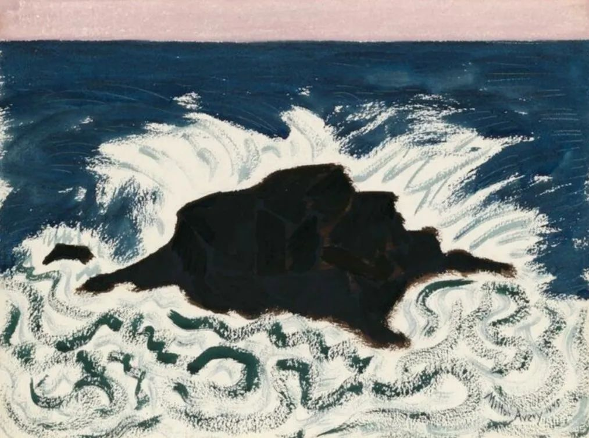

Milton Avery

  

连岳老师您好：

  

我是一名培训机构教留学考试的英语教师，主要针对留学美国的学生。本来是挺吃香的职位，因为之前留学美国已经越来越低龄化，人数也越来越多。加上考试难度高，所以能做这行也是挺有成就感的。

  

但是2020以来，市场就改变了。转眼疫情已经持续一年多了，留学市场也萎缩了很多。很多家庭不再选择让孩子出国，尤其是美国。为此，公司出台各种政策，本质就是多干三倍活，工资不涨。培训行业一直重视老师“服务学生”，以前是“站着服务”，现在是“趴着服务”。为维持业绩，想尽各种方式“跪舔学生和家长”。同事们已经万分无奈，离职的，转行的，忍耐留守的。我是后者。

  

有同事选择转到K12，因为这个市场很大，受疫情影响不大。有同事转到互联网线上教学，走网红路线。有同事转教研岗，不再想继续一线教学。

  

我倾向于继续留守。主要是K12内容简单，教学没有成就感。教研岗又离开了讲台，而我喜欢教课。网络名师倒是看着很吸引人，各大平台各种烧钱打造名师，但是我没有网红气质。而且我觉得线上教学永远无法代替面授课程。

  

连岳老师怎么看呢？美国留学还有市场么？谢谢您！

  

祝开心！

  

一名英语教师

  

* * *

  

一名英语教师：

  

美国留学还有没市场？你的亲身经历已经证明了这市场在转向，在变小。

  

之前留美为什么热，甚至低龄化？甚至留美留英不得，澳大利亚这样国家也行？那是中国这个社会普遍还在认同、羡慕美国，爱屋及乌，连同美国的小弟也爱。本来这个潮流可能还要持续一两代人，美国留学在这个时间段内都是好市场。但历史的发展，往往不按剧本来，2020年的疫情改变了这一切，让未来提前到来。

  

中美两国的防疫对比，正常人都看到中国完胜，美国完败。美国还败得很难看，一再向中国甩锅、泼污水以转移国内矛盾。近来仇视攻击亚裔（主要是针对华裔）的行为，就是美国治国精英们仇恨中国的必然结果。美国人现在当然还自认为文明灯塔，可惜正常的中国人已经不吃这一套了。经过去年，他们切身感受到文明只是美国人嘴里说的漂亮话，在行动上，他们是野蛮的，唯我独尊，竞争有胜势，就用市场逻辑，竞争不过，就用强盗逻辑，硬抢。他们的体制和精英，连自己的底层民众，都弃之如猪狗，他们会来关心中国人？以及全世界其他人？在这个残酷真相面前，你说，美国留学还有市场吗？中国人还放心把低龄孩子送去美国吗？送去学美国人自己都不信的那一套？送去被歧视？被骂被打？

  

中国与美国，肯定还有合作，不至于成为敌对国（美国若愚蠢地介入可能的台海冲突，那另当别论了）。中国的态度是摆出来的，美国无论是个人、公司、还是政府，只要真诚做人，中国就是合作共赢的好伙伴；如果你要摆教师爷的谱，要当强盗，吃独食，抢中国人的劳动成果，那“中国人不吃这一套”，你自己一边凉快去。在接下来的很长一段时间内，美国还是想当强盗的，抢惯了，没那么容易改，还有许多摩擦。在这种大潮流、大背景下，美国留学的市场只会变小。你个人再努力，都赢不了趋势。

  

不久前，国家领导人有句感叹：“70后、80后、90后、00后，他们走出去看世界之前，中国已经可以平视这个世界了，也不像我们当年那么‘土’了……”这不是随便的一句话，是得出了结论，定了调，中国要开始平视世界了，这个要平视的世界，当然是原来高高在上的美西方一些国家，这是最大的趋势，一个中国人的人生选择、职业选择，顺这个趋势兴，逆这个趋势衰。

  

祝开心。

  

连岳

  

（我的邮箱：lianyue@xmlykd.com，来信前请谨慎考虑，因为意味着只可能在微信平台公开回复，并授权我用于图书汇编。）

推荐：[说说H&M事件，中国好不好，谁说了算？](http://mp.weixin.qq.com/s?__biz=MjM5NDU0Mjk2MQ==&mid=2651693498&idx=1&sn=77b73fb302011d8de758990994a79fa3&chksm=bd7f25a48a08acb25d53efb10f5cc872683fcf9856f7dd46c0afa0681fd7f6876eefdca9a95e&scene=21#wechat_redirect)  

上文：[父亲挣下十位数的资产，接不接手？](http://mp.weixin.qq.com/s?__biz=MjM5NDU0Mjk2MQ==&mid=2651694548&idx=1&sn=4405097b5224245145c7743198c33859&chksm=bd7f21ca8a08a8dc758ea37b769e8fd390426e7ec5d7e338e9bdd15ddb0a234056368c61d743&scene=21#wechat_redirect)
