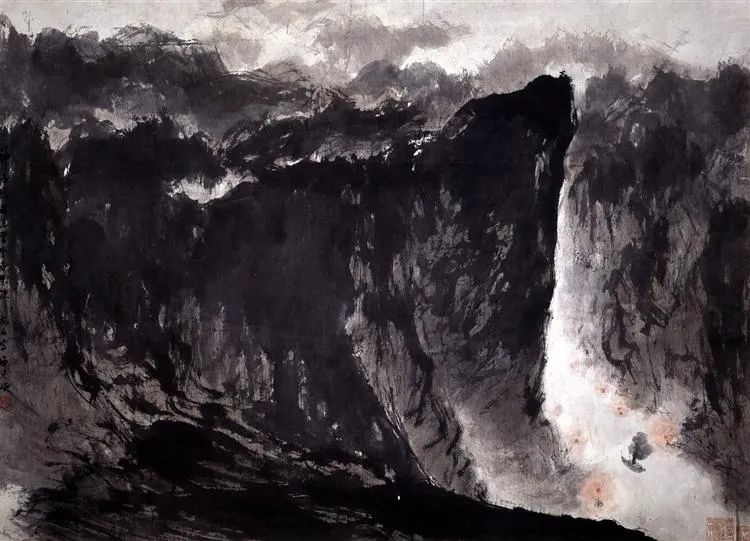
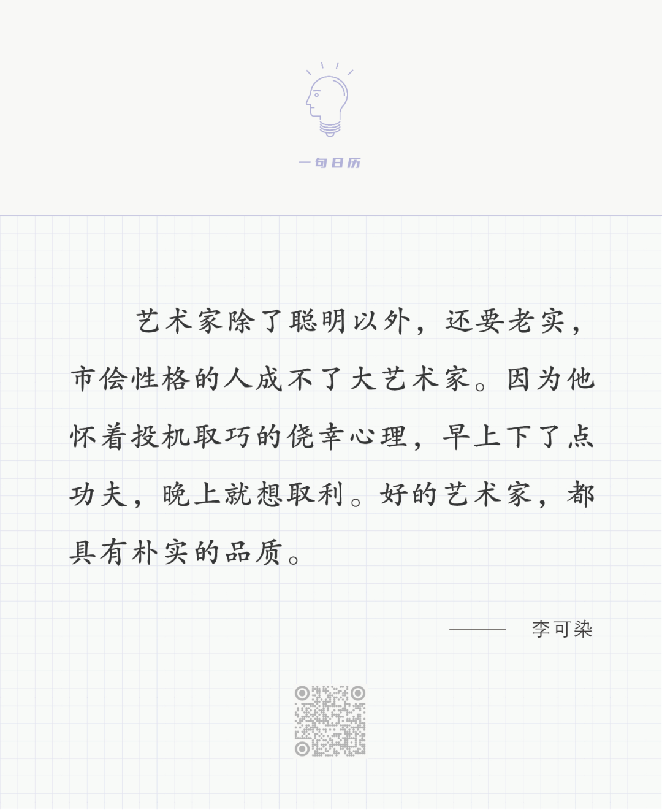

傅抱石，西陵峡  

  

长按二维码可关注

  

不仅是好的艺术家，要成为一切好的家，要当一个好人，都要具有朴实的本质。

  

朴实其实是人与生俱来的品质，婴儿的状态就是朴实的状态，不矫情，不掩饰，不虚荣。人慢慢学会说话，也学会说假话，读得懂他人心思，也知道怎么骗人。这时候，朴实就开始流失。越是聪明的人，朴实流失的风险越大。因为聪明人说几句漂亮话，就能得到他人的称赞、敬佩与羡慕，以为你很显赫、很富有、很有本事，那他怎么愿意下苦功夫呢？这不是少数人的成长风险，而是所有人的成长风险，所以孔夫子才会说，知之为知之，不知为不知，是知也。这句话的重点是“不知为不知”，知之我们会大声地说自己知之，那是值得炫耀的事，而不知我们却容易不那么朴实地隐藏过去，做出一副知之的样子。真正的聪明，是在某一刻意识到，这么做是不对的，是危险的，返朴归真，在求知的领域一点点下苦功夫。求知不只包括书本知识，各种考试，求知就是人生，越好的人生知识含量越高。文化程度不高，甚至文盲，能不能求知？当然能，活着就能求知，知识就是我们说的话，做的事。一个人在这世界中，在这一生中，保持了朴实，就是获得了大知识，当一个好人，已是大成就。

  

今天是第166期“下周很重要”，为什么要订计划？计划就是不想骗自己，有没做完，有没做好，自己最清楚，没人监督自己，真诚面对自己，这是在保有自己的朴实品质。

  

推荐：[怕什么，跟着走](http://mp.weixin.qq.com/s?__biz=MjM5NDU0Mjk2MQ==&mid=2651638402&idx=1&sn=f1e649d14208dafc260a566d70129c05&chksm=bd7e4e9c8a09c78a121595b304fe9379ac19e0f7baece36e4c95ad2bf68961f9653bf9db4c02&scene=21#wechat_redirect)  

上文：[说说H&M事件，中国好不好，谁说了算？](http://mp.weixin.qq.com/s?__biz=MjM5NDU0Mjk2MQ==&mid=2651693498&idx=1&sn=77b73fb302011d8de758990994a79fa3&chksm=bd7f25a48a08acb25d53efb10f5cc872683fcf9856f7dd46c0afa0681fd7f6876eefdca9a95e&scene=21#wechat_redirect)
