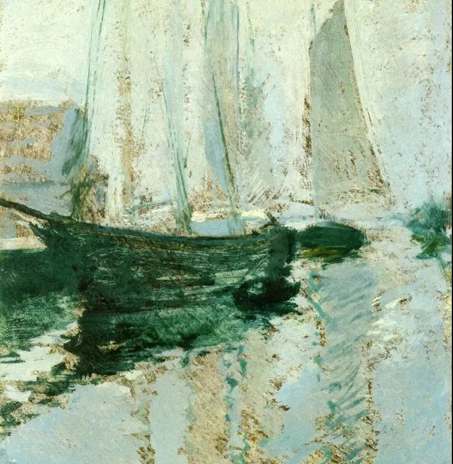

John Henry Twachtman

  

连叔您好：

  

我活下来了，又好像活不下去了，但是我想活着！

  

我农村出来的，但打小就搬出县城里住了，没吃过什么苦，大专学历，今年就30了。如果14年没有选择离职，或许跟那些还留在国企当工人的同学一样，大富大贵谈不上，起码在佛山安居落业了吧。不过我也清楚，没用的，我肯定还是会离开，因为我的内心一直都不想过低配人生，一直想成为别人口中有钱的人上人。殊不知自己的认知和能力，跟我所追求的完全匹配不上，乃至到现在，我依然只是个巨婴吧。

  

其实从国企里出来不到一年，因为受不了外面社会的毒打，15年我就又选择了回头路，去了另一家待遇稍差一点的国企干回老本行。其实不追求什么的话，待遇也还行其实。然后由于一些所谓的派系斗争，很多升职的机会都与我无关，以至于18年又给自己找理由开溜了：“我都忍气吞声一年多了，还要我怎么做？那个机会才能轮到我？”然后就又离职了。这期间，我犯了人生的第一个重大错误，沾染上了网络赌博，直到离职的时候，已经有二十六万的负债了。当时的我肯定知道那是不对的，但是我还是去做了，我肯定知道会有套路，但是我没能控制住对金钱的欲望，还是被套的死死的。所以事情发生以后我后悔啊，流着真诚的眼泪向我哥求助，而我却没有向他完全坦白，我说只有十六万。我哥把他所有的积蓄给我，而我却欺骗他窟窿都填满了，实则窟窿的边缘一点都不扎实，随时可以再塌一次，我却浑然不觉。

  

终于，2020年这个疫情之年，在多重压力之下，我竟然再一次想通过赌博来翻身，犯了人生第二次重大错误。这一次，负债变成五十六万了，我不知道当时怎么就控制不住会红了眼停不下来，等停下来以后，我第一想到的就是结束自己的生命，我接受不了这样的自己，我也无颜再面对家人和亲戚朋友。但是上到二十几楼的楼顶的时候，总觉得是不是得向谁交代些什么，于是就通知了我女朋友和我哥，在他们的劝说下，我没往下跳。好吧，我承认，我就是怕死。

  

接下来的半年，我来了深圳，也换了新工作成了一名销售。这半年，其实是我过得最轻松但是也是最痛苦的半年。轻松是因为我从未活的这么真实过，当所有人知道我的事以后，竟如释重负，终于再也不用去伪装什么了。痛苦是因为我要面对催收，然后有些催债的电话又转移到我的家人和女朋友那去了，心里愧疚但是却又无能为力，所以家人也在压力之下对我说了有史以来最重的话，女朋友也终于说出一句挨不下去了。因为对家人的愧疚，我都不敢跟家人多说一句话，我也不知道该说什么才好，女朋友还在，我就把她当救命稻草，完全没在乎过她的感受，所以她成了我这半年里的情绪垃圾桶，终于在她说出要离开的那一天，我又说出不想活这种话来要挟，又爬上了上次那栋楼，然后又在一通通电话一天天短信中走下了楼梯。本来大家就因为我生活变得够糟的了，我还让他们一次一次的失望，所以自那天以后，我就决定再也不会说要死这种话了。

  

所以啊，我努力工作，终于，到了第七个月，收入可以过万。这个销售工作是属于累积型的，谈一个客户，只要每个月都有合作，就每个月都有相应的提成，所以2021年再努努力，开多些客户，保持月收入过万，争取月入两万也是有可能的。但是最近又开始收到各个信用卡银行和网贷平台的短信说要起诉我了，心态一下子又要崩了，我不知道自己还有没有机会重新开始。我跟那些平台的解释过很多次，会还，也在努力提升收入争取还多一点，但是每个平台都一句话还钱，我说的停息挂账，没有一个平台接受我的诉求。尽管我爸说过让我去死，我哥也说我是一个恶魔，但他们心里是想帮我的，我都知道的，事实上也帮了我不少。我已经不敢再主动要他们帮我了，我怕说了，就真的失去他们了。

  

真的挺痛苦的！连叔！这两次同样的重大错误，我可能要花四五年才能有所好转，父母年过半百还在为我操碎心，我甚至还影响到了我哥的人生轨迹，他本该在前两年就应该买房结婚生娃的，唉！我不想连累家人，但是我又想重新开始，另一方面我又想他们能帮我，所以事实就是我已经连累到他们了。两次想自杀，其实也是想着人死债消的，但是我又不想死，我想活着。

  

我的人生难题在等着去解决，我也知道要用行动让家人们再次相信我是件很难得事，我觉得跟我很多方面的认知存在一定的盲区有很大关系吧，所以这件事发生以后我没有处理好，人生也是过得一塌糊涂。

  

所以希望连叔可以给予一些意见，不胜感激！

  

盼复～

  

YCL

  

* * *

  

YCL：

  

当然要活着。你的债务四五年可以还完的，甚至可能快一点。到时你35岁左右，还年轻，人生还有大把机会。

  

你的内心还是希望家人替你一把还清，让你迅速重新开始。这个心思有毒，赌徒之所以戒不了，往往就是因为有人替他买单，赌博的刺激他自己得了，财债的痛苦别人承担，一定会越玩越疯，直到把买单的人玩死为止。你很聪明，非常善于利用人性的弱点。你脸皮也厚，会演戏，装真诚，扮痛苦，七分真，三分假。又聪明脸皮又厚，这次你想再坑一把家人，还是能成功的。成功之后的大失败剧本早就写好了，你会再玩一把大的，大到把家人的人生彻底毁掉，你不死，父母与哥哥可能都得去死。所以，要把毒心思彻底掐死，你才能成为新人，你以后才有机会弥补对家人的伤害。

  

建议你接下来抱着一个简单的信条生活：我一定要凭自己还完债务。过程当然苦，被债主骂，被别人嫌，完全是一个标准的人下人。承受这个毒打，才叫赎罪，才算真诚，才能成长。

  

你要按一个人下人的低配过日子：

  

一、不要死，死只会让家人永远蒙羞，再无洗刷的可能。你要像狗一样活下去，像流浪狗一样，像癞皮狗一样，活着。像老鼠蟑螂一样活着。你要活得久一点，用变好后的你抚慰你曾经伤害过的人。

  

二、如果没有与女友分手，赶紧彻底分。分了就不要打扰她。你配不上她，让她更好的生活。也不要打扰任何一个姑娘，你配不上她们。

  

三、除了表达自己改正的决心以外，不要打扰父亲与哥哥，及一切家人，你努力半年一年，他们就会忍不住想帮你还债，到时不能接受，告诉他们，若不是每一分钱都自己还完，赌瘾戒不掉。

  

四、不要动不动伤自尊，心态崩。要有自知之明，你现在是所有人心中的下贱之人，谁给你自尊？谁管你的心态？这些高贵的、正常人才能拥有的待遇，你现在配不上，你还需要很长的时间一点点挣回来。

  

五、认真工作，感激你的每一位雇主，善待你的每一个客户。工作越认真，悲伤越少，恢复得越快。你的耻辱，要用工作的泪水与汗水洗掉，流得越多，洗得越干净。

  

祝开心。

  

连岳

  

推荐：[道理与行动之间，有3分钟的鸿沟](http://mp.weixin.qq.com/s?__biz=MjM5NDU0Mjk2MQ==&mid=2651626387&idx=1&sn=ff9540f96114a55a9eb2c8b18cea0e67&chksm=bd7e1f8d8a09969b66a36cc44d0a1c401663ce936cf6a37dcd70c551fcc987a5c1a7c9376d68&scene=21#wechat_redirect)  

上文：[我知道，你在偷偷变厉害，你自己却不知道](http://mp.weixin.qq.com/s?__biz=MjM5NDU0Mjk2MQ==&mid=2651684960&idx=1&sn=2ae71981e5189271d317af948870cd53&chksm=bd7f047e8a088d6823b51a59b9146f8f47aa1758083da9b3b0449c6db3dbd2256c20526d7514&scene=21#wechat_redirect)
