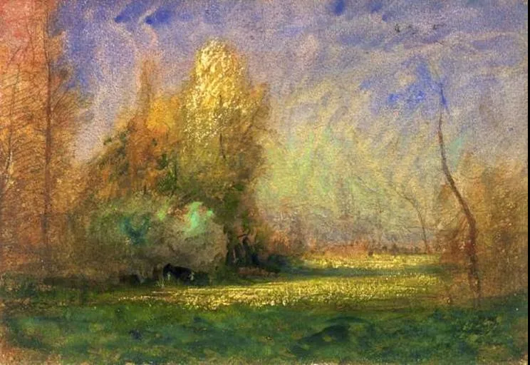

François-Auguste Ravier  

  

长按二维码可关注

  

我一直很喜欢佛家所说的“戒、定、慧”，这三字可以出佛家之圈，指导一切人生。

  

我们都想要有慧。慧不仅指智慧，还可以象征高级的成果，对于我们俗人来说，功名利禄是，幸福生活是。

  

慧自然难得，我们出发之前，甚至想象不出它是什么样子。没有定见与定力，则一定左右为难，进退失据，路都不会走，别说得到慧，就是慧摆在你面前，你也不认识。把慧塞在你手时，有人说它不是，你也会扔了。

  

而定见与定力从何而来？从戒而来。戒是戒律，是纪律，是约束，是熵减，是辛苦，是不舒服，是违背人性。一个小朋友上学，你不知道他将来要得什么慧，但总是从今天的戒中长出的某物。越能戒，越能慧，成年人也是如此。

  

饱食终日，无所作为，最后就会作妖，浪费一生。在一个富足的社会，往往会有这种富贵病。当一个人不知道做什么时，我建议赶紧给自己找一个戒律，哪怕就是早睡早起，健康饮食都行。只要开始约束自己，有一点辛苦，就会有事可做，事就会做得好，其意义就会体现，意义就能引你到慧。

  

今天是第165期“下周很重要”，所谓的计划，就是戒，就是艰辛的劳作，你不写下来，不告诉自己必须完成，它根本不会出现。这意味着机会不会出现。智慧不会出现。

  

推荐：[别逃，随大流吃苦](http://mp.weixin.qq.com/s?__biz=MjM5NDU0Mjk2MQ==&mid=2651633429&idx=1&sn=2458cd8c2c967e23ed71bee773e1bad1&chksm=bd7e330b8a09ba1dbf14722390fe40a11f89925ab32bc0dbc98b273f5e95193f67fc7ae380be&scene=21#wechat_redirect)  

上文：[50岁的投资难题：我想，丈夫却不从，如何说服他？](http://mp.weixin.qq.com/s?__biz=MjM5NDU0Mjk2MQ==&mid=2651691132&idx=1&sn=bddc2354241fbdcf34005a93c4585336&chksm=bd7f1c628a0895742610131a059f17ac12ee4c9b42514d942fe3b8c947b1b044a9a60b5c5203&scene=21#wechat_redirect)
