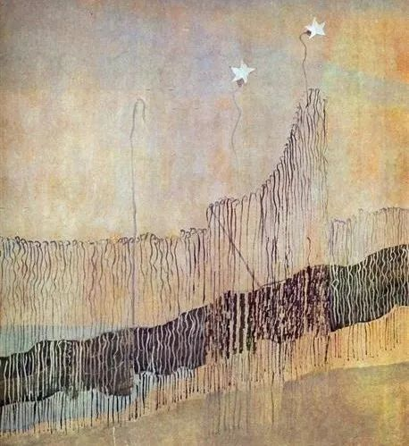

Mikalojus Konstantinas Ciurlionis

  

亲爱的连叔：

  

您好！我是一名初二的学生，最近总有一些事情让我日思夜想。希望连叔能在百忙之中看到我这份突如其来的邮件。事情是这样的：那时我七年级，刚刚知道学校有篮球队，并且篮球队员是从小学特招过来的。那时的我刚开始对篮球十分的感兴趣，看到篮球队为学校获奖时，一股想要进篮球队的想法从我内心蹦出。接着，我靠关系找到了学校的篮球队教练，询问能否进入学校篮球队。后来教练给了我一个机会，我也成功的进入了篮球队。但是，不到两天班主任找到了我，告诉我篮球队你不准去！我百思不得其解，为什么突然就不让我训练呢？

  

后来，到了初二，我们换了个班主任。那时班主任问过我是不是特长生，我坦然说不是。之后，班主任就没再提起过了。

  

就在几个星期前，我再一次的向班主任提出是否能进篮球队，却被班主任一票否决。班主任告诉我，现在你只有两种选择：

  

一、你可以去篮球队训练但是从今以后你的学习成绩好坏与我无关。以后要是篮球打不好，就只能你自己讨饭了。

  

二、不去篮球队，好好学习，考一个好一点的高中，高考考完能有个好大学读。

  

班主任这种种考验使我进也不行，退也不行。我该怎么办？

  

到底是去校队还是好好学习？希望能得到连叔的回复。

  

一个迷茫的初二学生

  

* * *

  

一个迷茫的初二学生：

  

能在学校引人注目，这对青少年来说，是难以抗拒的诱惑。成为校队的一员，代表学校比赛，是校园里的明星，当然引人注目，即使按你的水平，进校队并非主力，只能坐板凳当替补，可照样也能引人注目，这就是你挖空心思进校队的心理动机。运动显得人特别帅气，魅力盖过那些成绩特别好的孩子。马上可以得到的满足，让你念念不忘。

  

想引人注目的心理动机没有错。不仅没错，还特别好。正因为有它，人们才展开竞争，赢下比赛，获得成就，做出贡献，要让人注目，你总要变得特别一点。如果所有人都只能活到初中毕业，我支持你进校队风光一下。不过，初中属于人生刚开始的那部分，多年以后，很多同学的名字你都记不起来。所以，初中时代的明星，如果无法持续自己的辉煌，一到高中就被人遗忘了。你初中的校篮球队，都要靠关系才能进去，说明篮球的好处，你最多吃到初中毕业。以后的人生，难道就靠回忆初中过日子？你真这么做了，你的同学会觉得你很可怜，很无聊。别说回忆初中了，那些特别爱回忆高中、回忆大学辉煌的人，都会被听众视为心理有点毛病。

  

初中生，唯一的选择就是好好读书。任何一个阶段的学生，小学生，高中生，大学生，乃至博士生，都是如此。这不是说不要体育，要的，只是体育处于次要的、辅助的地位，你学习之余照样可以打打球。

  

人类社会，实质上是知识社会，最大的竞争力是获取知识、创造知识的能力。所以学习的过程很长，学校生涯，少则十来年，多则二十来年。在学校这个系统中逐级打怪，我们离开学校后，才能成为一个主动的知识创造者。当然，在任何一级的学校里，成绩特别拔尖的学生，总是只有几个。多数孩子很努力，成绩也一般，你可能也会如此。这不是说他们白学了，恰恰相反，他们学到了人生中一个最重要的技能——承担责任，尽力而为。我是一个学生，学习就是我的责任，无论结果如何，尽全力拼就是了。能坚持这个简单原则的孩子，在学校里再普遍，再不引人注目，将来都会有一个丰富的、幸福的、受人尊敬的人生。

  

一个承担责任、尽力而为的人，是无敌的，他的家人，他的朋友，他的同事，遇见他的一切人，不可能不喜欢他。这样的人，在他们是初中生时，往往就是那些好好学习，但成绩可能一般的孩子，人生非常长，他们当时的好品质，要经过十多年，几十年的积累，才能显现出来。

  

祝开心。

  

连岳

  

（我的邮箱：lianyue@xmlykd.com，来信前请谨慎考虑，因为意味着只可能在微信平台公开回复，并授权我用于图书汇编。）

推荐：[不要怕这障碍，要爱这障碍](http://mp.weixin.qq.com/s?__biz=MjM5NDU0Mjk2MQ==&mid=2651689528&idx=1&sn=2a8f0fe8796d6c9cb14581cd1c284c06&chksm=bd7f16268a089f30e5b054a816accb2cdd9fd9c0dac409eab88f658f44f5258a175e85f96cbe&scene=21#wechat_redirect)  

上文：[如何和孩子谈死亡，及避免不必要的教育焦虑](http://mp.weixin.qq.com/s?__biz=MjM5NDU0Mjk2MQ==&mid=2651696864&idx=1&sn=548ef7747b415847336743c678d1c0fc&chksm=bd7f2afe8a08a3e8df27b0b4d543b36dafc5a064e0fff347f34f22aaff0194791e23d7bae79e&scene=21#wechat_redirect)
