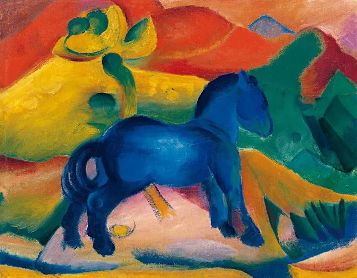

Franz Marc

  

亲爱的连岳叔叔，您好！  

  

我是一个二年级的小朋友。我在学校别人都和同学玩去了，没人想玩我的游戏，我有点伤心，回家我管不住自己，总是想玩平板，看电视……作业都不想写了，每次写作业写到十点钟，每次写作业都想写完赶紧去看电视，玩平板，妈妈都会发火。

  

妈妈她为什么会发火？因为她每次下班回来都是九点钟八点钟，我作业都没有写完，所以妈妈总是发火批评我，我理解妈妈，她下班回来会很累，然后呢，我作业又没有写完，所以妈妈她才会对我发脾气。我很理解她。我觉得我自己很过分。我爸爸呢，他每次有时间回来都不管我作业，只管我睡觉吃饭，不过他对我很好，为着我，他没有时间来管我，每天要上班打卡，有时候不回来，是因为他的工作是警察，很忙，现在不是新冠病毒期间吗？就因为他是警察所以他一直很忙，没有时间管我，说着说着我都有点想他了。

  

写日记我只是想付老师读读我的日记，只有一次被表扬过，我不想要奖状，但我只想要付老师读读我的日记，在全班同学面前。

  

我现在心里已经没有数了，总是想着玩平板看电视玩游戏机，我觉得我现在再这样下去我的学习可能会退步，亲爱的连岳叔叔，我该怎么做才能管好我自己，不要总是玩平板，看电视，玩游戏机，看爱奇艺。我该怎么做？

  

阿瑟儿丰富的山山

  

* * *

  

阿瑟儿丰富的山山：

  

连岳叔叔要先和你道个歉，本来应该早点给你回信的。因为每天要花很多时间看邮件，有时周末就会偷懒，想，休息一下吧，下周再看邮件。邮件就在邮箱里迅速堆积起来。一直到昨天，下定决心把所有未读邮件读完，才翻到你这封邮件。让你久等了。

  

你看，连岳叔叔和你一样，也会为拖延所困扰。事实上，世上的所有人多多少少都会拖延。为什么会这样？因为那些在计划中该做的事，比如你写作业，我写文章，它们无一例外，需要大脑集中注意力，这消耗大量的能量，这样大脑就不愿意做，刚开始很抗拒很辛苦（所以你做作业就会老想着游戏），显得时间过得很慢，你以为努力了很久，一看，才10分钟。玩游戏、看电视等娱乐刚好相反，大脑无需消耗能量集中注意力就可以获得愉悦，所以大脑一直想获得这种低成本的的愉悦，一开始就难停止，这也是“我就玩5分钟”为何总会玩到半个小时，因为时间过得很快，你以为只玩了5分钟，其实半小时1小时已经过去。

  

所以，无论是谁，小孩还是大人，只要起了“先玩一会”的心思，结果一定是玩了很久，再来做事时，时间就显得不够，该做的事自然做不好，做不完，导致自己焦虑、内疚，引来他人的不满和批评。就像你妈妈，晚上八九点钟疲惫地回到家里，看你该写的作业还没写，她的内心反应很复杂，一是委屈，自己工作这么辛苦，孩子还在增添辛苦，下了班情绪还无法放松；二是内疚，没办法花更多的时间陪伴孩子；三是害怕，万一孩子这种状态持续且放大，怎么办？这时候，她的想象力很惊人，想到了你以后变成一事无成、游手好闲、为非作歹的二流子。这些情绪同时起作用，互相刺激，就变成了情绪炸弹，威力惊人，大家都不开心，还影响妈妈当晚的睡眠，第二天的工作。

  

应对方法很简单，该做的事情先做完，做好，之后再玩。绝对不做“先玩一会”的事，做事时也别想着玩。连岳叔叔每天就是这么安排工作的，我早上5点至8点间，把一天最重要的工作，写文章，先做完，一天的其他时间，就不怕任何走神与干扰了。你一回家就马上专心把作业高质量写完，该做的事情一口气做掉后，你会发现，心情相当愉快。这种更高级的愉快，又会减少低级愉快的诱惑力，让你保持住好习惯。同时，这种愉快还会传染，妈妈下班回来，看到你这个做完作业，开开心心的小孩子，她的心情也马上好起来，工作一天的疲惫似乎消失了。此时，大人孩子都做完一天的工作，聊聊天，一起看看电视，你玩玩游戏，其乐融融，这就是幸福家庭的样子。做作业看电视玩游戏，你做的事情还是一样多，结果为何大不同？安排的顺序不同，性质就不同。先工作再娱乐，那工作娱乐两不误。先娱乐再工作，那工作娱乐两耽误。学习好与学习糟，工作好与工作糟，人与人分出差距，就在这个小小的安排顺序上。

  

顺便说一声，你的文章写得好。好文章就得这么写，写自己经历的事情，写自己真实的感受，这么写下去，无论有没有当范文，将来文章都写得好。比如你写爸爸那一句“说着说着我都有点想他了”，这是神来之笔，爸爸工作的辛苦，孩子的思念，爸爸孩子间真挚的感情，几个字全写出来了。所以也拜托你替连岳叔叔做一件事，替我拥抱一下你的爸爸妈妈，是那种深深的、长达10秒钟的拥抱。

  

祝开心。

  

连岳

  

（我的邮箱：lianyue@xmlykd.com，来信前请谨慎考虑，因为意味着只可能在微信平台公开回复，并授权我用于图书汇编。）

推荐：[理解儿童，就是理解自己](http://mp.weixin.qq.com/s?__biz=MjM5NDU0Mjk2MQ==&mid=2651637685&idx=1&sn=1bf899226075e34f3e73109eeb3d8fd8&chksm=bd7e43ab8a09cabdcfc4331bd8af31fb962b14a8e7c9ee6bfca349a439f3f39f33b85c88ed82&scene=21#wechat_redirect)  

上文：[白眼狼是怎么养成的？](http://mp.weixin.qq.com/s?__biz=MjM5NDU0Mjk2MQ==&mid=2651699533&idx=1&sn=1ed9a7397b38e167dd75cf4df5e706f4&chksm=bd7f3d538a08b445f027286bedb72c5e171148a0332503bad3f02b58e3bed71252be5bd0b9d7&scene=21#wechat_redirect)
