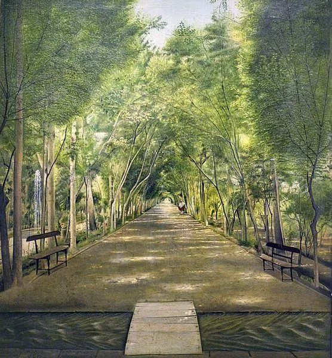

Kamal-ol-Molk

  

连叔：

  

您好，也向连太问好！

  

我在读书期间保持着阅读的习惯，工作以后会每天翻阅一些优质的公众号文章，关注您也是从微信平台，钦佩您总能用平实的语言传递理性的建议和温暖的情感，文字朴素动人，结构严谨分明，做您的读者大概已有五年。

  

[今天您写到](http://mp.weixin.qq.com/s?__biz=MjM5NDU0Mjk2MQ==&mid=2651701082&idx=1&sn=39a58256dbadb7255bedf9c8cdc8e8d7&chksm=bd7f3b448a08b252e30fc55fb6a7c358aa2d6926c245165703833c78ee82d86a74a7afc58a89&scene=21#wechat_redirect)：“年轻人大学毕业，选择就业地时，尽量去发达都市，这样机会与财富的量级都高一些。不然，过了几年，结婚生子后，再换地方，难度就大得多，多数人是在一个地方呆一辈子的。”恰恰戳中我的痛处，让我反思自省，却仍然难以抉择。

  

我今年27岁，七年前毕业于一所部属211大学，便回到四线小城担任公办高中教师的职务。然而世事难料，我所在的单位从17年下半年开始拖欠教师工资，截至目前也有近四年的时间。我现在每月收入两千五，只有基本工资，其他的奖金、补贴、绩效一律拖欠不发。若是应发全发，月入6k左右。前两年以为地方财政困难，哪怕晚发也总会发的。从去年开始，眼看拖欠的日子越久，金额越多，心中的失望转化成绝望，便不断关注新的招聘信息谋求更好的工作机会，同时告诉家人自己打算去大城市的私立学校或头部教育公司，却遭到所有亲友的劝阻，认为我罔顾现实、异想天开。理由如下：

  

1\. 父母反对是由于担心我去大城市从零开始，工作任务重，思想压力大。因为我的性格略敏感，比如明天有重要的考试，我可能整夜无法安眠。另一方面，他们了解我打小做事踏实认真，就像我现在每天批改作业时都会标记学生的错题，分析答错的原因，思考避免再次出错的办法，统计每一份作业是否敷衍了事。父母怕我会累到自己，得不到充分的休息而影响身体。

  

2\. 朋友们一致认为我是天真无害的傻白甜，不善于曲意逢迎、逢场作戏，难以应付复杂多面的利益关系。前年我参加一场上级部门组织的教学比赛，经过精心缜密的设计，被我校的教研组长大加赞赏。意想不到的是，评委在赛后立刻把我的教学过程一五一十转述给另一位参赛的同事，另一位同事便把我的PPT拿去作了汇报，并获得一等奖，而我无故落选，只为他人做嫁衣。

  

3\. 我结婚不久，在本地国企上班的丈夫希望我继续忍耐，不愿夫妻分居两地。

  

说来令人扼腕，虽然我的处事观念日渐更新，但行动却止步不前，常常举棋不定、长吁短叹。每时每刻都有两个小人在脑中争执不休，一个鼓起勇气，另一个偃旗息鼓。我认为现在的生活让人心灰意冷，在麻木中丧失斗志，可辞职的计划被所有人反对，难道真的是我脱离实际？是我错了吗？我渴望离开当下的工作环境，也是为了自己和家人的长期生活质量考量。原因有以下三点：

  

1\. 我的同学们不管身处何处，至少月入7k+，足够保证日常所需，而我不得不每天参与团购秒杀等待打折。贫穷降低大脑的带宽，终日心神不宁。心有不甘，难以坦然面对命运的捉弄。

  

2\. 父母年近60还在努力赚钱，年收入10w左右，为此爸爸还在异乡值夜班。他们奔波劳苦，而我接受他们的经济支援，成为家里的寄生虫。

  

3\. 公婆一直以务农作为唯一的经济来源，近70岁尚无积蓄，年收入1w，只能勉强维生。若日后生病需要照料，何以负担？

  

抱歉让连叔看到如此懦弱不堪的来信，期盼能得到您的指导。看过许多精彩的故事，我这般顾影自怜的模样着实可恨。

  

一只迷失方向的鹿

  

* * *

  

一只迷失方向的鹿：

  

你工作认真，为人真诚，业务水平高，这样的人都是强人，无论装得多么的弱。只是人生的强与弱，需要一段比较长的时间来检验。短期内，有些投机取巧，品德不端的人似乎还会占上风，就像他们偷走你的教学比赛荣誉。世上总有坏人，在任何一个地方总有坏人，不要因为有坏人而怀疑自己的好，不要因为坏人一时得利而放弃当好人。好人之所以是好人，就是因为能够看透坏人是走不远的，好人之所以好，不是因为傻，而是因为真聪明，是本性善良、理性纯熟、目光长远的综合结果。

  

刺激你想辞职的理由是收入低。其实你的收入与同学比，并不低，只是一大部分被财政拖欠了。我虽然不是政府，但可以大着胆子说一下，这些钱最后你是拿得到的。最后真拿不到再辞职也不迟。业务能力持续精进，教学成果摆出来，好老师永远抢手，真本事谁也偷不走。所以，我也是不支持你现在辞职的。

  

其实，你现在可以把生活重心调整一下，不去比收入。刚结婚，双方老人又还处于健康稳定的状态，在这个时间段，把计划中的孩子生了，计划生几个都生掉，完成这件大事是不是收入？当然是，如果能折算成钱，也是大数字。人生安排，要以我为主，因地制宜，发挥优势，这样，命运把你放在哪个位置，你都能在有限条件下得出最佳结果。

  

赡养老人，抚育孩子，这几乎是所有家庭的任务与责任，肯定也会产生压力，总是担心钱不够。要与这种压力共生，因为这压力从来都是人生的一部分。指望暴富以免除这压力，概率太低，如果这么设计人生，那人生将永远处于逃避、沮丧、失败的境地。绝大多数人，大都市也罢，小县城也罢，收入就在平均线上下，能把家庭经营得幸福的、财务健康的，靠的都是家庭成员大家都当好人，各司其职，认真工作，承担责任。

  

想当好人，想生活幸福，这不受时空限制，想，就能做到。今天做到了，明天的风险就小一点。今天幸福了，人生幸福的总量就大了一天。

  

祝开心。

  

连岳

  

（我的邮箱：lianyue@xmlykd.com，来信前请谨慎考虑，因为意味着只可能在微信平台公开回复，并授权我用于图书汇编。）

推荐：[青年的资本与陷阱](http://mp.weixin.qq.com/s?__biz=MjM5NDU0Mjk2MQ==&mid=2651633412&idx=1&sn=c9b5d1dbdf0198837c165018472197a5&chksm=bd7e331a8a09ba0c640527dc9f1cd8dac15e2150afee896b83f972c706160d659db91d3a5589&scene=21#wechat_redirect)  

上文：[背上那么多房贷，出了意外怎么办？](http://mp.weixin.qq.com/s?__biz=MjM5NDU0Mjk2MQ==&mid=2651700723&idx=1&sn=d779b14dee2374d35132ebe3846474ee&chksm=bd7f39ed8a08b0fbdd9ef03b85f0dc1ab102cae7eb6c5e6277b129a5302311f5d4551f189043&scene=21#wechat_redirect)
